# 株投資リサーチアプリ 設計資料

> 本資料は `ai-stock-investing-tutorial/app` の実装済みコードから起こしたリファレンス設計書です。
> 個別機能の意思決定の経緯（検討した代替案など）は [`docs/superpowers/specs/`](superpowers/specs/) 配下の各設計書を参照してください。本資料はそれらを踏まえた**全体構成と現状の挙動**の整理を目的とします。

## 1. 概要

- [ai-stock-investing-tutorial](../../README.md) の教材内容（プロンプト設計・データAPI連携・分析エージェント・ポートフォリオ管理・バックテスト）を統合した、個人利用向けのStreamlit Webアプリ。
- 教育目的の参考実装であり、投資助言を目的としない。生成される全レポートに免責事項（[`common/disclaimer.py`](../common/disclaimer.py)）を明示する。
- LLM呼び出しは既定でAPIキーを直接使わず、ログイン済みの **Claude Code CLI**（`claude -p`）をサブプロセスとして実行する方式を採るが、`llm_provider`設定でOpenAI Chat Completions APIへの切り替えも可能（[5.1](#51-llm連携claude-code-cli--openai-api)参照）。

## 2. 構成

### 2.1 技術スタック

| 項目               | 内容                                                                                                                                                                                                                                                                                                                                 |
| ------------------ | ------------------------------------------------------------------------------------------------------------------------------------------------------------------------------------------------------------------------------------------------------------------------------------------------------------------------------------ |
| UI                 | Streamlit（`st.tabs` による7タブ切替（`is_admin`ユーザーには8番目に管理者タブを追加表示） + `st.dialog` の銘柄詳細モーダル、単一プロセス。`streamlit-authenticator` によるログイン/新規登録ゲートあり）。`app.py` は起動処理とタブ生成のみを担い、各タブの描画は `app_tabs/` 配下のモジュールに分割                      |
| データ処理         | pandas / numpy（`scripts/import_all_listed_tickers.py`はJPX公式 `.xls` 読み込みに`xlrd`を利用）                                                                                                                                                                                                                                |
| チャート描画       | Altair（`st.altair_chart`。ローソク足＋出来高チャート＋移動平均線（5/25/75日）、業種間相関・ウェーブレット分析・バックテストのグリッドサーチ結果ヒートマップ。streamlit経由の間接依存） / Mermaid（業種間ネットワーク図。CDN読み込みの`mermaid.js`+`svg-pan-zoom.js`を`st.iframe`でパン・ズーム可能に埋め込み）              |
| 株価・ニュース取得 | yfinance                                                                                                                                                                                                                                                                                                                             |
| 日本語銘柄名取得   | Yahoo!ファイナンス日本版のHTMLタイトルを`requests` でスクレイピング                                                                                                                                                                                                                                                                |
| LLM                | Claude Code CLI（`subprocess.run([executable, "--system-prompt", ..., "-p"], input=prompt)`、既定）／OpenAI Chat Completions API（`llm_provider="openai"`設定時、[5.1](#51-llm連携claude-code-cli--openai-api)参照）                                                                                                              |
| 並列処理           | `concurrent.futures.ThreadPoolExecutor`（`common/concurrency.py`の`map_concurrently`、最大8並列。`portfolio_management/backtest.py`の`run_universe_backtest_ranking`も銘柄ごとの近傍グリッドサーチを同様に最大8並列で実行するが、Streamlit非依存を保つため`map_concurrently`は経由せず直接`ThreadPoolExecutor`を使う） |
| ウェーブレット分析 | PyWavelets（`pywt.cwt`、複素モルレーウェーブレット`cmor1.5-1.0`によるクロスウェーブレット・コヒーレンス計算）                                                                                                                                                                                                                    |
| パッケージ管理     | uv（Python 3.14系）                                                                                                                                                                                                                                                                                                                  |
| テスト             | pytest（yfinance・`call_llm` はモック化）                                                                                                                                                                                                                                                                                          |

### 2.2 ディレクトリ構成

```
app/
  app.py                        # Streamlitエントリーポイント（set_page_config・起動時LLM可用性チェック・
                                 # streamlit-authenticator認証ゲート・7タブ生成（管理者は8タブ目）+ 各タブ関数の呼び出しのみ）
  auth.py                        # streamlit-authenticatorとDB（Userテーブル）を仲介
                                  # （build_credentials/get_user_id/get_is_admin/persist_new_user/persist_password_update）
  admin.py                       # 管理者タブのユーザー管理向けDB操作（list_users/set_admin_status/delete_user）
  app_tabs/
    shared.py                    # 全タブ共通のキャッシュ付き取得関数、show_stock_detail_dialog（銘柄詳細ダイアログ）、
                                  # handle_table_selection（表クリック→ダイアログ起動）、render_mermaid、
                                  # run_or_load_sector_rotation（セクターローテーション分析の実行/キャッシュ読込、
                                  # セクタータブ・AI戦略ビルダータブで共有）、データ保存先パス定数
    portfolio_tab.py              # render_portfolio_tab（ポートフォリオタブ）
    screening_tab.py              # render_screening_tab（スクリーニングタブ）
    backtest_tab.py                # render_backtest_tab（バックテストタブ）
    ranking_tab.py                 # render_ranking_tab（一括バックテストタブ）
    strategy_builder_tab.py        # render_strategy_builder_tab（AI戦略ビルダータブ）
    qa_tab.py                      # render_qa_tab（AI質問箱タブ）
    admin_tab.py                   # render_admin_tab（管理者タブ、is_adminユーザーのみ表示。4.9節参照）
    sector/
      tab.py                      # render_sector_tab（セクタータブのエントリーポイント。表示設定・分析実行・キャッシュ管理を担当し、
                                   # 個別グラフの描画は同ディレクトリの各モジュールに委譲する）
      heatmap.py                   # render_heatmap（業種間相関ヒートマップ）
      pairs_table.py               # render_pairs_table（リード・ラグ上位ペア表）
      ai_comments.py                # render_ai_comments（相関上位5ペアのAIコメント）
      network_diagram.py            # render_network_diagram（業種間ネットワーク図、Mermaid描画の_render_mermaidも含む）
      wavelet_analysis.py           # render_wavelet_analysis（ウェーブレット分析セクション）
  data_api/
    stock_price_api.py          # fetch_price_history / fetch_fundamentals / fetch_news / fetch_japanese_name /
                                 # fetch_company_profile / fetch_universe_fundamentals / fetch_universe_price_histories
                                 # （DB read-throughの並列フェッチ）、load_all_company_profiles（company_profiles全件、
                                 # 旧UNIVERSE/UNIVERSE_NAMES/SECTOR_MAPに代わる銘柄一覧の単一情報源）、
                                 # load_*_for_ticker/save_*_for_ticker（管理者タブ向けCRUD）、
                                 # yfinanceのYFRateLimitErrorに対するバックオフ付きリトライ（_call_with_rate_limit_retry）
    llm_client.py                # call_llm, check_llm_available（Claude Code CLI / OpenAI APIをllm_provider設定で切り替え）
  prompt_patterns/
    screening.py                 # build_screening_prompt, apply_filters, generate_screening_comments
    report_generation.py         # build_report_prompt（ポートフォリオレビュー用）
    backtest_explanation.py      # build_backtest_prompt, build_improvement_prompt（Prompt Chaining Step2）, generate_ranking_comments
    sector_rotation.py           # build_sector_rotation_prompt, generate_sector_rotation_comments
    stock_detail.py              # build_stock_detail_prompt（銘柄詳細ダイアログ用、単一銘柄）、
                                  # build_company_profile_prompt（事業内容の要約）、
                                  # build_news_title_translation_prompt / build_news_summary_translation_prompt（ニュース日本語訳）
    wavelet_explanation.py       # build_wavelet_prompt, generate_wavelet_explanation（ウェーブレット分析スナップショット解説）
    strategy_dialogue.py         # build_dialogue_prompt, parse_dialogue_response（AI戦略ビルダー対話、PIPELINE_FUNCTIONSベースの
                                  # stepsスキーマをペルソナ指示に埋め込む）,
                                  # build_refinement_prompt（Evaluator-Optimizer改善ステップ）
    qa_routing.py                # classify_question, build_*_answer_prompt（AI質問箱、Routingパターン）
  analysis_agents/
    fundamental_agent.py         # analyze_fundamentals（PER/PBR/配当利回り）
    technical_agent.py           # analyze_technical（25/75日移動平均シグナル、RSI/ATR/ADX/OBV）
    news_research_agent.py       # research_news_batch（ニュース見出し→LLMセンチメント一括判定）
  portfolio_management/
    composition.py               # analyze_portfolio_composition（構成比・損益）
    risk.py                      # assess_risk（ボラティリティ・相関）
    review.py                    # generate_portfolio_review（事実データ統合＋LLM考察生成）
    storage.py                   # load_holdings / save_holdings（DB, holdingsテーブル永続化）
    ticker_names.py               # build_candidate_names（company_profiles名＋未知銘柄の名前解決）
    backtest.py                   # 戦略4種の実装、STRATEGIES定義（param_grid/fixed_params）、
                                   # compute_ma_crossover_series等の指標系列計算、
                                   # 近傍グリッドサーチ（run_grid_search）・安定性判定（summarize_grid_stability）・
                                   # 一括ランキング関数（build_universe_backtest_cache_key含む）、generate_backtest_explanation
                                   # （Prompt Chaining: 結果解説→改善提案の2段階）
  strategy_builder/
    conditions.py                  # apply_strategy_conditions（indicator/operatorスキーマ。screening.pyのfield/記号演算子
                                    # スキーマとは別。単独では使わず、FILTER_BY_FUNDAMENTALSステップの内部実装として使う）
    evaluation.py                  # build_evaluate_prompt, evaluate_strategy, run_evaluation_loop
                                    # （Evaluator-Optimizer: 確定候補の自動評価・改善ループ）
    sector_insight.py              # build_watchlist_from_rotation（業種ローテーションからの銘柄提案、
                                    # app_tabs.shared.run_or_load_sector_rotationの結果を入力とする純粋ロジック）
    storage.py                     # load_strategies / save_strategy（DB, strategiesテーブル永続化）、
                                    # load_all_strategies / delete_strategy_by_id / update_strategy_json_by_id（管理者向け全ユーザー横断操作）
    pipeline.py                    # run_pipeline（AIが生成したsteps配列を先頭から順に実行するエンジン、4.7節参照）
    pipeline_functions.py          # PIPELINE_FUNCTIONS レジストリ（BACKTEST_RANK/MULTI_STRATEGY_RANK/FILTER_CURRENT_SIGNAL/
                                    # FILTER_BY_FUNDAMENTALS/SORT_BY/TOP_N。戦略の`steps`が使う関数チェーン）
  sector_analysis/
    correlation.py                # compute_sector_returns, compute_lead_lag_pairs（業種別リターン・時差相関計算）
    wavelet.py                    # compute_cross_wavelet_lead_lag ほか（クロスウェーブレット・コヒーレンス、周期帯分類、全ペア集約）
    network.py                    # build_mermaid_lead_lag_graph（周期帯・コヒーレンス閾値でフィルタしたリード・ラグ関係のMermaid図生成）
    display_settings.py           # load/save_sector_display_settings（セクションの表示ON/OFF・順序・高さ、DB永続化）
  stock_detail/
    detail.py                     # generate_stock_detail（株価OHLCV/ファンダメンタル/テクニカル/ニュース/事業内容統合＋AIコメント、キャッシュ付き）
  db/
    models.py                      # SQLAlchemy ORMモデル定義（User/Holding/Strategy/SectorDisplaySetting/PriceHistory/
                                    # FundamentalsSnapshot/CompanyProfile/TickerNews、5.3節参照）
    engine.py                      # create_db_engine/init_db（スキーマ初期化、既存DBへの軽量マイグレーション、
                                    # company_profilesのFK実効化、seed_company_profiles.csvの投入）
    seed_company_profiles.csv      # 旧UNIVERSE_NAMES/SECTOR_MAPから生成した初期投入データ（ticker, name, sector_jp）
  scripts/
    migrate_to_db.py               # DB化前のholdings.json等をDBへ一回限り移行する対話的CLI（5.3節参照）
    import_all_listed_tickers.py   # JPX東証上場銘柄一覧（data_j.xls）を毎回最新版でダウンロードし、
                                    # company_profilesへ全銘柄（ETF/REIT等含む）をupsertするバッチ
    import_all_listed_tickers.bat  # 上記バッチのWindows起動用ランチャー
    update_market_data.py          # company_profiles全銘柄のprice_history/fundamentals_snapshots/ticker_news/
                                    # company_profileを更新するバッチ（4フェーズ、同時実行数を絞ってレート制限を回避）
    update_market_data.bat         # 上記バッチのWindowsタスクスケジューラ向けランチャー
  common/
    disclaimer.py                  # DISCLAIMER_NOTICE 定数
    cache.py                       # 日付キー付きファイルキャッシュのヘルパー
    concurrency.py                 # map_concurrently（ThreadPoolExecutorによる並列実行、例外は要素単位で捕捉）
    json_parsing.py                # strip_code_fence（LLM応答のコードフェンス除去）
    logging_config.py              # setup_logging/log_duration（ログ設定・処理時間計測）
  data/                             # 実行時生成データ（.gitignore対象）
    app.db                          # SQLiteデータベース（ユーザー固有データ + 全ユーザー共有の市場データ、5.3節参照）
    cache/                          # 日付+ハッシュキー（一部は銘柄コードそのまま）のキャッシュファイル
  tests/                            # pytest
  docs/                             # 本資料・設計書一式、data_j.xls（JPX公式東証上場銘柄一覧。scripts/import_all_listed_tickers.pyが
                                     # 実行のたびに最新版で上書きするため、固定スナップショットではない）
  pyproject.toml / uv.lock
```

`screening/`（`universe.py`＝固定UNIVERSE 228銘柄、`sectors.py`＝SECTOR_MAP）は`company_profiles`テーブルへの統合に伴い削除され、`data_api/stock_price_api.py::load_all_company_profiles`が銘柄一覧・日本語名・東証17業種区分（`sector_jp`）の単一の情報源になっている（詳細は[5.3](#53-データ永続化)参照）。

### 2.3 モジュール依存関係

```mermaid
flowchart LR
    app["app.py（エントリーポイント）"]

    subgraph app_tabs["app_tabs"]
        shared_m["shared.py（共有キャッシュ関数 + 銘柄詳細ダイアログ）"]
        portfolio_tab_m["portfolio_tab.py"]
        screening_tab_m["screening_tab.py"]
        backtest_tab_m["backtest_tab.py"]
        ranking_tab_m["ranking_tab.py"]
        strategy_builder_tab_m["strategy_builder_tab.py"]
        qa_tab_m["qa_tab.py"]
        admin_tab_m["admin_tab.py"]

        subgraph sector_pkg["sector/"]
            sector_tab_m["tab.py"]
            heatmap_m["heatmap.py"]
            pairs_table_m["pairs_table.py"]
            ai_comments_m["ai_comments.py"]
            network_diagram_m["network_diagram.py"]
            wavelet_analysis_m["wavelet_analysis.py"]
        end
    end

    subgraph prompt["prompt_patterns"]
        screening_p["screening.py"]
        report_p["report_generation.py"]
        backtest_p["backtest_explanation.py"]
        sector_p["sector_rotation.py"]
        detail_p["stock_detail.py"]
        wavelet_p["wavelet_explanation.py"]
        strategy_dialogue_p["strategy_dialogue.py"]
        qa_routing_p["qa_routing.py"]
    end

    subgraph agents["analysis_agents"]
        fundamental["fundamental_agent.py"]
        technical["technical_agent.py"]
        news["news_research_agent.py"]
    end

    subgraph pm["portfolio_management"]
        composition["composition.py"]
        risk["risk.py"]
        review["review.py"]
        storage["storage.py"]
        ticker_names["ticker_names.py"]
        backtest["backtest.py"]
    end

    subgraph sb["strategy_builder"]
        sb_conditions["conditions.py"]
        sb_evaluation["evaluation.py"]
        sb_sector_insight["sector_insight.py"]
        sb_storage["storage.py"]
        sb_pipeline["pipeline.py"]
        sb_pipeline_functions["pipeline_functions.py"]
    end

    subgraph api["data_api"]
        price_api["stock_price_api.py"]
        llm_client["llm_client.py"]
    end

    subgraph sector_analysis["sector_analysis"]
        correlation["correlation.py"]
        wavelet["wavelet.py"]
        network["network.py"]
        display_settings["display_settings.py"]
    end

    subgraph stock_detail["stock_detail"]
        detail["detail.py"]
    end

    subgraph dbpkg["db"]
        db_models["models.py"]
        db_engine["engine.py"]
    end

    auth["auth.py"]
    admin["admin.py"]

    subgraph common["common"]
        cache["cache.py"]
        disclaimer["disclaimer.py"]
        json_parsing["json_parsing.py"]
        concurrency["concurrency.py"]
        logging_config["logging_config.py"]
    end

    subgraph scripts_pkg["scripts"]
        migrate_script["migrate_to_db.py"]
        import_script["import_all_listed_tickers.py"]
        update_script["update_market_data.py"]
    end

    app --> portfolio_tab_m
    app --> screening_tab_m
    app --> backtest_tab_m
    app --> ranking_tab_m
    app --> sector_tab_m
    app --> strategy_builder_tab_m
    app --> qa_tab_m
    app --> admin_tab_m
    app --> auth

    portfolio_tab_m --> shared_m
    screening_tab_m --> shared_m
    backtest_tab_m --> shared_m
    ranking_tab_m --> shared_m
    sector_tab_m --> shared_m
    wavelet_analysis_m --> shared_m
    strategy_builder_tab_m --> shared_m
    qa_tab_m --> shared_m
    admin_tab_m --> shared_m

    sector_tab_m --> heatmap_m
    sector_tab_m --> pairs_table_m
    sector_tab_m --> ai_comments_m
    sector_tab_m --> network_diagram_m
    sector_tab_m --> wavelet_analysis_m

    shared_m --> agents
    shared_m --> api
    shared_m --> stock_detail
    shared_m --> common

    portfolio_tab_m --> agents
    portfolio_tab_m --> pm
    portfolio_tab_m --> api
    portfolio_tab_m --> common

    screening_tab_m --> prompt
    screening_tab_m --> api
    screening_tab_m --> common

    backtest_tab_m --> pm
    backtest_tab_m --> common

    ranking_tab_m --> pm
    ranking_tab_m --> prompt
    ranking_tab_m --> common
    ranking_tab_m --> api

    sector_tab_m --> sector_analysis
    sector_tab_m --> prompt
    sector_tab_m --> common
    sector_tab_m --> api
    network_diagram_m --> sector_analysis
    wavelet_analysis_m --> sector_analysis
    wavelet_analysis_m --> prompt
    wavelet_analysis_m --> common
    wavelet_analysis_m --> api

    review --> composition
    review --> risk
    review --> report_p
    backtest --> backtest_p
    ticker_names --> price_api

    fundamental --> price_api
    news --> json_parsing
    news --> llm_client
    screening_p --> json_parsing
    screening_p --> llm_client
    report_p --> disclaimer
    backtest_p --> disclaimer
    backtest_p --> json_parsing
    backtest_p --> llm_client
    review --> llm_client
    review --> disclaimer
    backtest --> llm_client
    backtest --> disclaimer
    price_api --> cache
    price_api --> concurrency
    price_api --> dbpkg
    storage --> dbpkg
    storage --> price_api
    display_settings --> dbpkg

    sector_p --> json_parsing
    sector_p --> llm_client
    wavelet_p --> llm_client

    detail --> agents
    detail --> price_api
    detail --> detail_p
    detail --> llm_client
    detail --> cache

    strategy_builder_tab_m --> strategy_dialogue_p
    strategy_builder_tab_m --> sb
    strategy_builder_tab_m --> sb_pipeline
    strategy_builder_tab_m --> sector_analysis
    strategy_builder_tab_m --> api
    strategy_builder_tab_m --> common
    sb_evaluation --> strategy_dialogue_p
    sb_evaluation --> llm_client
    sb_evaluation --> json_parsing
    strategy_dialogue_p --> json_parsing
    strategy_dialogue_p --> sb_pipeline_functions
    sb_storage --> common
    sb_storage --> dbpkg
    sb_pipeline --> sb_pipeline_functions
    sb_pipeline_functions --> sb_conditions
    sb_pipeline_functions --> pm
    sb_pipeline_functions --> api
    sb_pipeline_functions --> cache

    qa_tab_m --> qa_routing_p
    qa_tab_m --> agents
    qa_tab_m --> pm
    qa_tab_m --> llm_client
    qa_tab_m --> common
    qa_routing_p --> llm_client

    admin_tab_m --> admin
    admin_tab_m --> api
    admin_tab_m --> sb_storage
    auth --> dbpkg
    admin --> dbpkg
    db_engine --> db_models

    migrate_script --> dbpkg
    import_script --> dbpkg
    update_script --> api
    update_script --> dbpkg
```

## 3. 機能一覧

| # | タブ                                   | 概要                                                                                                                                                                                                                                                                                                |
| - | -------------------------------------- | --------------------------------------------------------------------------------------------------------------------------------------------------------------------------------------------------------------------------------------------------------------------------------------------------- |
| 1 | ポートフォリオ                         | 保有銘柄を登録し、構成比・損益・リスク・ファンダメンタル・テクニカル・ニュースセンチメントを統合したレビューレポートを生成する                                                                                                                                                                      |
| 2 | スクリーニング                         | 自然言語の投資条件をAIがフィルタ条件（JSON、per/pbr/dividend_yield_pct/sectorに対応）に変換し、確認後に`company_profiles`の全登録銘柄から絞り込む                                                                                                                                                 |
| 3 | バックテスト                           | 指定銘柄に対し4戦略について近傍グリッドサーチ（15〜40通り）でベクトル化バックテストを実行し、ヒートマップと安定性チェック（変動係数）を表示したうえで、AIによる結果解説と改善提案の2段階（Prompt Chaining）を表示する                                                                               |
| 4 | 一括バックテスト                       | `company_profiles`の全登録銘柄＋保有銘柄に対し、選択した戦略について銘柄ごとに近傍グリッドサーチで最良パラメータを探索して一括バックテストし、リスク調整済みリターン順にランキング表示する                                                                                                        |
| 5 | セクターローテーション                 | `company_profiles`のうち東証17業種区分（`sector_jp`）が設定された銘柄を対象に、業種間の値動きの時差相関（リード・ラグ）・全ペアネットワーク図・ウェーブレット分析（時間変化するリード・ラグ）を過去の株価データから計算して表示する。表示するセクションのON/OFF・順序・高さはユーザーが設定可能 |
| 6 | AI戦略ビルダー                         | 投資アイデアをAIとの対話で関数チェーン型のスクリーニング/バックテストパイプライン（`steps`）に詰め、確定候補は自動評価・改善ループ（Evaluator-Optimizer）を経てから確認・保存し、パイプラインを実行して最新データで銘柄選定を行う                                                                 |
| 7 | AI質問箱                               | 自由記述の投資質問をAIが5カテゴリに分類し（Routing）、専用の分析エージェントへ振り分けて回答する                                                                                                                                                                                                    |
| 8 | 管理者（`is_admin`ユーザーのみ表示） | 全ユーザーの保存済み戦略・ユーザーアカウントの一覧確認/編集/削除、および銘柄コード単位での市場データ（`price_history`/`fundamentals_snapshots`/`company_profiles`）のCRUD編集を行う（4.9節参照）                                                                                              |

上記5タブ（スクリーニング／一括バックテスト／セクターローテーションの結果テーブル、ポートフォリオの保有銘柄一覧、AI戦略ビルダーのパイプライン実行結果テーブル）からは行クリックまたはボタンで**銘柄詳細ダイアログ**（[4.6](#46-銘柄詳細ダイアログクロスタブ機能)参照）を開ける。特定のタブに属さないクロスカッティングな機能のため、上表には独立行を設けていない。

共通の起動時チェックとして、`app.py` はStreamlit描画前に `check_llm_available()` を呼び、設定済みLLMプロバイダ（`.streamlit/secrets.toml`の`llm_provider`、デフォルト`claude_cli`）が利用できない場合は `st.error` を表示して `st.stop()` で処理を止める（全タブ＋銘柄詳細ダイアログすべての前提条件）。続けて `streamlit-authenticator` によるログイン/新規登録ゲートを通過したユーザーのみがタブを利用できる（詳細は[4.9](#49-管理者タブ)冒頭・[5.3](#53-データ永続化)参照）。

---

## 4. 機能ごとの詳細

### 4.1 ポートフォリオレビュー

#### シーケンス図

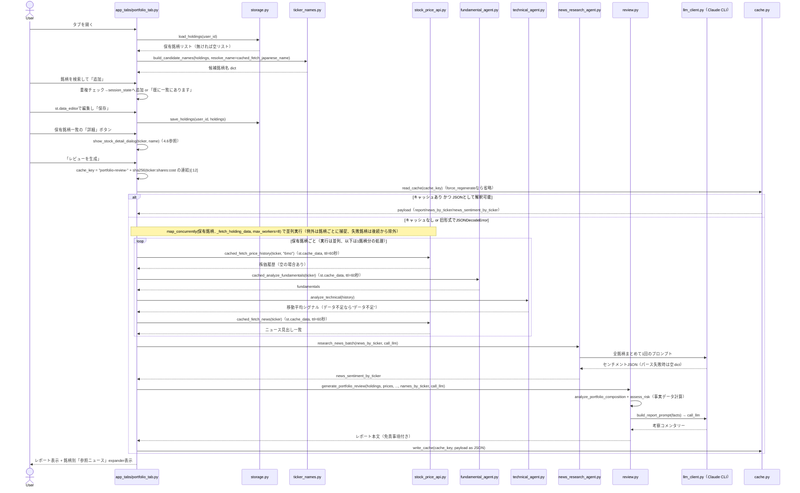

#### ステップ・分岐の説明

1. **保有銘柄の読み込み**: セッション初回のみ `load_holdings(user_id)` を呼ぶ。DBに該当ユーザーの行が1件も無ければ空リストにフォールバックし、初期行 `{"ticker": "", "shares": 0, "cost": 0.0}` を1件表示する。
2. **銘柄名候補の構築**: `company_profiles`の登録済み日本語名（`load_all_company_profiles()`）に加え、保有銘柄のうち未登録のティッカーは `fetch_japanese_name` で名前解決する。この関数は `app_tabs/shared.py` の `cached_fetch_japanese_name`（`st.cache_data(ttl=60秒)`、[5.2](#52-キャッシュ機構)参照）でラップされており、同一ティッカーへの重複リクエストを抑制する。
3. **銘柄の検索・追加**: セレクトボックスで `"ティッカー 銘柄名"` の形式から選び、「追加」ボタン押下時のみ `session_state["holdings_rows"]` に反映する。**既に一覧にあるティッカー**を選んだ場合は追加せず `st.info` で通知する（分岐）。
4. **編集・保存**: `st.data_editor` は行の追加・削除・編集を許可する（`num_rows="dynamic"`）。「保存」ボタンを押すまでDBには反映されず、ティッカーが空の行は保存時に除外される。`save_holdings` は当該ユーザーの既存行を全削除してから渡された全件で置き換える。
5. **銘柄詳細ダイアログ**: 保存済み保有銘柄ごとに「詳細」ボタンが並び（`key=f"portfolio_detail_{i}_{ticker}"` で行インデックスをキーに含め、同一ティッカー重複時もボタンキーが衝突しないようにしている）、押下すると [4.6](#46-銘柄詳細ダイアログクロスタブ機能) のダイアログが開く。
6. **レビュー生成のキャッシュ判定**:
   - `cache_key` は `"portfolio-review-"` に保有銘柄の `ticker:shares:cost` を連結したSHA256の先頭12文字を付加したもの。**構成が変われば別キャッシュキーになる**。
   - `force_regenerate`（キャッシュを無視するチェックボックス）がオンなら `read_cache` 自体を呼ばない。
   - キャッシュヒットしても中身が **旧バージョン形式**（レポート文字列のみ）で `json.loads` が失敗する場合は、無視して再生成する（後方互換の分岐）。
   - `common/cache.py` の実装上、キャッシュファイル名には**当日の日付**が含まれるため、日付が変われば自動的に再生成対象になる。
7. **事実データの収集（キャッシュミス時）**: 銘柄ごとの株価履歴（6ヶ月）・fundamentals・technical・newsの取得は `_fetch_holding_data` にまとめられ、`common/concurrency.py::map_concurrently`（`ThreadPoolExecutor`, 最大8並列）で保有銘柄横断に**並列実行**される。個別銘柄の取得で例外が発生してもその銘柄の結果が `Exception` として捕捉されるだけで他銘柄の処理は継続し、`isinstance(result, Exception)` の銘柄は `continue` でスキップされる。株価履歴が空でも `current_prices`/`price_histories` への登録をスキップするのみで後続処理は継続する（銘柄単位の防御的実装）。株価履歴・fundamentals・newsの取得自体もそれぞれ `st.cache_data(ttl=60秒)` の薄いラッパー（`app_tabs/shared.py` の `cached_fetch_price_history` / `cached_analyze_fundamentals` / `cached_fetch_news`）を経由し、同一セッション内の再取得コストを下げる（詳細は [5.2](#52-キャッシュ機構) 参照）。
8. **ニュースセンチメントのバッチ判定**: 全保有銘柄のニュース見出しを1つのプロンプトにまとめ、**1回のLLM呼び出し**でJSON形式のセンチメントを取得する（サブプロセス起動オーバーヘッド対策）。JSONパースに失敗した場合は空dictとなり、各銘柄のセンチメントは `None` 扱いになる。
9. **レビュー本文の生成**: `analyze_portfolio_composition`（構成比・損益、価格取得不可の銘柄は `None`）と `assess_risk`（銘柄間相関・ボラティリティ、年率換算）を「事実データ」としてPython側で計算し、これをJSONとしてプロンプトに埋め込んで初めてLLMに渡す。プロンプトは「観察事項の列挙のみ、売買推奨・目標株価の提示は禁止」を明示する。
10. **表示**: レポート本文の前後に `DISCLAIMER_NOTICE` を必ず付与する。センチメント判定の根拠として、銘柄ごとに参照ニュース一覧を折りたたみ表示する（ニュースが0件の場合は「ニュースが取得できませんでした」と表示）。

---

### 4.2 スクリーニング

#### シーケンス図

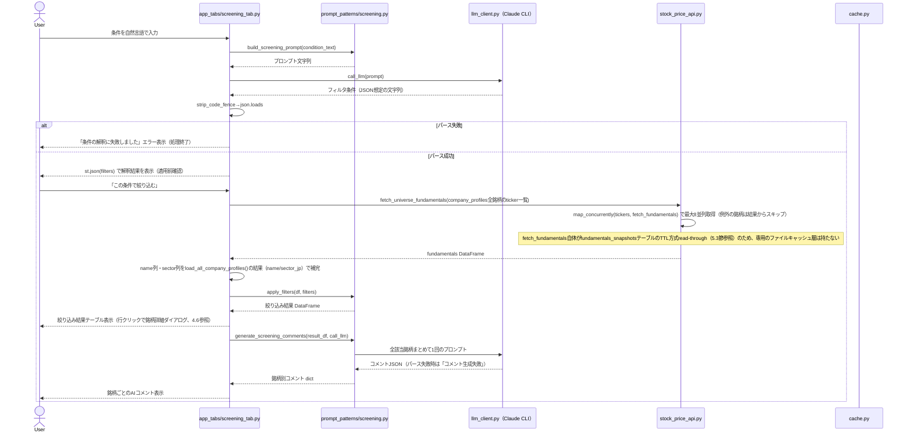

#### ステップ・分岐の説明

1. **条件のフィルタ変換**: `build_screening_prompt` は使用可能なfieldを `per` / `pbr` / `dividend_yield_pct` / `sector`（業種）の4つに限定するようプロンプト内で明示し、LLMにJSON配列のみを出力させる。`sector` を使う場合の `operator` は `==` のみとし、`value` は `company_profiles.sector_jp` の値（東証17業種区分）から表記ゆれを吸収して選ばせる。
2. **パース失敗時の分岐**: `strip_code_fence`（```json フェンス除去）後に `json.loads` が失敗すると `st.error` を出し、以降の絞り込み処理には進まない（ユーザーに条件の言い換えを促す）。
3. **確認ステップ（誤解釈対策）**: 解釈結果は `st.json` で必ず画面表示し、**「この条件で絞り込む」ボタンを押すまで実データには一切適用しない**。これによりAIの誤変換に早期に気づける。
4. **対象銘柄fundamentalsの取得**: `fetch_universe_fundamentals` は `data_api/stock_price_api.py::load_all_company_profiles` が返す `company_profiles` の全登録ティッカー（旧UNIVERSE/UNIVERSE_NAMES/SECTOR_MAPに代わる銘柄一覧の単一情報源、[5.3](#53-データ永続化)参照）を対象に、`common/concurrency.py::map_concurrently` で最大8並列に取得する。銘柄ごとの当日分キャッシュ判定は `fetch_fundamentals` が内部で行う `fundamentals_snapshots` テーブルへのTTL方式read-through（同日分があればDBから再利用、無ければyfinanceから取得してDBへ追加）に委譲されており、本関数自体は専用のファイルキャッシュを持たない（起動のたびに全銘柄分yfinance呼び出しをしない、という目的は変わらない）。個別銘柄の取得で例外が発生した場合はその銘柄を結果からスキップして処理を続ける（フィルタ対象の減少のみで処理全体は止めない）。`fetch_fundamentals` の日本語銘柄名は精度が低いため、`name` 列は `company_profiles.name` で上書き補完し、`sector` 列は `company_profiles.sector_jp`（東証17業種区分）から付加する。
5. **フィルタ適用**: `apply_filters` は条件を1件ずつ順番にAND条件で適用する。`field` がDataFrameの列に存在しない、または `operator` が `<=`/`>=`/`<`/`>`/`==` のいずれでもない場合は**その条件だけを無視**して次の条件に進む（フィルタ全体を失敗させない防御的実装）。値が `None`（`NaN`）の行は `notna()` チェックで除外される。
6. **絞り込み結果テーブル**: `ticker`/`name`/`sector`/`per`/`pbr`/`dividend_yield_pct` に加え `market_cap`（時価総額）列も表示する。テーブルは `on_select="rerun"`・`selection_mode="single-row"` でクリック可能になっており、行を選ぶと [4.6](#46-銘柄詳細ダイアログクロスタブ機能) の銘柄詳細ダイアログが開く。
7. **AIコメント生成**: 絞り込み結果が0件なら `generate_screening_comments` は空dictを返しLLM呼び出し自体を行わない。0件でない場合は該当銘柄すべてをまとめた**1回のプロンプト**でコメントを一括生成し、JSONパースに失敗した場合は全銘柄に対し「コメント生成失敗」を表示する。

---

### 4.3 バックテスト（単一銘柄）

#### シーケンス図

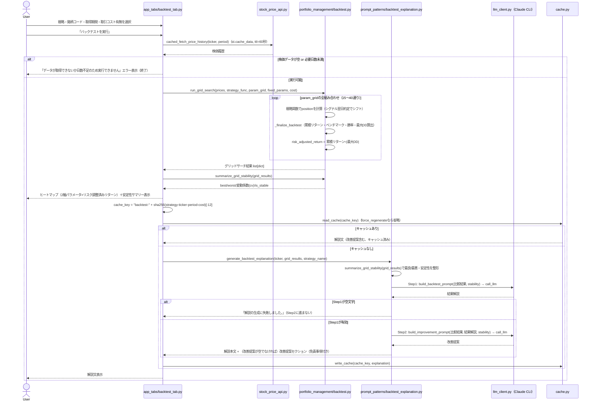

#### ステップ・分岐の説明

1. **戦略の選択**: `STRATEGIES` に定義された4戦略（移動平均クロスオーバー／RSI逆張り／MACDクロスオーバー／ボリンジャーバンド逆張り）から選ぶ。各戦略は `func`・`param_grid`（探索する2軸パラメータ）・`min_days`（実行に必要な最小日数）を持ち、RSI・MACDは3つ目のパラメータを `fixed_params` で固定する。
2. **株価取得**: `app_tabs/shared.py` の `cached_fetch_price_history`（`st.cache_data(ttl=60秒)`）経由で取得するため、同一銘柄・同一期間の再実行はセッション内では再フェッチしない。
3. **データ不足時の分岐**: 取得した株価が空、または `len(history) < strategy["min_days"]` の場合は即座にエラー表示して処理を終了する（例: MA戦略は85日、RSIは18日必要）。
4. **バックテスト計算（`_finalize_backtest`）**:
   - 各戦略は当日のシグナルに基づき `position`（0/1）を算出し、**1日シフトして翌日約定とする**（ルックアヘッドバイアス回避、全戦略共通のコメント付きロジック）。
   - `transaction_cost_pct` が0より大きい場合、ポジションが変化した日（`position.diff() != 0`）にのみ取引コスト（0.1%/回）を差し引く。
   - ベンチマークは常にBuy&Hold（`daily_return` の累積）。
   - 勝率は「ポジションを持っている日」のうちリターンがプラスだった日の割合。ポジションを一度も持たない場合は0.0。
   - 最大ドローダウンは累積リターン曲線の `cummax` からの下落率の最小値。
5. **RSI逆張り／ボリンジャーバンド逆張りのエントリー・エグジット**: いずれも「entry条件で1、exit条件で0を代入し `ffill` で保持」という共通パターン。RSIは「下から上に売られすぎ水準を回復した日にエントリー、買われすぎ水準到達で手仕舞い」。ボリンジャーは「下バンド割れでエントリー、中心線（移動平均）以上への回帰で手仕舞い」。
6. **近傍グリッドサーチと安定性チェック**: `run_grid_search` が `param_grid` の全組み合わせ（デカルト積）でバックテストを実行し、各組み合わせに `risk_adjusted_return`（収益率÷|最大DD|）を付与する。`summarize_grid_stability` が、その中の最良/最悪の組み合わせと、変動係数（標準偏差÷|平均|）による安定性判定（`cv < 0.5` で安定）を求める。UIはこの結果をヒートマップ（2軸パラメータ×色=リスク調整済みリターン）と安定性バッジで表示する。
7. **キャッシュ判定**: `"backtest-"` + `strategy名-ticker-period-cost` のハッシュをキーとし、`force_regenerate` チェックボックスがオフかつ当日分キャッシュがあれば解説文（改善提案含む最終Markdown）をそのまま再利用し、LLM呼び出しをスキップする。
8. **AI解説の生成（Prompt Chaining: 2ステップ）**: `generate_backtest_explanation` は `grid_results` を受け取り、内部で `summarize_grid_stability` を呼んで最良/最悪の2点と安定性情報（`cv`・`is_stable`）を整形する。Step1（`build_backtest_prompt`）は「1.最良パラメータの戦略×ベンチマーク比較 2.勝率・最大DDの意味 3.過学習・取引コスト未考慮への注意喚起 4.安定性（is_stable/cv）を踏まえた過学習リスクの強調 5.追加確認指標の提案（実行はしない）」を必須項目として明示し、指示的な売買文言を禁止する。Step1の結果が空文字の場合はgate（検証）としてStep2を呼ばずエラーメッセージを返す。Step1が有効な場合のみ、その結果と安定性情報をStep2（`build_improvement_prompt`）に渡し、過学習リスク・取引コスト等の追加観点を提案させる。Step2の結果が空文字の場合は改善提案セクションのみ省略し、Step1の結果は失わない。

---

### 4.4 一括バックテスト（ランキング）

#### シーケンス図

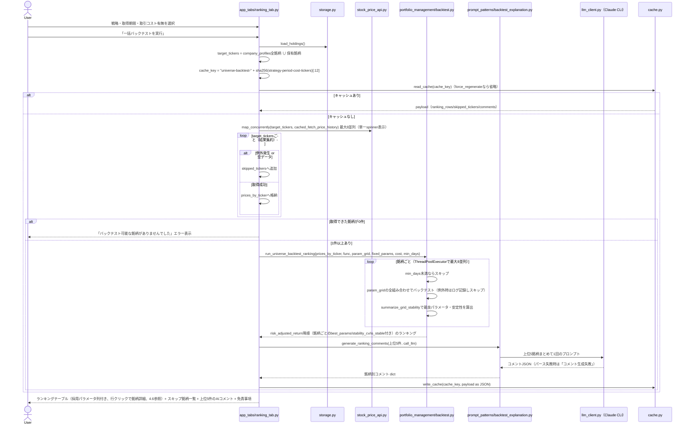

#### ステップ・分岐の説明

1. **対象銘柄の決定**: `load_all_company_profiles()` が返す `company_profiles` の全登録ティッカーと現在の保有銘柄ティッカーの**和集合**を対象にする。保有銘柄が `company_profiles` 未登録でも対象に含まれる（`save_holdings` 側で `ensure_company_profile_stub` によりスタブ行が自動作成されるため、実運用では基本的に登録済みになる）。
2. **キャッシュ判定**: `"universe-backtest-"` + `strategy-period-cost-対象銘柄一覧` のハッシュをキーにする。**対象銘柄の集合が変わる**（保有銘柄の増減や `company_profiles` への銘柄追加）だけでもキャッシュキーが変わり再計算される。
3. **株価取得の並列化とエラーハンドリング**: `map_concurrently` で対象銘柄すべてを最大8並列に取得する（進捗バーは銘柄単位の逐次表示ではなく、並列バッチ全体を覆う単一の `st.spinner`）。取得中に例外が発生した銘柄、または空データだった銘柄は `skipped_tickers` に記録して処理を継続する。全銘柄が取得失敗した場合のみ致命的エラーとして扱う。
4. **銘柄ごとに近傍グリッドで最良パラメータを探索**: 単一銘柄バックテストと同様の `param_grid`/`fixed_params` を使い、銘柄ごとに全組み合わせをバックテストして `risk_adjusted_return` が最大の組み合わせを採用する（計算は `ThreadPoolExecutor` で最大8並列）。個別銘柄のグリッドサーチで例外が発生した場合はログに記録しその銘柄をランキングから除外する。
5. **ランキング計算**: 銘柄ごとに `min_days` に満たないものは除外。採用した最良パラメータの `risk_adjusted_return` で降順にソートする。各行に採用パラメータ（`best_params`）・変動係数（`stability_cv`）・安定判定（`is_stable`）を保持する。
6. **AIコメントは上位5件のみ**: 全銘柄ではなく上位5件だけをまとめて1回のプロンプトでコメント生成する（コスト・待ち時間対策）。
7. **表示**: ランキング表には保有銘柄・ユニバース双方の日本語名を再解決して付与し、順位列を1から採番する。「採用パラメータ」列に銘柄ごとに探索された最良パラメータを表示する。テーブルは行クリックで銘柄詳細ダイアログ（[4.6](#46-銘柄詳細ダイアログクロスタブ機能)）を開ける。スキップ銘柄がある場合はその一覧を表示し、末尾に免責事項を明示する。

---

### 4.5 セクターローテーション

5タブ中もっとも機能が多く、(a) 時差相関に基づく従来分析（ヒートマップ・上位ペア表・AIコメント）、(b) 全業種ペアを俯瞰する**ネットワーク図**、(c) 時間変化するリード・ラグを可視化する**ウェーブレット分析**の3層で構成される。表示するセクションの選択・並び順・チャート高さは「表示設定」expanderからユーザーが調整でき、設定は `sector_display_settings` テーブル（[5.3](#53-データ永続化)参照）に永続化される。分析の実体（データ取得〜キャッシュ判定〜業種別リターン・リード/ラグ集計）は `app_tabs/shared.py::run_or_load_sector_rotation` に切り出されており、本タブと [4.7 AI戦略ビルダー](#47-ai戦略ビルダー)の「業種ローテーションから本日の注目銘柄を提案」の双方から共有される。

#### シーケンス図（分析実行〜結果保存）

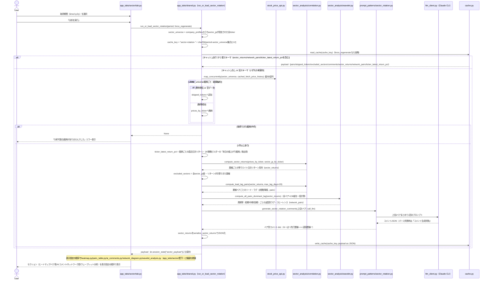

#### ステップ・分岐の説明（分析実行）

1. **業種マッピング**: 旧 `screening/sectors.py::SECTOR_MAP`（固定dict）は廃止され、`company_profiles.sector_jp`（東証17業種区分）列がその役割を引き継いでいる。初期値は旧SECTOR_MAPから生成した `db/seed_company_profiles.csv` を `init_db()` が起動時にupsertすることで投入され、`scripts/import_all_listed_tickers.py`（JPX公式全銘柄一覧 `docs/data_j.xls` を毎回最新版でダウンロードして投入するバッチ、[5.3](#53-データ永続化)参照）で新規上場銘柄等を追加できる。分析対象の `sector_universe` は `company_profiles` のうち `sector_jp` が設定されている（`None`でない）全ティッカーで、固定228銘柄という制約は無くなっている。
2. **キャッシュ判定**: `"sector-rotation-"` + `期間-sector_universe集合` のハッシュをキーにする。`force_regenerate` チェックボックスがオンなら読み込みをスキップする。キャッシュヒットしても `payload` に `sector_returns`・`network_pairs`・`ticker_latest_return_pct` のいずれかのキーが無い場合（各機能追加前に生成された旧スキーマ）は無視して再計算する。
3. **株価取得**: `sector_universe` の全銘柄を `map_concurrently` で最大8並列に取得する（`cached_fetch_price_history` 経由で `st.cache_data(ttl=60秒)` の薄い前段キャッシュも併用、[5.2](#52-キャッシュ機構)参照）。取得失敗・空データの銘柄は `skipped_tickers` に記録し処理を継続、全滅時のみエラー表示。
4. **業種別リターンの計算（`compute_sector_returns`）**: 業種ごとに構成銘柄の日次リターン（`pct_change`）を等ウエイト平均する。`prices_by_ticker` に存在しない（取得失敗）銘柄はスキップし、構成銘柄が1件も取得できなかった業種は `sector_returns` から丸ごと除外される。除外された業種は `excluded_sectors`（`sector_jpの全値 − sector_returnsのキー`）として記録され、画面下部に一覧表示する。あわせて、業種集計前の銘柄別直近日次リターンを `ticker_latest_return_pct` として保持する（[4.7](#47-ai戦略ビルダー)の「本日の値上がり銘柄」検出に使う）。
5. **リード・ラグ相関の計算（`compute_lead_lag_pairs`）**: 業種の全ペア（重複なし）について、`-20〜+20営業日` の範囲でラグをずらしながら相関係数を計算し、絶対値が最大となるラグを採用する。共通の非欠損日数が `max_lag_days`（20）未満のペアは結果から除外する。`lag > 0` は「一方の業種の過去の値がもう一方の現在値と相関する＝過去側の業種が先行（リード）、現在側が追随（ラグ）」と解釈し、`leading_sector`/`lagging_sector`/`lag_days`/`correlation` を持つdictのリストを、相関の絶対値降順で返す。
6. **全ペアのウェーブレット集約（`compute_all_pairs_dominant_lag`）**: 業種の全組み合わせ（17業種なら136ペア）について `compute_cross_wavelet_lead_lag`（後述）を実行し、周期帯（短期/中期/長期）ごとに直近20営業日分のコヒーレンス加重平均ラグへ集約する。個別ペアで例外が発生した場合、またはデータ不足で空の結果になった場合はそのペア・周期帯を結果からスキップし、処理全体は継続する。結果はネットワーク図の描画に使う `network_pairs` としてキャッシュされる。
7. **AIコメント生成**: 相関上位5ペアのみをまとめて1回のプロンプトでコメント生成する（他タブのAIコメントと同じ「上位N件バッチ」パターン）。プロンプトは「過去の統計的傾向の説明にとどめ、将来の値動きの保証や売買の指示的表現をしないこと」を明示する。JSONパースに失敗した場合は該当ペアすべてに「コメント生成失敗」を表示する。
8. **キャッシュへの保存**: `sector_returns`（業種別日次リターン系列）は `serialize_sector_returns` で日付ISO文字列＋数値リスト（NaNは`null`）のJSON可能な形に変換してから、他の計算結果と合わせて1つのJSONペイロードとして保存する。ウェーブレット分析タブはこの `sector_returns` を再利用するため、分析実行のたびに個別銘柄の株価から再計算する必要はない。分析結果は `st.session_state["sector_payload"]` にも保持され、[4.7](#47-ai戦略ビルダー)の「業種ローテーションから本日の注目銘柄を提案」もこの同じセッション状態・関数（`run_or_load_sector_rotation`）を再利用する。

#### 表示設定（`sector_analysis/display_settings.py`）

- 「表示設定」expander内の `st.data_editor` で、5セクション（ヒートマップ／ペア表／AIコメント／ネットワーク図／ウェーブレット分析）それぞれの表示ON/OFFと表示順序（1〜5の整数）を編集できる。ヒートマップ・ネットワーク図・ウェーブレット分析の3セクションは、表示ONの場合のみチャート高さ（250〜900px）のスライダーも表示される。
- 編集結果が現在の設定と異なる場合のみ `save_sector_display_settings(user_id, settings)` でDB（`sector_display_settings`テーブル、ユーザーごとに1行）に書き込み、次回起動時も設定が引き継がれる。
- `load_sector_display_settings(user_id)` はDBに該当ユーザーの行が無い・型不正のいずれの場合も `DEFAULT_SECTOR_DISPLAY_SETTINGS`（全セクション表示ON、定義順、高さ500/400/400px）にフォールバックする（`_normalize`）。旧バージョン形式（`{"heatmap": true, ...}` のようなフラットなbool辞書のみ、DB化前のJSONファイルからの移行データに残り得る）も読み込み可能で、`visible` として扱い `order`/`height` はデフォルト値で補う。
- 実際の描画順序は `app_tabs/sector/tab.py` 側で `section_renderers` dictを `display_settings["order"]` の値でソートして決定する。ヒートマップ・ペア表・AIコメントの3セクションは、有効な業種ペア（`pairs`）が1件もない場合は表示設定に関わらずスキップされる。

#### 各セクションの内容

| セクション                       | 内容                                                                                                                        | 実装モジュール                                                         |
| -------------------------------- | --------------------------------------------------------------------------------------------------------------------------- | ---------------------------------------------------------------------- |
| 業種間相関ヒートマップ           | `pairs` の全ペアから対称な相関行列（`\|correlation\|`）を構築し、Altairの `mark_rect` で描画する。                      | `app_tabs/sector/heatmap.py`（`render_heatmap`）                   |
| リード・ラグ上位ペア             | `leading_sector`/`lagging_sector`/`lag_days`/`correlation` の表と、リード・ラグの読み方を説明する `st.expander`。 | `app_tabs/sector/pairs_table.py`（`render_pairs_table`）           |
| 相関上位5ペアのAIコメント        | `payload["comments"]` を `"<先行業種>-><追随業種>"` キーで参照して表示する。                                            | `app_tabs/sector/ai_comments.py`（`render_ai_comments`）           |
| 業種間ネットワーク（全ペア俯瞰） | 後述（ネットワーク図）。                                                                                                    | `app_tabs/sector/network_diagram.py`（`render_network_diagram`）   |
| ウェーブレット分析               | 後述（ウェーブレット分析）。                                                                                                | `app_tabs/sector/wavelet_analysis.py`（`render_wavelet_analysis`） |

有効な業種ペアが1件もない場合は「有効な業種ペアがありませんでした」と表示する。スキップ銘柄一覧・除外業種一覧・免責事項はセクションの表示設定に関わらず常に末尾に表示する。本タブの結果テーブル（ヒートマップ・ペア表）からは、他タブと異なり**銘柄詳細ダイアログへの導線はない**（対象が「業種」であり個別銘柄ではないため）。

#### ネットワーク図（`sector_analysis/network.py`, `build_mermaid_lead_lag_graph`）

- キャッシュ済みの `network_pairs`（全136ペア×3周期帯のウェーブレット集約結果）から、ユーザーが選んだ**周期帯**（短期/中期/長期のセレクトボックス）と**コヒーレンス閾値**（0〜1のスライダー、デフォルト0.5）でフィルタし、Mermaidの `flowchart LR` 有向グラフ定義文字列を組み立てる。業種名はMermaidのノードID規則に使えない文字（「・」等）を含みうるため、`S0`, `S1`, ... の合成IDをノードIDとし、業種名はラベルとしてのみ使う。エッジには先行→追随の矢印とラグ日数・コヒーレンスを付与する。フィルタ後にエッジが0件になった場合は `None` を返し、UI側は「十分な確信度を持つ関係が見つかりませんでした。閾値を下げてみてください。」と案内する。
- 生成したMermaidコードは `_render_mermaid`（`app_tabs/sector/network_diagram.py`）が、CDNから読み込んだ `mermaid.js` と `svg-pan-zoom.js` を使い `st.iframe` 経由でHTML埋め込みとして描画する。業種間ネットワークは横に広がりやすいため、単純な自動フィットではなく「縦方向優先で拡大しつつ、全体表示時倍率の2倍を上限とする」独自ロジックでズーム倍率を決めており、はみ出した部分はドラッグ・ホイールで閲覧する。

#### ウェーブレット分析（`sector_analysis/wavelet.py`）

通常の時差相関（4節参照）は期間全体で1つの数値しか出せないのに対し、ウェーブレット分析は値動きを周期の長さ（短期/中期/長期）ごとに分解し、時間軸に沿ってリード・ラグ関係の変化を追跡する。ユーザーが業種A・業種Bの組み合わせを選び、明示的にボタンを押した時点で計算する（分析実行時に全ペア分を計算する4.5前半のネットワーク図用集計とは別処理）。

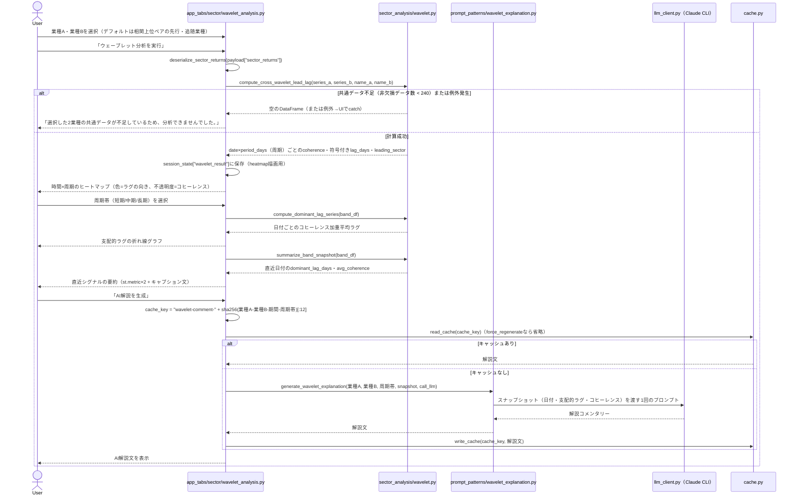

##### ステップ・分岐の説明（ウェーブレット分析）

1. **クロスウェーブレット・コヒーレンス計算（`compute_cross_wavelet_lead_lag`）**: 複素モルレーウェーブレット（`cmor1.5-1.0`）を用いた連続ウェーブレット変換（`pywt.cwt`）を2系列（業種A・業種B）それぞれに適用し、クロスパワースペクトル・自己パワースペクトルを周期の長さに比例した窓幅のboxcarフィルタで時間軸方向に平滑化した上で、コヒーレンス（0〜1、平滑化なしでは常に1になるため必須）と位相差から符号付きラグ（`lag_days`、正なら業種Aが先行）を周期ごとに算出する。周期の探索範囲は4〜120営業日（1オクターブあたり4ボイス）。共通の非欠損データ数が `max_period_days * 2`（240）未満の場合は空のDataFrameを返し、UI側は「選択した2業種の共通データが不足しているため、分析できませんでした。」と案内する。
2. **周期帯の分類（`classify_period_band`）**: 算出した各周期（`period_days`）を短期（4〜10営業日未満）／中期（10〜40営業日未満）／長期（40〜120営業日）の3帯に分類する。範囲外の周期は結果から除外される。
3. **ヒートマップ描画**: 横軸=日付、縦軸=周期（`period_days`、降順）、色（`redblue`スケール、中央値0）=ラグの符号と大きさ、不透明度=コヒーレンス（0〜1を0.05〜1にマッピングし、確からしさが低い部分を視覚的に弱める）で描画する。
4. **支配的ラグの算出（`compute_dominant_lag_series`）**: 選択した周期帯のデータについて、日付ごとにコヒーレンスで加重平均したラグ（`dominant_lag_days`）と、その日の周期方向の単純平均コヒーレンス（`avg_coherence`）を計算する。コヒーレンス合計が0の日付は結果から除外する。
5. **直近シグナルの要約（`summarize_band_snapshot`）**: `compute_dominant_lag_series` の結果のうち最新日付の値をスナップショットとして返す（AIを使わない機械的な数値表示）。有効なデータがなければ `None` を返し、UI側は要約パネルを表示しない。周期帯のセレクトボックスを変更するたびに自動的に再計算される。
6. **AI解説の生成とキャッシュ**: 「AI解説を生成」ボタン押下時のみLLMを呼び出す（自動生成しない）。キャッシュキーは `"wavelet-comment-"` + `業種A-業種B-取得期間-周期帯` のSHA256先頭12桁。`generate_wavelet_explanation`（`build_wavelet_prompt`）は算出済みのスナップショット（日付・支配的ラグ・コヒーレンス）だけをプロンプトに渡し、LLM側での再計算は求めない。表示中の業種ペア・周期帯と異なる古いコメントが残らないよう、`session_state["wavelet_comment"]` には生成時のキー（業種A・業種B・取得期間・周期帯のタプル）も一緒に保持し、現在の選択と一致する場合のみ表示する。

---

### 4.6 銘柄詳細ダイアログ（クロスタブ機能）

特定のタブに属さず、`app_tabs/shared.py` の `@st.dialog`（`show_stock_detail_dialog`）で実装されたモーダル。同じく `shared.py` の `handle_table_selection` を経由して、ポートフォリオタブの保有銘柄一覧（「詳細」ボタンから直接呼び出し）、スクリーニング結果テーブル（行クリック）、一括バックテストのランキングテーブル（行クリック）の3箇所から共通して呼び出される。

#### シーケンス図

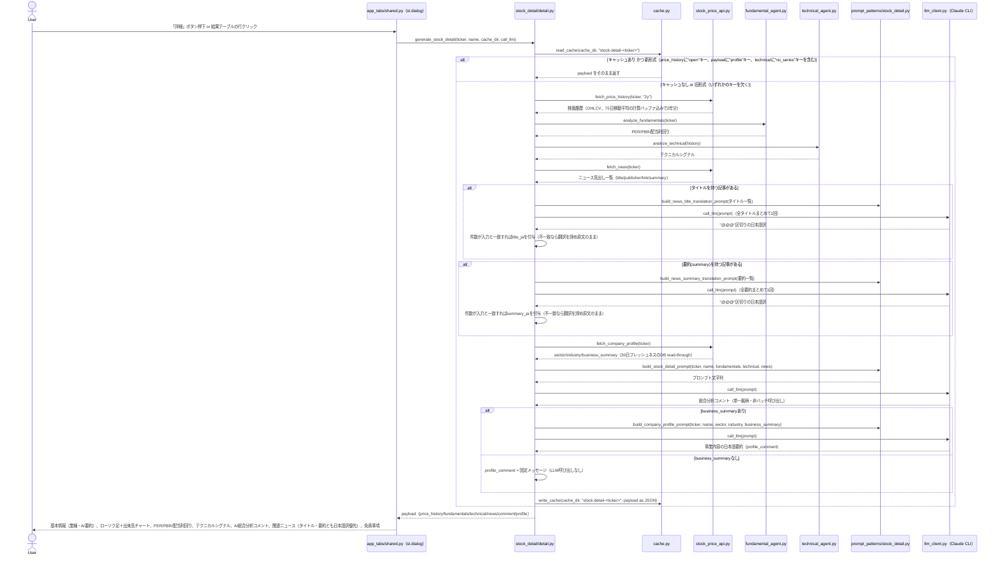

#### ステップ・分岐の説明

1. **キャッシュキー**: 他機能と異なり `"stock-detail-" + ticker` という**ハッシュ化しないキー**を使う（銘柄コードそのものをキーに含める）。当日日付とキー文字列でファイル名が決まる点は他機能と共通（[5.2](#52-キャッシュ機構) 参照）が、**「キャッシュを無視して再生成する」チェックボックスは存在しない**（他4つのキャッシュ利用機能と異なる点）。
2. **旧形式キャッシュの扱い**: OHLCV対応前（終値のみを保存していた時期）のキャッシュには `price_history` に `"open"` キーが存在しないため、`"open" in payload["price_history"]` が偽の場合はキャッシュを無視して再取得・再生成する（ポートフォリオレビューの旧形式フォールバックと同種のパターン）。同様に、`technical` にRSI/ADX/ATRの時系列（`"rsi_series"`）が無い旧形式キャッシュ、および事業内容セクション追加前で `payload` に `"profile"` キーが無い旧形式キャッシュも無効として再生成する。
3. **データ取得**: 株価履歴（OHLCV）・fundamentals・technical・newsを取得する。株価履歴は `fetch_price_history(ticker, "2y")` で**2年分**取得する（75日移動平均線・RSI/ADX/ATRの計算に必要なバッファを確保するため）。株価データが空の場合、チャートは描画せず `st.info("株価データを取得できませんでした。")` を表示するのみで、他の情報（fundamentals・technical・news・AIコメント）の表示は継続する。
4. **ニュースのタイトル・要約の日本語訳**: 画面表示専用に、タイトル一覧・要約一覧をそれぞれ1回のLLM呼び出しでまとめて日本語訳する（`"@@@"` を区切り文字として入力と同じ順序・件数で返すよう指示する）。応答の件数が入力件数と一致しない場合（LLMが指示通りの件数を返さなかった場合）は、誤った記事に翻訳を割り当てるリスクを避け、その種別（タイトル/要約）の翻訳付与を諦めて原文のまま表示する（`logger.warning` で記録）。翻訳結果（`title_ja`/`summary_ja`）はDBの `ticker_news` テーブルには保存されず、この銘柄詳細情報のキャッシュ（`stock-detail-<ticker>`）にのみ含まれる画面表示専用データである。
5. **事業内容（基本情報）の取得・要約**: `fetch_company_profile` は `company_profiles` テーブルの `sector`/`industry`/`business_summary`（yfinance由来、30日フレッシュネスのDB read-through、[5.3](#53-データ永続化)参照）を返す。`business_summary` が空の場合はLLMを呼ばず固定メッセージ（「事業内容の情報が取得できませんでした。」）を使う（無駄な呼び出しを避ける防御的分岐）。
6. **チャート描画**: 取得したOHLCVから `direction`（陽線/陰線）列を作り、Altairでローソク足（`mark_rule` による高値-安値のヒゲ + `mark_bar` による始値-終値の実体）と出来高バーチャートを重ねて表示する（陽線 `#26a69a`／陰線 `#ef5350`）。ローソク足には5日/25日/75日の単純移動平均線（`chart_df["close"].rolling(window=N).mean()`）も重ね描画する（色は青/オレンジ/紫）。移動平均は2年分の取得データ全体で計算してから、表示範囲（直近6ヶ月）に絞り込むため、表示開始時点から途切れなく描画される。続けてRSI（0〜100、70/30に破線）・ADX（25に破線）・ATR%の3つを、`technical["rsi_series"]`/`"adx_series"`/`"atr_pct_series"`（`analyze_technical`が全期間分を計算済み）を同じ直近6ヶ月に絞り込んだ折れ線チャートとして、価格チャートの下に個別のパネルで表示する。
7. **AIコメント生成**: `build_stock_detail_prompt` は「PER/PBR/配当利回り/テクニカルシグナル（移動平均線）/RSI/ADX/ATR/OBV/直近ニュース見出し（要約があれば付記）」を渡し、断定的な売買判断を含めない3〜4文程度の総合分析コメントを1銘柄単位で生成する。他機能（ニュースセンチメント・スクリーニングコメント・ランキングコメント・セクターローテーションコメント）が複数対象を1回のプロンプトにまとめる「バッチ処理」なのに対し、本機能は**ダイアログを開くたびに単一銘柄分だけ**LLMを呼び出す点が異なる（総合コメント1回＋事業内容要約1回＋タイトル/要約翻訳最大2回の、最大4回のLLM呼び出しになりうる）。
8. **表示**: 冒頭に「基本情報」として業種・詳細業種・事業内容のAI要約（`profile_comment`）を表示する。PER/PBR/配当利回りは `st.metric`、値が `None` の場合は「―」を表示する。RSI/ADX/ATR/OBVも `st.metric`（4列）で、値の下に信号ラベル（例: 「買われすぎ」「強いトレンド」）を表示する。関連ニュースは日本語訳（`title_ja`/`summary_ja`）を優先し、無ければ英文原文（`title`/`summary`）を表示する。関連ニュースが0件の場合は「ニュースが取得できませんでした。」と表示する。末尾に免責事項を表示する。

---

### 4.7 AI戦略ビルダー

投資アイデアの入力からAIとの対話によるロジック構築、確定後のパイプライン実行までを1つの画面で完結させるタブ。②の対話で確定候補が生成された直後には、確認前にEvaluator-Optimizerパターンによる自動評価・改善ループを1回だけ実行する。

戦略のスキーマは、`strategy_builder/pipeline_functions.py::PIPELINE_FUNCTIONS`（`BACKTEST_RANK`/`MULTI_STRATEGY_RANK`/`FILTER_CURRENT_SIGNAL`/`FILTER_BY_FUNDAMENTALS`/`SORT_BY`/`TOP_N`）から選んだ関数を順に並べた `[{"function": "...", "params": {...}}, ...]`（`steps`、関数チェーン型パイプライン）の1種類のみ。AI対話のペルソナ指示（`strategy_dialogue.py::_PERSONA_INSTRUCTIONS_TEMPLATE`）はこの形式のみを出力するよう指示する。

#### シーケンス図（②AIとの対話でロジックを構築 〜 確定）

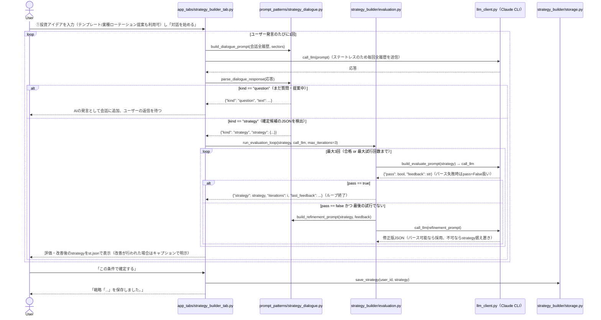

#### ステップ・分岐の説明

1. **①投資アイデアの入力**: テンプレートボタン（バリュー株/グロース株/配当株の3種）、または「業種ローテーションから本日の注目銘柄を提案」expander（セクターローテーションタブと同じ `run_or_load_sector_rotation` を共有し、本日の値上がり銘柄→先行業種→追随業種→候補銘柄を `strategy_builder/sector_insight.py::build_watchlist_from_rotation` で洗い出す）のいずれかから自由記述の投資アイデア欄に反映できる。「対話を始める」ボタン押下時にのみ対話セッション（`strategy_chat_history`）を初期化する。
2. **②対話の実行**: `call_llm` はステートレスなサブプロセス呼び出しのため、ターンごとに会話全履歴を`build_dialogue_prompt`でまとめて再送信する。最後のターンがユーザー発言で確定候補が未確定の場合のみLLMを呼ぶ（同一状態での再実行時に重複呼び出ししないための判定）。
3. **確定候補の判定（`parse_dialogue_response`）**: LLM応答が`strategy_name`と`steps`の両方を含むJSONコードブロックとしてパースできれば`kind: "strategy"`、それ以外（パース不可・いずれかのキー欠落を含む）は`kind: "question"`として会話に追加する。この判定自体が「ユーザーと合意できるまで確定させない」緩やかな確認プロセスとして機能する。
4. **確定候補の自動評価・改善（Evaluator-Optimizer、`strategy_builder/evaluation.py`）**: `kind: "strategy"`と判定された直後、`run_evaluation_loop`を1回だけ実行する。評価基準は (a) 各ステップのfunction・paramsが具体的か (b) 対象銘柄が0件になりそうな過度な絞り込みでないか (c) 断定的な投資助言表現を含まないか、の3点で、戦略JSON全体を評価対象にする。`evaluate_strategy`がJSONパースに失敗、または`pass`キーを含まない場合は安全側に倒し不合格として扱う。不合格時は`build_refinement_prompt`（対話ペルソナ指示は使わない軽量プロンプト）で修正案を生成し、応答が無効なJSON、または`steps`キーを欠く場合はそのイテレーションをスキップし直前の候補のまま次の評価に進む。最大3イテレーションで打ち切り、最後の評価の後には改善案を生成しない（無駄な`call_llm`を避ける）。
5. **確認ステップ（Verification、既存の確認UIとの統合）**: 評価・改善ループ後の最終案を`st.json`で表示する（`iterations > 0`の場合は「AIによる自動改善を行いました。」というキャプションと評価フィードバックを追加表示）。**「この条件で確定する」ボタンを押すまでDB（`strategies`テーブル）には一切保存されない**。「さらに対話を続ける」を選んだ場合は候補・評価結果をクリアし対話を継続する。
6. **保存済み戦略の読み込み**: `load_strategies(user_id)`でDBから該当ユーザーの一覧を取得し、選択後「この戦略を読み込む」を押すと`strategy_confirmed`に直接反映される（この経路は既に確定・保存済みのためEvaluator-Optimizerループを経由しない）。読み込み・新規確定のいずれの場合も、前の戦略に対する実行結果（パイプライン結果テーブル・トレース）は`_clear_strategy_execution_state`でセッションからクリアされる（別の戦略に切り替えたのに前の結果が残り続けることを防ぐ）。

#### シーケンス図（③ パイプラインを実行）

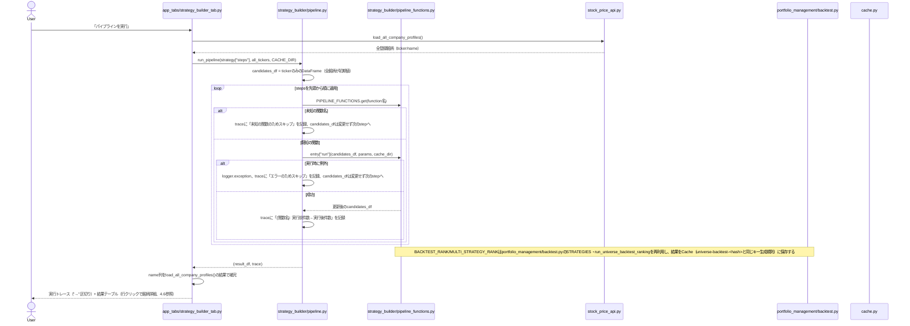

##### ステップ・分岐の説明（パイプライン実行）

1. **初期候補集合**: `all_tickers`（`company_profiles`の全登録ティッカー）のみを列に持つDataFrameを初期値とし、以降の各ステップが順にフィルタ・並び替え・列追加していく。
2. **未知関数・例外への防御的実装**: `run_pipeline`はステップごとに`PIPELINE_FUNCTIONS`から関数を引けない場合、または実行時に例外が発生した場合、そのステップをスキップして直前の`candidates_df`のまま次のステップへ進む（既存の`apply_filters`と同じ「壊れたLLM出力・実行時エラーで処理全体を落とさない」方針）。スキップ理由は`trace`（文字列のリスト）に記録され、画面に「→」区切りで表示される。
3. **BACKTEST_RANK/MULTI_STRATEGY_RANK**: 対象銘柄群を`portfolio_management/backtest.py`の`STRATEGIES`（4戦略）でバックテストし、銘柄ごとに近傍グリッドサーチで最適パラメータを探索してリスク調整済みリターン降順にランキングする（`MULTI_STRATEGY_RANK`は4戦略すべてを試し、`aggregation`パラメータ＝MEAN/CONSENSUS/BESTで銘柄ごとの採用戦略・順位を決める）。結果は`_source_strategy`（採用した戦略名）・`best_params`列を後続ステップに引き継ぐ。キャッシュキーは一括バックテストランキングと同じ`build_universe_backtest_cache_key`で生成するため、対象銘柄・戦略・期間・コストが一致すれば[4.4](#44-一括バックテストランキング)のキャッシュと共有される。
4. **FILTER_CURRENT_SIGNAL**: 各銘柄について、`_source_strategy`列（または`params.strategy`で明示指定）が直近5営業日以内にENTRY/EXITシグナル（戦略ごとに定義されたゴールデンクロス/デッドクロス、売られすぎ回復等）を出したかで絞り込む。`best_params`が欠落・不整合な場合は`STRATEGIES`相当の既定パラメータにフォールバックする。
5. **FILTER_BY_FUNDAMENTALS**: PER/PBR/ROE/配当利回り/売上高伸び率/時価総額/業種（`SECTOR`、`EQUALS`のみ）の条件でフィルタする。内部で`fetch_universe_fundamentals`・`_load_company_profiles_cached`（`load_all_company_profiles`をプロセス内で30秒だけ再利用する薄いラッパー。同一パイプライン実行に本ステップが複数回含まれても、その回数だけcompany_profiles全件スキャンを繰り返さないようにする）を呼んで候補銘柄にfundamentals/sector列を結合してから、`strategy_builder/conditions.py::apply_strategy_conditions`（元は旧`conditions`形式の戦略全体を絞り込むための関数だったが、廃止後は本ステップの内部実装としてのみ残る）を`{"conditions": [...]}`の形で呼んで絞り込む。2回目以降のFILTER_BY_FUNDAMENTALSステップ実行時に備え、`candidates_df`側とfundamentals_df側で重複する列（per/sector等）は結合前にcandidates_df側から落としてから結合する（`per_x`/`per_y`のような重複列名に化けてフィルタが無効化することを防ぐ、冪等性のための実装）。
6. **SORT_BY / TOP_N**: `SORT_BY`はその時点で存在する列（前段のステップが追加した列を含む）で並べ替え、存在しない列なら並べ替えをスキップする。`order`は大文字小文字を区別せず`"desc"`等も降順として扱う（`"DESC"`以外はすべて昇順、という単純な不一致比較ではなく正規化してから比較する）。`TOP_N`は`by`指定があればその列で降順ソートしてから、無ければ直前の並び順のまま先頭n件を取る。
7. **結果表示**: 実行トレースを画面上部にキャプション表示し、結果テーブル（列構成はどのステップを通ったかにより可変）を行クリックで銘柄詳細ダイアログ（[4.6](#46-銘柄詳細ダイアログクロスタブ機能)）を開けるかたちで表示する。

---

### 4.8 AI質問箱

自由記述の投資質問を5カテゴリ（fundamental/technical/news/portfolio/general）に分類し、専用の分析エージェントへ振り分けて回答する（Routingパターン）。既存の分析エージェント（ファンダメンタルズ・テクニカル・ニュース・ポートフォリオ構成/リスク）をほぼそのまま再利用し、新規ドメインロジックを増やさない設計。

#### シーケンス図

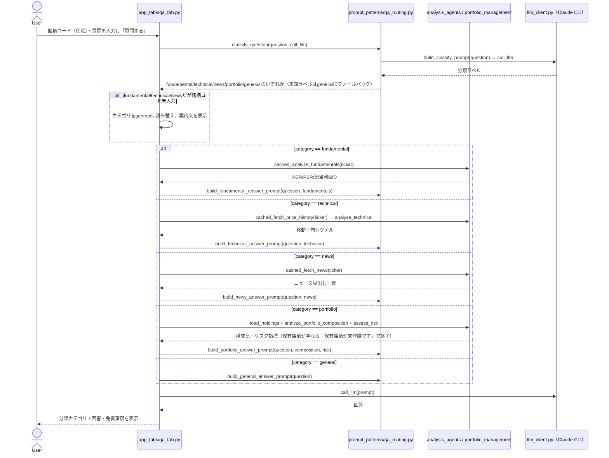

#### ステップ・分岐の説明

1. **分類（Routing）**: `classify_question`は質問文を`build_classify_prompt`で5カテゴリのいずれかに分類させ、未知のラベルや空応答は安全側の`general`にフォールバックする。分類自体も1回のLLM呼び出し。
2. **銘柄コード未入力時のフォールバック**: `fundamental`/`technical`/`news`に分類されたが銘柄コードが未入力の場合は`general`に読み替え、「個別銘柄について聞く場合は銘柄コードを入力してください。一般的な回答を表示します。」と案内する（分類は正しいが実行に必要な入力が欠けているケースへの安全側フォールバック）。
3. **事実データの取得と回答生成**: カテゴリごとに既存の分析エージェント・集計関数（`cached_analyze_fundamentals`/`analyze_technical`/`cached_fetch_news`/`analyze_portfolio_composition`+`assess_risk`）で取得・計算した事実データを、対応する`build_*_answer_prompt`でプロンプトに埋め込んでから2回目のLLM呼び出しで回答させる（事実/考察分離の既存規約に従う）。`portfolio`カテゴリで保有銘柄が0件の場合はLLMを呼ばず「保有銘柄が未登録です。ポートフォリオタブで銘柄を追加してください。」で終了する。
4. **表示専用の低リスク機能**: 誤分類・誤回答があっても実データの操作には影響しないため、確認ステップは設けていない。日次ファイルキャッシュも使わず、質問のたびに毎回LLMを呼び出す（他機能と異なりキャッシュ層の対象外）。

---

### 4.9 管理者タブ

`is_admin=True` のユーザーにのみ `app.py` が8番目のタブとして表示する（[3](#3-機能一覧)参照）。LLMを一切呼び出さず、DBに対するCRUD操作のみで完結する管理機能。3セクションから成り、`render_admin_tab`が上から順に描画する。

#### シーケンス図

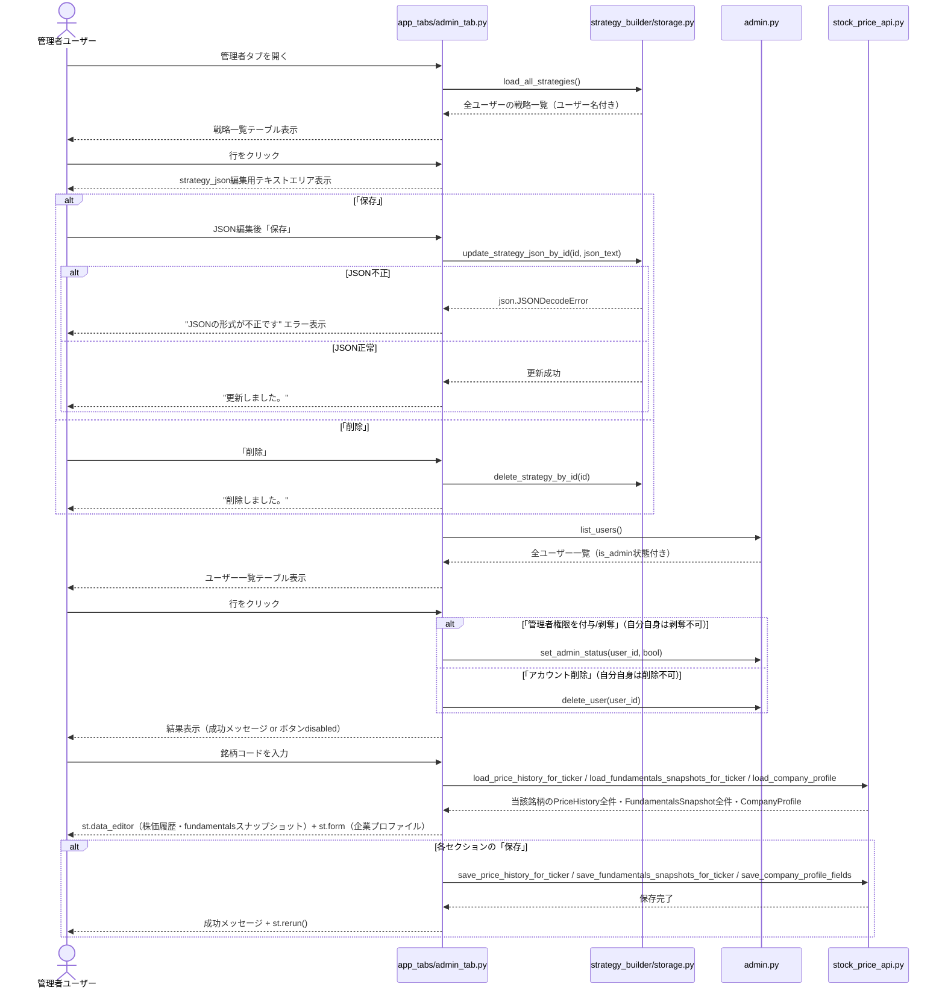

#### ステップ・分岐の説明

1. **全ユーザー戦略管理**: `load_all_strategies()`はDB全件を`(Strategy, User.username)`のJOINで取得する（ユーザーを問わない管理者向け専用関数）。保存済み戦略が1件も無ければ以降の表示をスキップする。テーブルの行選択→JSON編集→保存/削除という操作は[4.7](#47-ai戦略ビルダー)の一般ユーザー向け保存フローとは独立しており、`update_strategy_json_by_id`はJSONとしてパースできれば`strategy_name`キーがあれば戦略名列も同期し、パースできなければ`json.JSONDecodeError`をそのまま`st.error`に表示する（呼び出し元でキャッチ）。
2. **削除直後の選択インデックス処理**: 戦略・ユーザーいずれのテーブルも、削除操作後の`st.rerun()`で一覧が1件短くなるため、直前に選択されていた行インデックス（`st.dataframe`のウィジェット状態に残ったままのことがある）が新しい一覧長に対して範囲外になり得る。`selected_idx >= len(...)`を明示チェックし、範囲外なら選択なし扱いとしてスキップする（`IndexError`回避の防御的実装）。
3. **ユーザーアカウント管理**: `list_users()`で全ユーザー（`username`/`email`/`created_at`/`is_admin`）を一覧表示する。選択行が自分自身（`get_current_user_id()`と一致）の場合、「管理者権限を剥奪」「アカウント削除」ボタンを`disabled=True`にし、キャプションで理由を明示する（最後の管理者が自分の権限を剥奪して管理者不在になる事故、および自己アカウント削除による即時ログアウト相当の事故を防ぐ）。付与・剥奪・削除はいずれも即座にDBへ反映され、確認ダイアログは無い。
4. **市場データ管理**: 銘柄コードを入力すると、`price_history`（日付/OHLCV）・`fundamentals_snapshots`（スナップショット日付/PER/PBR等）・`company_profiles`（日本語名/業種/詳細業種/東証17業種区分/事業内容）の3種類を編集できる。`price_history`と`fundamentals_snapshots`は`st.data_editor`（`num_rows="dynamic"`）で行の追加・削除・編集を行い、「保存」時は`save_price_history_for_ticker`/`save_fundamentals_snapshots_for_ticker`が当該銘柄の既存行を全削除してから編集後の全件で置き換える（`portfolio_management/storage.py::save_holdings`と同じ全置換パターン）。日付未入力の追加行（保存準備が整っていない空行）は保存対象から除外する。`company_profiles`は`st.form`で1行のみを直接UPDATEする（`save_company_profile_fields`）。保存対象の銘柄が`company_profiles`に無い場合は、`price_history`/`fundamentals_snapshots`の保存時に`ensure_company_profile_stub`でスタブ行を自動作成してからFK制約を満たす（[5.3](#53-データ永続化)参照）。
5. **キャッシュ非対象・確認ステップ無し**: 管理者専用のDB直接編集機能であり、日次ファイルキャッシュ（[5.2](#52-キャッシュ機構)）は経由しない。管理者権限を前提とした機能のため、他タブのような「確認してから適用」ステップは設けていない。

---

## 5. 横断的な設計事項

### 5.1 LLM連携（Claude Code CLI / OpenAI API）

- `call_llm(prompt, timeout=120)` は `.streamlit/secrets.toml` の `llm_provider` 設定（省略時は `"claude_cli"`）に応じて `_call_claude_cli()` / `_call_openai()` に振り分ける、プロバイダ非依存の共通呼び出し口。
- `_call_claude_cli()` は `_resolve_claude_executable()`（内部で `shutil.which("claude")`）で解決した実行パスを使い、`subprocess.run([executable, "--system-prompt", ..., "-p"], input=prompt, ...)` の形でプロンプトを**標準入力経由**で渡す。Windowsでは `claude` がnpmの `.cmd` シムに解決されバッチ引数展開でダブルクォート入りのJSONプロンプトが壊れるため、あえてargvではなくstdin経由にしている。CLI未検出時は `ClaudeCLINotFoundError`、サブプロセスの非0終了時は `ClaudeCLIError` を送出する。
- `_call_openai()` は OpenAI Chat Completions API（`openai_model` 設定、省略時は `"gpt-5"`）にシステムプロンプト＋ユーザープロンプトの2メッセージで送信する。`openai_api_key` 未設定時は `OpenAIAPIKeyMissingError`、API呼び出し失敗時は `OpenAIAPIError` を送出する。
- 起動時に `check_llm_available()` で設定済みプロバイダの利用可否を確認し、不可なら全機能を使わせずアプリを停止する。
- JSON形式の応答が必要な箇所（スクリーニング条件変換、各種コメント一括生成、ニュースセンチメント）は共通して「コードブロック不要・JSONのみ出力」と明示し、`common/json_parsing.strip_code_fence` でコードフェンスを除去してから `json.loads` する。パース失敗時は**機能ごとに定めたフォールバック**（「コメント生成失敗」文字列、空dict、エラー表示など）に倒す。
- 複数対象に対する処理（ニュースセンチメント・スクリーニングコメント・ランキングコメント・セクターローテーションコメント）は個別呼び出しではなく**必ず1回のプロンプトにまとめてバッチ処理**する（サブプロセス起動オーバーヘッドの削減）。唯一の例外は銘柄詳細ダイアログのAIコメント（[4.6](#46-銘柄詳細ダイアログクロスタブ機能)）で、こちらは性質上つねに単一銘柄分だけを都度呼び出す。
- 単一のAugmented LLM呼び出しでは表現しづらい構造には、複数LLM呼び出しを組み合わせるパターンを採用している。バックテスト解説（[4.3](#43-バックテスト単一銘柄)）は結果解説→改善提案の**Prompt Chaining**、AI質問箱（[4.8](#48-ai質問箱)）は分類→専用処理の**Routing**、AI戦略ビルダーの確定フロー（[4.7](#47-ai戦略ビルダー)）は評価→改善の**Evaluator-Optimizer**をそれぞれ使う。残りの機能はすべて単発またはバッチの1回呼び出しに留めている。

### 5.2 キャッシュ機構

本アプリには性質の異なる2層のキャッシュが存在する。

**(a) セッション内メモリキャッシュ（`st.cache_data`, TTLベース）**

`app_tabs/shared.py` で以下の薄いラッパー関数として定義され、Streamlitのセッション内で同一引数の呼び出し結果をメモリ上に保持する。実データ自体はすべて（b）とは別にDB（`price_history`/`fundamentals_snapshots`/`company_profiles`/`ticker_news`テーブル、[5.3](#53-データ永続化)参照）でread-through方式により全ユーザー共有・長期キャッシュされているため、この層はDBへの問い合わせすら同一セッション内の連続rerunで繰り返さないための**前段の薄いキャッシュ**という位置づけであり、TTLは短め（60秒）に統一されている。ポートフォリオ・バックテスト・一括バックテスト・セクターローテーションの各タブモジュールから共通してインポートされる。

| 関数                            | ラップ対象               | TTL  |
| ------------------------------- | ------------------------ | ---- |
| `cached_fetch_japanese_name`  | `fetch_japanese_name`  | 60秒 |
| `cached_fetch_price_history`  | `fetch_price_history`  | 60秒 |
| `cached_analyze_fundamentals` | `analyze_fundamentals` | 60秒 |
| `cached_fetch_news`           | `fetch_news`           | 60秒 |

**(b) 日次ファイルキャッシュ（`common/cache.py`, 日付ベース）**

- キャッシュキーは「当日日付＋呼び出し元が指定するキー文字列」で構成されるファイルパス（`data/cache/YYYY-MM-DD-<key>.txt`）。
- 日付が変わると自動的にキャッシュミスになる（同日内のみ再利用）。
- 利用箇所: ポートフォリオレビュー・単一銘柄バックテスト解説（Step1・Step2の結果を結合した1つの文字列として保存、[4.3](#43-バックテスト単一銘柄)参照）・一括バックテストランキング・セクターローテーション分析結果（ネットワーク図データ含む）・ウェーブレット分析AI解説・銘柄詳細情報（詳細は [5.3](#53-データ永続化) の一覧表を参照）。**AI質問箱（[4.8](#48-ai質問箱)）とAI戦略ビルダーの対話・評価ループはこの層を使わない**（質問・対話のたびに毎回LLMを呼び出す）。ユニバースfundamentalsは市場データDB化前はこの層を使っていたが、現在は `fundamentals_snapshots` テーブルのTTL方式read-throughに置き換わり、この層は使わない（[5.3](#53-データ永続化)参照）。
- キー文字列は基本的にSHA256ハッシュの先頭12桁だが、**銘柄詳細情報のみ例外**で `stock-detail-<ticker>` という非ハッシュのキーを使う（銘柄単位で1エントリのため衝突の懸念がなく、ハッシュ化する意味が薄いため）。
- 各タブ（およびウェーブレット分析セクションのAI解説）に「キャッシュを無視して再生成する」チェックボックスがあり、オンの場合は読み込みをスキップして必ず再計算する（書き込みは常に行われ、既存キャッシュを上書きする）。**銘柄詳細ダイアログのみこのチェックボックスが無く**、常に同日キャッシュがあれば再利用する。
- AI戦略ビルダーで保存する戦略（`strategies`テーブル、[5.3](#53-データ永続化)参照）は、この日次ファイルキャッシュとは別物の**ユーザー入力データ**（明示的な「確定する」操作でのみ更新され、日付が変わっても消えない永続データ）である。

### 5.3 データ永続化

ユーザー固有データと、全ユーザーで共有する市場データは **SQLite（`data/app.db`、SQLAlchemy ORM）** に永続化する（`db/models.py` がテーブル定義、`db/engine.py` がエンジン生成・スキーマ初期化を担う）。LLM呼び出し・API呼び出し結果の「使い捨て」データ（[5.2](#52-キャッシュ機構) (b)参照）は従来どおり `data/cache/` 配下の日次ファイルキャッシュのまま使う。保存先はすべて `data/` 配下にまとまっており、**丸ごと `.gitignore` 対象**でGitには一切コミットされない。

```
data/
  app.db                          # SQLiteデータベース（ユーザー固有データ + 全ユーザー共有の市場データ）
  cache/                          # LLM呼び出し・API呼び出し結果の日次キャッシュ（すべて再生成可能）
    YYYY-MM-DD-<種別>-<hash または ticker>.txt
  *.json.migrated                 # DB化前の永続化ファイル（移行済み・参照されない。下記「データ移行」参照）
```

#### ER図

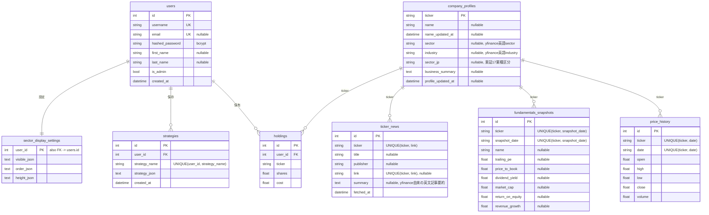

`price_history`・`fundamentals_snapshots`・`company_profiles`・`ticker_news`・`holdings` の5テーブルは `ticker`（銘柄コード文字列）をキーに参照される。`company_profiles` を銘柄マスタとして、`price_history`/`fundamentals_snapshots`/`ticker_news`/`holdings` の `ticker` 列には `company_profiles.ticker` への外部キー制約を設定しており（`db/engine.py` で `PRAGMA foreign_keys=ON` を有効化して実効化）、上記ER図の実線はこれを表す。書き込み側（`data_api/stock_price_api.py::ensure_company_profile_stub`、`portfolio_management/storage.py::save_holdings`・`scripts/migrate_to_db.py::migrate_holdings` から利用）は、対象tickerの `company_profiles` 行が無ければ書き込み前に空のスタブ行（ticker列のみ）を自動作成するため、`stock_detail/detail.py` のように `fetch_price_history` を `fetch_company_profile` より先に呼ぶ既存の呼び出し順序でも破綻しない。本制約導入前に作られた既存DBに対しては、`db/engine.py::init_db()` が起動時に (1) 孤児ticker（子テーブルにはあるが `company_profiles` に無いticker）をスタブ補完し、(2) `company_profiles` 宛のFK制約が未宣言のテーブルのみ作り直す、という軽量マイグレーションを自動実行する（SQLiteはALTER TABLEでのFK制約後付けに対応していないため）。`holdings` は移行前から `user_id -> users.id` のFKを持つため、「FKが1つも無いか」ではなく「`company_profiles` 宛のFKがあるか」で判定し、既存のFKを失わずに作り直す。

#### テーブルの用途

| テーブル                    | スコープ       | 用途・特記事項                                                                                                                                                                                                                                                                                                                                                                                                                                                                                                                                                                                                                                                                                                                                                                                                                                                                                              |
| --------------------------- | -------------- | ----------------------------------------------------------------------------------------------------------------------------------------------------------------------------------------------------------------------------------------------------------------------------------------------------------------------------------------------------------------------------------------------------------------------------------------------------------------------------------------------------------------------------------------------------------------------------------------------------------------------------------------------------------------------------------------------------------------------------------------------------------------------------------------------------------------------------------------------------------------------------------------------------------- |
| `users`                   | ユーザー       | 認証情報（`streamlit-authenticator` が要求する `username`/`email`/`hashed_password`）。`hashed_password` は `bcrypt`（移行スクリプトのハッシュと `streamlit-authenticator` のハッシュ方式を一致させている）。`first_name`/`last_name`/`is_admin` はいずれも後から追加した列で、`db/engine.py::init_db()` が `PRAGMA table_info` で既存列を確認し無ければ `ALTER TABLE` する軽量マイグレーションで既存DBへ自動追従する（Alembic等は不使用の方針）。管理者が1人もいなければ `MIN(id)` のユーザーへ自動的に `is_admin` を付与する。                                                                                                                                                                                                                                                                                                                                              |
| `holdings`                | ユーザー       | 保有銘柄（`portfolio_management/storage.py`）。`save_holdings` は既存行を全削除してから渡された全件で置き換える方式。                                                                                                                                                                                                                                                                                                                                                                                                                                                                                                                                                                                                                                                                                                                                                                                   |
| `strategies`              | ユーザー       | AI戦略ビルダーで確定・保存した戦略（`strategy_builder/storage.py`）。`(user_id, strategy_name)` の複合UNIQUE制約により同名戦略は上書き。                                                                                                                                                                                                                                                                                                                                                                                                                                                                                                                                                                                                                                                                                                                                                                |
| `sector_display_settings` | ユーザー       | セクターローテーションタブの表示設定（`sector_analysis/display_settings.py`）。`user_id` を主キー兼外部キーとする1ユーザー1行の構成。                                                                                                                                                                                                                                                                                                                                                                                                                                                                                                                                                                                                                                                                                                                                                                   |
| `price_history`           | 全ユーザー共有 | 日次OHLCV。`data_api/stock_price_api.py::fetch_price_history` が read-through方式で管理する：DB上のデータが鮮度切れの場合は常に `_MAX_FETCH_PERIOD="5y"`（アプリ内最大期間）分をyfinanceから取得してDBへ追記し、要求期間分をDBから組み立てて返す（期間ごとに異なる要求が来ても再フェッチ不要にする設計）。                                                                                                                                                                                                                                                                                                                                                                                                                                                                                                                                                                                              |
| `fundamentals_snapshots`  | 全ユーザー共有 | PER/PBR/配当利回り等の日次スナップショット。TTL方式（当日分があれば再利用）。                                                                                                                                                                                                                                                                                                                                                                                                                                                                                                                                                                                                                                                                                                                                                                                                                               |
| `company_profiles`        | 全ユーザー共有 | 銘柄コードを主キーに、日本語名（`data_api/stock_price_api.py::fetch_japanese_name`）と業種・事業概要（`data_api/stock_price_api.py::fetch_company_profile`）・東証17業種区分（`sector_jp`、管理者タブまたは`scripts/import_all_listed_tickers.py`経由でのみ更新）を1テーブルに統合。取得元ごとに `name_updated_at`/`profile_updated_at` を独立管理し、それぞれ別のTTL（当日/30日）で更新判定する。旧`screening/universe.py`（`UNIVERSE`/`UNIVERSE_NAMES`）・`screening/sectors.py`（`SECTOR_MAP`）に代わる、アプリが分析対象とする銘柄一覧の**単一の情報源**（`data_api/stock_price_api.py::load_all_company_profiles`が全件取得口）。初期データは旧UNIVERSE_NAMES/SECTOR_MAPから生成した`db/seed_company_profiles.csv`を`init_db()`が起動時にupsertする形で投入され、`scripts/import_all_listed_tickers.py`実行でJPX公式全銘柄（ETF/REIT等含む）へ拡張できる（後述）。 |
| `ticker_news`             | 全ユーザー共有 | ニュース見出し・要約（`summary`、yfinance由来の英文）。毎回フェッチしてDBに追記したうえで、DB上位N件を返す（`link` があれば `(ticker, link)` でUNIQUE、`link` が無い記事は `(ticker, title, publisher)` でアプリ側dedup）。画面表示専用の日本語訳（`title_ja`/`summary_ja`）はDBには保存せず、銘柄詳細ダイアログ生成時（[4.6](#46-銘柄詳細ダイアログクロスタブ機能)）に都度LLMで翻訳し、その結果は`stock-detail-<ticker>`の日次ファイルキャッシュ側にのみ含まれる。                                                                                                                                                                                                                                                                                                                                                                                                                          |

`fetch_universe_fundamentals`/`fetch_universe_price_histories`（スクリーニング・一括バックテスト・AI戦略ビルダーで使用）は、銘柄ごとの上記read-through関数を `common/concurrency.py::map_concurrently` で並行呼び出しするだけの薄い集約関数で、専用のファイルキャッシュは持たない（DB自体が恒久キャッシュとして機能するため）。yfinance側のレート制限（`YFRateLimitError`）に対しては、`data_api/stock_price_api.py::_call_with_rate_limit_retry`が全yfinance呼び出し（株価・fundamentals・企業プロファイル・ニュース）を30秒→60秒→120秒のバックオフで自動リトライし、それでも解消しない場合は例外を呼び出し元へ伝播させる（[5.5](#55-エラーハンドリング一覧)参照）。

#### データ移行

DB化前は `holdings.json`/`sector_display_settings.json`/`strategies.json` にユーザー入力データを保存していた。`scripts/migrate_to_db.py`（一回限りの対話的CLI）が、これらのファイルを最初の登録ユーザーのデータとしてDBへ移行し、移行元ファイルは `.json.migrated` にリネームして残す（読み込みには使われない）。

#### 初期データ投入・定期更新バッチ

- **初期投入（`init_db()`起動時）**: `db/seed_company_profiles.csv`（旧`UNIVERSE_NAMES`/`SECTOR_MAP`から一度だけ生成した静的データ、ticker/name/sector_jp）を、`company_profiles`に該当ticker行が無ければ新規作成、あってもname/sector_jpがNULLの列のみ埋める形でupsertする（既にyfinance取得済みの値や管理者編集値は上書きしない）。
- **`scripts/import_all_listed_tickers.py`（手動実行、`import_all_listed_tickers.bat`経由）**: JPX公式サイトから東証上場銘柄一覧（`data_j.xls`）の最新リンクを毎回解決してダウンロードし（あわせて`docs/data_j.xls`を上書き保存）、ETF/REIT/PRO Market等を含む全銘柄を`company_profiles`へupsertする。「17業種区分」が`"-"`（業種分類対象外）の銘柄は`sector_jp`を`None`のままにする。新規上場銘柄の反映やETF等の追加対象を広げる用途で、定期実行はスケジューラに組み込まれておらず手動運用が前提（[6](#6-未実装将来課題)参照）。
- **`scripts/update_market_data.py`（Windowsタスクスケジューラ等から`update_market_data.bat`経由での定期実行を想定）**: `company_profiles`に登録済みの全銘柄を対象に、`price_history`/`fundamentals_snapshots`/`ticker_news`/`company_profile`（sector/industry/business_summary）の4フェーズを順に更新する。対話UI（数百銘柄規模）と異なり数千件規模を4フェーズ連続でyfinanceへアクセスするため、`map_concurrently`の同時実行数を既定の8から3へ絞ってレート制限を回避する。フェーズ・銘柄単位で失敗を記録して処理を継続し、1件でも失敗があれば終了コード1を返す（バッチ全体は落とさない防御的実装）。

#### 日次ファイルキャッシュのデータ一覧（[5.2](#52-キャッシュ機構) (b)）

| データ                                    | 保存先                                                 | キー・形式                                                                                                                                                                                                                                                                                                                                                                                                                                                                                                                 | 生成元                                                                                                                      |
| ----------------------------------------- | ------------------------------------------------------ | -------------------------------------------------------------------------------------------------------------------------------------------------------------------------------------------------------------------------------------------------------------------------------------------------------------------------------------------------------------------------------------------------------------------------------------------------------------------------------------------------------------------------- | --------------------------------------------------------------------------------------------------------------------------- |
| ポートフォリオレビュー結果                | `data/cache/YYYY-MM-DD-portfolio-review-<hash>.txt`  | JSON文字列`{"report", "news_by_ticker", "news_sentiment_by_ticker"}`。キーは保有銘柄の `ticker:shares:cost` 連結のSHA256先頭12桁                                                                                                                                                                                                                                                                                                                                                                                       | ポートフォリオタブ「レビューを生成」                                                                                        |
| 単一銘柄バックテスト解説                  | `data/cache/YYYY-MM-DD-backtest-<hash>.txt`          | 解説文＋改善提案（プレーンテキスト、Prompt Chaining Step1・Step2を結合した1つの文字列）。キーは戦略名・銘柄・期間・取引コストのSHA256先頭12桁                                                                                                                                                                                                                                                                                                                                                                              | バックテストタブ「バックテストを実行」                                                                                      |
| 一括バックテストランキング                | `data/cache/YYYY-MM-DD-universe-backtest-<hash>.txt` | JSON文字列`{"ranking_rows", "skipped_tickers", "comments"}`。`ranking_rows`の各行は銘柄ごとに探索された`best_params`・`stability_cv`・`is_stable`を含む。キーは戦略・期間・コスト・対象銘柄一覧のSHA256先頭12桁                                                                                                                                                                                                                                                                                                  | 一括バックテストタブ「一括バックテストを実行」                                                                              |
| セクターローテーション分析結果            | `data/cache/YYYY-MM-DD-sector-rotation-<hash>.txt`   | JSON文字列`{"pairs", "skipped_tickers", "excluded_sectors", "comments", "sector_returns", "network_pairs", "ticker_latest_return_pct"}`。キーは期間・sector_universe集合（`company_profiles`のうち`sector_jp`設定済み銘柄）のSHA256先頭12桁。`sector_returns`は業種別日次リターン系列（ウェーブレット分析の再計算元）、`network_pairs`は全ペア×周期帯の支配的ラグ集約（ネットワーク図の描画元）、`ticker_latest_return_pct`は銘柄別直近日次リターン（[4.7](#47-ai戦略ビルダー)の「本日の値上がり銘柄」検出元） | セクターローテーションタブ「分析を実行」（`app_tabs/shared.py::run_or_load_sector_rotation`、AI戦略ビルダータブとも共有） |
| ウェーブレット分析AI解説                  | `data/cache/YYYY-MM-DD-wavelet-comment-<hash>.txt`   | 解説文（プレーンテキスト）。キーは業種A・業種B・取得期間・周期帯のSHA256先頭12桁                                                                                                                                                                                                                                                                                                                                                                                                                                           | ウェーブレット分析セクション「AI解説を生成」                                                                                |
| 銘柄詳細情報                              | `data/cache/YYYY-MM-DD-stock-detail-<ticker>.txt`    | JSON文字列`{"ticker", "name", "price_history"(OHLCV), "fundamentals", "technical", "news"(title_ja/summary_ja含む), "comment", "profile"(sector/industry/profile_comment)}`。キーはハッシュ化せず**ティッカーそのまま**                                                                                                                                                                                                                                                                                            | 銘柄詳細ダイアログ（`stock_detail/detail.py`）                                                                            |
| AI戦略ビルダー パイプライン内バックテスト | `data/cache/YYYY-MM-DD-universe-backtest-<hash>.txt` | 一括バックテストランキングと同一形式・同一キー生成規則（`build_universe_backtest_cache_key`）。`BACKTEST_RANK`/`MULTI_STRATEGY_RANK`ステップが対象銘柄・戦略・期間・コストが一致する既存キャッシュを再利用する                                                                                                                                                                                                                                                                                                       | AI戦略ビルダータブ「パイプラインを実行」（[4.7](#47-ai戦略ビルダー)参照）                                                    |

#### 保管方式のポイント（`common/cache.py`）

- ファイル名は `data/cache/<今日の日付>-<呼び出し元指定のキー>.txt` という規則で、パスそのものが「キャッシュキー」を兼ねる単純な仕組み（このキャッシュ層自体はDBを使わない）。
- **日付がファイル名の一部**のため、日をまたぐと自動的にキャッシュミス扱いになり再生成される（同日内のみ再利用、TTL管理などは行わない）。
- 各タブの「キャッシュを無視して再生成する」チェックボックスをオンにすると読み込みをスキップし、常に再計算のうえ同名ファイルを上書きする（銘柄詳細ダイアログを除く）。
- キャッシュファイルの旧形式（JSONDecodeError、または銘柄詳細情報の場合はOHLCV拡張前の `price_history` 形式）はキャッシュミスとして扱われ再生成される。`load_holdings`（DB read）は該当ユーザーの行が1件も無ければ空リストを返す。

#### 外部送信について

- ユーザー固有データ・市場データ（`data/app.db`）およびキャッシュデータ（`data/cache/`）はローカルに留まり、外部サーバーへの送信は行わない。
- 例外は **LLM呼び出し時**で、事実データ（構成比・リスク指標・株価・ニュース見出しなど）がプロンプトの一部としてClaude Code CLI経由でAnthropicへ送信される。これは各機能のシーケンス図中の `call_llm` 呼び出しに該当する。

### 5.4 免責事項の扱い

- `DISCLAIMER_NOTICE` をサイドバーに常時表示するほか、ポートフォリオレビュー・バックテスト解説の本文冒頭と末尾、一括バックテストランキング画面の末尾、セクターローテーション分析結果（表示設定に関わらず常に表示）の末尾、銘柄詳細ダイアログの末尾に必ず挿入する。
- 各種プロンプトで「売買の推奨・指示・目標株価の提示をしないこと」を明示し、AIの考察はPython側で計算した「事実データ」と表示上分離する。

### 5.5 エラーハンドリング一覧

| 事象                                                                                                           | 挙動                                                                                                                                                                                                                      |
| -------------------------------------------------------------------------------------------------------------- | ------------------------------------------------------------------------------------------------------------------------------------------------------------------------------------------------------------------------- |
| Claude Code CLI未検出（`llm_provider = "claude_cli"`時）                                                     | アプリ起動時に`st.error` 表示＋`st.stop()`（`ClaudeCLINotFoundError`）                                                                                                                                              |
| LLMサブプロセスの非0終了（`llm_provider = "claude_cli"`時）                                                  | `ClaudeCLIError` を送出（呼び出し元でエラー表示）                                                                                                                                                                       |
| OpenAI APIキー未設定（`llm_provider = "openai"`時）                                                          | アプリ起動時に`st.error` 表示＋`st.stop()`（`OpenAIAPIKeyMissingError`）                                                                                                                                            |
| OpenAI API呼び出し失敗（`llm_provider = "openai"`時）                                                        | `OpenAIAPIError` を送出（呼び出し元でエラー表示）                                                                                                                                                                       |
| LLM応答のJSONパース失敗（スクリーニング条件）                                                                  | 「条件の解釈に失敗しました」エラー表示、以降の処理を行わない                                                                                                                                                              |
| LLM応答のJSONパース失敗（各種コメント・センチメント）                                                          | 該当箇所のみ「生成失敗」文字列や空値にフォールバックし、他の表示は継続                                                                                                                                                    |
| 対象ユーザーの保有銘柄が0件（`load_holdings`）                                                               | 空リストを返す                                                                                                                                                                                                            |
| 個別銘柄の株価データ取得失敗（ポートフォリオ）                                                                 | `map_concurrently` が例外を捕捉、その銘柄の`current_prices`/`price_histories` を欠落させたまま処理継続                                                                                                              |
| 個別銘柄のfundamentals取得失敗（スクリーニング）                                                               | `fetch_universe_fundamentals` 内で該当銘柄を結果からスキップし処理継続                                                                                                                                                  |
| 個別銘柄の株価データ取得失敗（一括バックテスト）                                                               | `skipped_tickers` に記録し処理継続、全滅時のみエラー表示                                                                                                                                                                |
| 個別銘柄のグリッドサーチ計算失敗（一括バックテスト）                                                           | `logger.exception` でログに記録し、その銘柄をランキング結果から除外して処理継続（`run_universe_backtest_ranking`）                                                                                                    |
| 個別銘柄の株価データ取得失敗（セクターローテーション）                                                         | `skipped_tickers` に記録、構成銘柄が全滅した業種は `excluded_sectors` に記録、全滅時のみエラー表示                                                                                                                    |
| ペア単位のウェーブレット集約失敗（ネットワーク図データ計算）                                                   | `compute_all_pairs_dominant_lag` 内で該当ペア・周期帯を結果からスキップし処理継続                                                                                                                                       |
| ネットワーク図でコヒーレンス閾値を満たすペアが0件                                                              | `build_mermaid_lead_lag_graph` が`None`を返し、「十分な確信度を持つ関係が見つかりませんでした。閾値を下げてみてください。」と表示                                                                                     |
| ウェーブレット分析で2業種の共通データが不足/計算例外                                                           | 空のDataFrame（または例外をUI側でcatch）を経て「選択した2業種の共通データが不足しているため、分析できませんでした。」と表示                                                                                               |
| 銘柄詳細ダイアログで株価データが空                                                                             | `st.info("株価データを取得できませんでした。")` のみでチャート省略、他情報は表示継続                                                                                                                                    |
| バックテスト対象の日数不足                                                                                     | エラー表示のみで実行しない                                                                                                                                                                                                |
| バックテスト解説Step1（結果解説）が空文字                                                                      | Step2（改善提案）に進まず「解説の生成に失敗しました。」を返す                                                                                                                                                             |
| バックテスト解説Step2（改善提案）が空文字                                                                      | 改善提案セクションのみ省略し、Step1の結果解説は表示する                                                                                                                                                                   |
| AI質問箱の分類ラベルが未知/空、または個別銘柄カテゴリで銘柄コード未入力                                        | `general`にフォールバックし、後者は案内文を表示                                                                                                                                                                         |
| AI質問箱でポートフォリオ質問時に保有銘柄が0件                                                                  | LLMを呼ばず「保有銘柄が未登録です。」と表示                                                                                                                                                                               |
| AI戦略ビルダーの評価（`evaluate_strategy`）がJSONパース失敗、または`pass`キー欠落                          | 不合格として扱い改善ループを継続（安全側フォールバック）                                                                                                                                                                  |
| AI戦略ビルダーの改善案（`build_refinement_prompt`応答）が無効なJSON、または`steps`キーを欠落               | そのイテレーションをスキップし直前の戦略のままループ継続                                                                                                                                                                  |
| AI戦略ビルダーのパイプライン実行（`run_pipeline`）で未知の`function`名、またはステップ実行時に例外         | そのステップをスキップして`trace`に理由を記録し、直前の`candidates_df`のまま次のステップへ継続                                                                                                                        |
| yfinance呼び出し（株価・fundamentals・企業プロファイル・ニュース）がレート制限（`YFRateLimitError`）に達した | `_call_with_rate_limit_retry`が30秒→60秒→120秒のバックオフで自動リトライし、それでも解消しなければ例外を呼び出し元へ伝播                                                                                              |
| 管理者タブの戦略/ユーザー一覧で、削除操作直後のrerunで選択行インデックスが新しい一覧長に対して範囲外           | `selected_idx >= len(...)`を明示チェックし、選択なし扱いとしてスキップ（`IndexError`回避）                                                                                                                            |
| 旧形式キャッシュ（フォーマット非互換）                                                                         | JSONDecodeError、（銘柄詳細情報の場合）`"open"`/`"profile"`/`"rsi_series"`キー欠落、または（セクターローテーションの場合）`sector_returns`/`network_pairs`/`ticker_latest_return_pct`キー欠落として扱い再生成 |

### 5.6 テスト方針

- `data_api` / `analysis_agents` / `portfolio_management` / `prompt_patterns` / `sector_analysis` / `stock_detail` / `strategy_builder` / `db` / `scripts` / `common` の純粋関数を pytest でユニットテストする（`tests/` 配下、機能ごとに1ファイル対応。`test_concurrency.py`・`test_sector_correlation.py`・`test_sector_rotation_prompt.py`・`test_stock_detail.py`・`test_stock_detail_prompt.py`・`test_stock_price_api.py`・`test_sector_display_settings.py`・`test_sector_network.py`・`test_sector_wavelet.py`・`test_wavelet_explanation_prompt.py`・`test_qa_routing.py`・`test_strategy_builder_conditions.py`・`test_strategy_builder_evaluation.py`・`test_strategy_builder_sector_insight.py`・`test_strategy_builder_storage.py`・`test_strategy_builder_pipeline.py`・`test_strategy_builder_pipeline_functions.py`・`test_strategy_dialogue_prompt.py`・`test_db_engine.py`・`test_auth.py`・`test_admin.py`・`test_migrate_to_db.py`・`test_import_all_listed_tickers.py`・`test_seed_company_profiles.py`・`test_update_market_data.py` など新規モジュールにも1:1でテストファイルが対応している）。ループ制御（`run_evaluation_loop`）のようにUIから独立させられるロジックは、純粋関数として切り出したうえでユニットテストする。旧`screening`パッケージ（`test_universe.py`・`test_sectors.py`）は`universe.py`/`sectors.py`本体の削除にあわせて削除済み。同様に、AI戦略ビルダーの旧`conditions`形式専用だった`strategy_builder/backtest.py`（`run_strategy_backtest`）とその`test_strategy_builder_backtest.py`も、`conditions`形式廃止（後述）にあわせて削除済み。
- yfinance呼び出し・`call_llm`（サブプロセス）は各テストでモック化し、外部通信やCLI起動なしに検証する。
- Streamlit UI（`app.py` + `app_tabs/` 配下の各タブモジュール）自体はロジックを持たせず、テスト可能な関数への薄い呼び出しに留め、UI動作は `uv run python -m streamlit run app.py` での手動確認に委ねる。

## 6. 未実装・将来課題（README・既存設計書からの補足）

- MCPサーバー経由でのデータ取得への置き換え
- レポートのメール/Slack自動送信
- `scripts/import_all_listed_tickers.py`（JPX上場銘柄一覧の`company_profiles`への取り込み）は`scripts/update_market_data.py`の定期更新バッチには含まれず、手動実行（`import_all_listed_tickers.bat`）が前提。新規上場・上場廃止銘柄の反映、および業種分類（`sector_jp`）の追随は定期自動照合の仕組みが無く手作業運用となる
