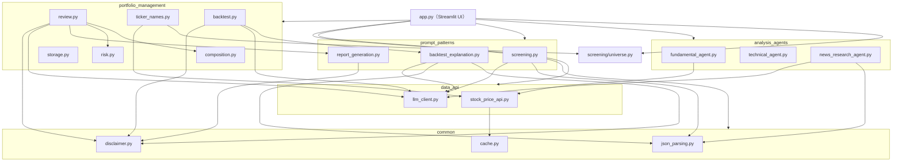
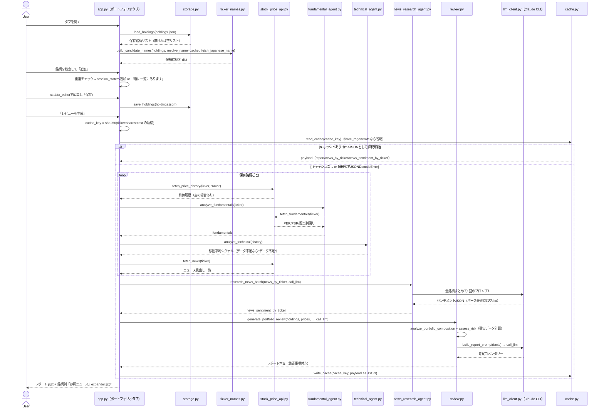
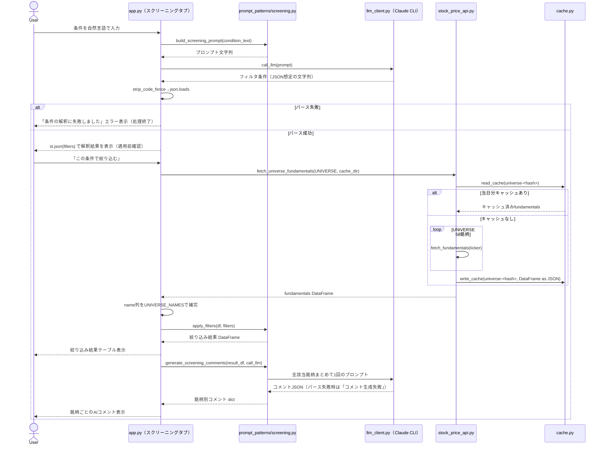
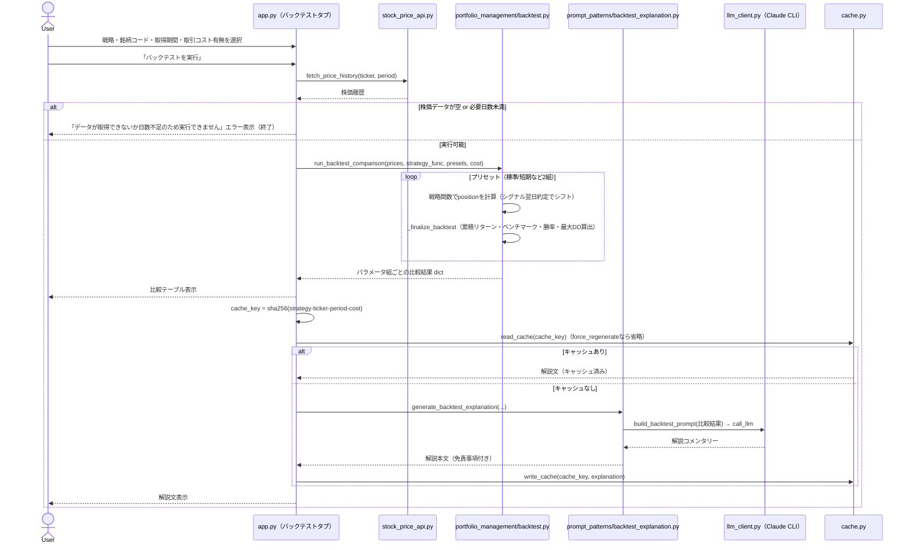
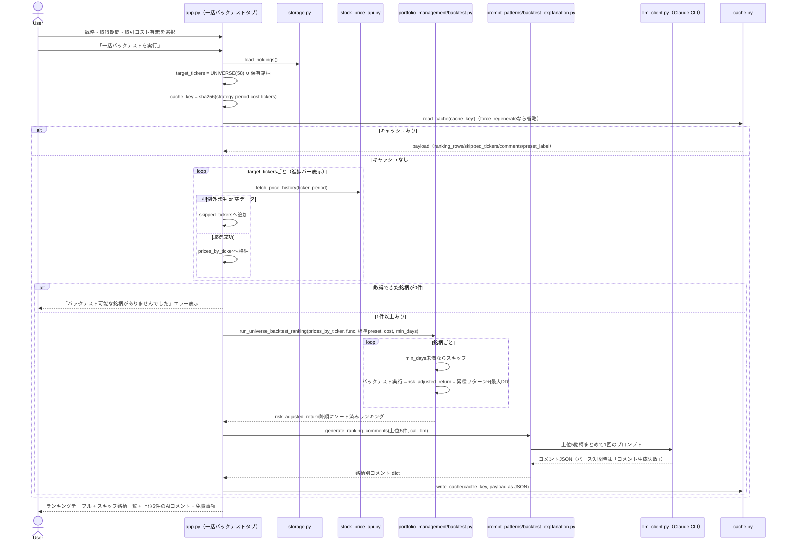

# 株投資リサーチアプリ 設計資料

> 本資料は `ai-stock-investing-tutorial/app` の実装済みコードから起こしたリファレンス設計書です。
> 個別機能の意思決定の経緯（検討した代替案など）は [`docs/superpowers/specs/`](superpowers/specs/) 配下の各設計書を参照してください。本資料はそれらを踏まえた**全体構成と現状の挙動**の整理を目的とします。

## 1. 概要

- [ai-stock-investing-tutorial](../../README.md) の教材内容（プロンプト設計・データAPI連携・分析エージェント・ポートフォリオ管理・バックテスト）を統合した、個人利用向けのStreamlit Webアプリ。
- 教育目的の参考実装であり、投資助言を目的としない。生成される全レポートに免責事項（[`common/disclaimer.py`](../common/disclaimer.py)）を明示する。
- LLM呼び出しはOpenAI/Anthropic APIキーを直接使わず、ログイン済みの **Claude Code CLI**（`claude -p`）をサブプロセスとして実行する方式を採る。

## 2. 構成

### 2.1 技術スタック

| 項目               | 内容                                                                                          |
| ------------------ | --------------------------------------------------------------------------------------------- |
| UI                 | Streamlit（`st.tabs` によるタブ切替、単一プロセス）                                         |
| データ処理         | pandas                                                                                        |
| 株価・ニュース取得 | yfinance                                                                                      |
| 日本語銘柄名取得   | Yahoo!ファイナンス日本版のHTMLタイトルを`requests` でスクレイピング                         |
| LLM                | Claude Code CLI（`subprocess.run(["claude", "--system-prompt", ..., "-p"], input=prompt)`） |
| パッケージ管理     | uv（Python 3.14系）                                                                           |
| テスト             | pytest（yfinance・`call_llm` はモック化）                                                   |

### 2.2 ディレクトリ構成

```
app/
  app.py                        # Streamlitエントリーポイント（4タブ切替、ロジックの呼び出しのみ）
  data_api/
    stock_price_api.py          # fetch_price_history / fetch_fundamentals / fetch_news /
                                 # fetch_japanese_name / fetch_universe_fundamentals（キャッシュ付き）
    llm_client.py                # call_llm, check_claude_cli_available（Claude Code CLIサブプロセス呼び出し）
  prompt_patterns/
    screening.py                 # build_screening_prompt, apply_filters, generate_screening_comments
    report_generation.py         # build_report_prompt（ポートフォリオレビュー用）
    backtest_explanation.py      # build_backtest_prompt, generate_ranking_comments
  analysis_agents/
    fundamental_agent.py         # analyze_fundamentals（PER/PBR/配当利回り）
    technical_agent.py           # analyze_technical（25/75日移動平均シグナル）
    news_research_agent.py       # research_news_batch（ニュース見出し→LLMセンチメント一括判定）
  portfolio_management/
    composition.py               # analyze_portfolio_composition（構成比・損益）
    risk.py                      # assess_risk（ボラティリティ・相関）
    review.py                    # generate_portfolio_review（事実データ統合＋LLM考察生成）
    storage.py                   # load_holdings / save_holdings（JSON永続化）
    ticker_names.py               # build_candidate_names（ユニバース名＋未知銘柄の名前解決）
    backtest.py                   # 戦略4種の実装、STRATEGIES定義、比較・ランキング関数
  screening/
    universe.py                   # 固定スクリーニング/バックテスト対象ユニバース（58銘柄・日本語名付き）
  common/
    disclaimer.py                  # DISCLAIMER_NOTICE 定数
    cache.py                       # 日付キー付きファイルキャッシュのヘルパー
    json_parsing.py                # strip_code_fence（LLM応答のコードフェンス除去）
  data/                             # 実行時生成データ（.gitignore対象）
    holdings.json                  # 保有銘柄
    cache/                          # 日付+ハッシュキー付きキャッシュファイル
  tests/                            # pytest
  docs/                             # 本資料・設計書一式
  pyproject.toml / uv.lock
```

### 2.3 モジュール依存関係



## 3. 機能一覧

| # | タブ             | 概要                                                                                                                           |
| - | ---------------- | ------------------------------------------------------------------------------------------------------------------------------ |
| 1 | ポートフォリオ   | 保有銘柄を登録し、構成比・損益・リスク・ファンダメンタル・テクニカル・ニュースセンチメントを統合したレビューレポートを生成する |
| 2 | スクリーニング   | 自然言語の投資条件をAIがフィルタ条件（JSON）に変換し、確認後に主要58銘柄から絞り込む                                           |
| 3 | バックテスト     | 指定銘柄に対し4戦略×2パラメータ組でベクトル化バックテストを実行し、AIによる結果解説を表示する                                 |
| 4 | 一括バックテスト | 主要銘柄＋保有銘柄に対し標準プリセットで一括バックテストし、リスク調整済みリターン順にランキング表示する                       |

共通の起動時チェックとして、`app.py` はStreamlit描画前に `check_claude_cli_available()` を呼び、Claude Code CLIが見つからない場合は `st.error` を表示して `st.stop()` で処理を止める（4機能すべての前提条件）。

---

## 4. 機能ごとの詳細

### 4.1 ポートフォリオレビュー

#### シーケンス図



#### ステップ・分岐の説明

1. **保有銘柄の読み込み**: セッション初回のみ `load_holdings()` を呼ぶ。ファイルが無い、または壊れている（JSON decode失敗）場合は空リストにフォールバックし、初期行 `{"ticker": "", "shares": 0, "cost": 0.0}` を1件表示する。
2. **銘柄名候補の構築**: `UNIVERSE_NAMES`（58銘柄）に加え、保有銘柄のうちユニバース外のティッカーは `fetch_japanese_name` で名前解決する。この関数は `st.cache_data(ttl=24h)` でラップされており、同一ティッカーへの重複リクエストを抑制する。
3. **銘柄の検索・追加**: セレクトボックスで `"ティッカー 銘柄名"` の形式から選び、「追加」ボタン押下時のみ `session_state["holdings_rows"]` に反映する。**既に一覧にあるティッカー**を選んだ場合は追加せず `st.info` で通知する（分岐）。
4. **編集・保存**: `st.data_editor` は行の追加・削除・編集を許可する（`num_rows="dynamic"`）。「保存」ボタンを押すまでファイルには反映されず、ティッカーが空の行は保存時に除外される。
5. **レビュー生成のキャッシュ判定**:
   - `cache_key` は保有銘柄の `ticker:shares:cost` を連結したSHA256の先頭12文字。**構成が変われば別キャッシュキーになる**。
   - `force_regenerate`（キャッシュを無視するチェックボックス）がオンなら `read_cache` 自体を呼ばない。
   - キャッシュヒットしても中身が **旧バージョン形式**（レポート文字列のみ）で `json.loads` が失敗する場合は、無視して再生成する（後方互換の分岐）。
   - `common/cache.py` の実装上、キャッシュファイル名には**当日の日付**が含まれるため、日付が変われば自動的に再生成対象になる。
6. **事実データの収集（キャッシュミス時）**: 銘柄ごとに株価履歴（6ヶ月）・fundamentals・technical・newsを個別取得する。株価履歴が空でも処理を止めず、`current_prices`/`price_histories` への登録をスキップするのみで後続処理は継続する（銘柄単位の防御的実装）。
7. **ニュースセンチメントのバッチ判定**: 全保有銘柄のニュース見出しを1つのプロンプトにまとめ、**1回のLLM呼び出し**でJSON形式のセンチメントを取得する（サブプロセス起動オーバーヘッド対策）。JSONパースに失敗した場合は空dictとなり、各銘柄のセンチメントは `None` 扱いになる。
8. **レビュー本文の生成**: `analyze_portfolio_composition`（構成比・損益、価格取得不可の銘柄は `None`）と `assess_risk`（銘柄間相関・ボラティリティ、年率換算）を「事実データ」としてPython側で計算し、これをJSONとしてプロンプトに埋め込んで初めてLLMに渡す。プロンプトは「観察事項の列挙のみ、売買推奨・目標株価の提示は禁止」を明示する。
9. **表示**: レポート本文の前後に `DISCLAIMER_NOTICE` を必ず付与する。センチメント判定の根拠として、銘柄ごとに参照ニュース一覧を折りたたみ表示する（ニュースが0件の場合は「ニュースが取得できませんでした」と表示）。

---

### 4.2 スクリーニング

#### シーケンス図



#### ステップ・分岐の説明

1. **条件のフィルタ変換**: `build_screening_prompt` は使用可能なfieldを `per` / `pbr` / `dividend_yield_pct` の3つに限定するようプロンプト内で明示し、LLMにJSON配列のみを出力させる。
2. **パース失敗時の分岐**: `strip_code_fence`（```json フェンス除去）後に `json.loads` が失敗すると `st.error` を出し、以降の絞り込み処理には進まない（ユーザーに条件の言い換えを促す）。
3. **確認ステップ（誤解釈対策）**: 解釈結果は `st.json` で必ず画面表示し、**「この条件で絞り込む」ボタンを押すまで実データには一切適用しない**。これによりAIの誤変換に早期に気づける。
4. **ユニバースfundamentalsの取得**: `fetch_universe_fundamentals` は58銘柄のティッカー集合のハッシュをキーに、**当日分**キャッシュがあれば再利用する（起動のたびに58回yfinance呼び出しをしない）。`fetch_fundamentals` の日本語銘柄名は精度が低いため、`name` 列は `UNIVERSE_NAMES` の日本語名で上書き補完する。
5. **フィルタ適用**: `apply_filters` は条件を1件ずつ順番にAND条件で適用する。`field` がDataFrameの列に存在しない、または `operator` が `<=`/`>=`/`<`/`>`/`==` のいずれでもない場合は**その条件だけを無視**して次の条件に進む（フィルタ全体を失敗させない防御的実装）。値が `None`（`NaN`）の行は `notna()` チェックで除外される。
6. **AIコメント生成**: 絞り込み結果が0件なら `generate_screening_comments` は空dictを返しLLM呼び出し自体を行わない。0件でない場合は該当銘柄すべてをまとめた**1回のプロンプト**でコメントを一括生成し、JSONパースに失敗した場合は全銘柄に対し「コメント生成失敗」を表示する。

---

### 4.3 バックテスト（単一銘柄）

#### シーケンス図



#### ステップ・分岐の説明

1. **戦略の選択**: `STRATEGIES` に定義された4戦略（移動平均クロスオーバー／RSI逆張り／MACDクロスオーバー／ボリンジャーバンド逆張り）から選ぶ。各戦略は `func`・`presets`（2パラメータ組）・`min_days`（実行に必要な最小日数）を持つ。
2. **データ不足時の分岐**: 取得した株価が空、または `len(history) < strategy["min_days"]` の場合は即座にエラー表示して処理を終了する（例: MA戦略は75日、RSIは14日必要）。
3. **バックテスト計算（`_finalize_backtest`）**:
   - 各戦略は当日のシグナルに基づき `position`（0/1）を算出し、**1日シフトして翌日約定とする**（ルックアヘッドバイアス回避、全戦略共通のコメント付きロジック）。
   - `transaction_cost_pct` が0より大きい場合、ポジションが変化した日（`position.diff() != 0`）にのみ取引コスト（0.1%/回）を差し引く。
   - ベンチマークは常にBuy&Hold（`daily_return` の累積）。
   - 勝率は「ポジションを持っている日」のうちリターンがプラスだった日の割合。ポジションを一度も持たない場合は0.0。
   - 最大ドローダウンは累積リターン曲線の `cummax` からの下落率の最小値。
4. **RSI逆張り／ボリンジャーバンド逆張りのエントリー・エグジット**: いずれも「entry条件で1、exit条件で0を代入し `ffill` で保持」という共通パターン。RSIは「下から上に売られすぎ水準を回復した日にエントリー、買われすぎ水準到達で手仕舞い」。ボリンジャーは「下バンド割れでエントリー、中心線（移動平均）以上への回帰で手仕舞い」。
5. **キャッシュ判定**: `strategy名-ticker-period-cost` のハッシュをキーとし、`force_regenerate` チェックボックスがオフかつ当日分キャッシュがあれば解説文をそのまま再利用し、LLM呼び出しをスキップする。
6. **AI解説の生成**: プロンプトには「1.パラメータ組ごとの戦略×ベンチマーク比較 2.勝率・最大DDの意味 3.過学習・取引コスト未考慮への注意喚起 4.パラメータ間の乖離が大きい場合の過学習リスク強調 5.追加確認指標の提案（実行はしない）」を必須項目として明示し、指示的な売買文言を禁止する。

---

### 4.4 一括バックテスト（ランキング）

#### シーケンス図



#### ステップ・分岐の説明

1. **対象銘柄の決定**: `UNIVERSE`（58銘柄）と現在の保有銘柄ティッカーの**和集合**を対象にする。保有銘柄がユニバース外でも対象に含まれる。
2. **キャッシュ判定**: `strategy-period-cost-対象銘柄一覧` のハッシュをキーにする。**対象銘柄の集合が変わる**（保有銘柄の増減）だけでもキャッシュキーが変わり再計算される。
3. **株価取得の銘柄単位エラーハンドリング**: 取得中に例外が発生した銘柄、または空データだった銘柄は `skipped_tickers` に記録して処理を継続する（進捗バーで取得状況を表示）。全銘柄が取得失敗した場合のみ致命的エラーとして扱う。
4. **標準プリセットのみ使用**: 単一銘柄バックテストと異なり、一括バックテストは各戦略の `presets[0]`（標準パラメータ）のみを使う（計算量削減のため）。
5. **ランキング計算**: 銘柄ごとに `min_days` に満たないものは除外。`risk_adjusted_return = total_return_pct / abs(max_drawdown_pct)`（ドローダウンが0の場合は `total_return_pct` をそのまま使用）を計算し、降順にソートする。
6. **AIコメントは上位5件のみ**: 全銘柄ではなく上位5件だけをまとめて1回のプロンプトでコメント生成する（コスト・待ち時間対策）。
7. **表示**: ランキング表には保有銘柄・ユニバース双方の日本語名を再解決して付与し、順位列を1から採番する。スキップ銘柄がある場合はその一覧を表示し、末尾に免責事項を明示する。

---

## 5. 横断的な設計事項

### 5.1 LLM連携（Claude Code CLI）

- `call_llm(prompt, timeout=120)` は `subprocess.run([claude実行パス, "--system-prompt", ..., "-p"], input=prompt, ...)` の形でプロンプトを**標準入力経由**で渡す。Windowsでは `claude` がnpmの `.cmd` シムに解決されバッチ引数展開でダブルクォート入りのJSONプロンプトが壊れるため、あえてargvではなくstdin経由にしている。
- 起動時に `check_claude_cli_available()`（`shutil.which("claude")`）でCLIの存在を確認し、無ければ全機能を使わせずアプリを停止する。
- サブプロセス呼び出しが失敗（`returncode != 0`）した場合は `ClaudeCLIError` を送出し、呼び出し元でエラー表示にする。
- JSON形式の応答が必要な箇所（スクリーニング条件変換、各種コメント一括生成、ニュースセンチメント）は共通して「コードブロック不要・JSONのみ出力」と明示し、`common/json_parsing.strip_code_fence` でコードフェンスを除去してから `json.loads` する。パース失敗時は**機能ごとに定めたフォールバック**（「コメント生成失敗」文字列、空dict、エラー表示など）に倒す。
- 複数銘柄に対する処理（ニュースセンチメント・スクリーニングコメント・ランキングコメント）は個別呼び出しではなく**必ず1回のプロンプトにまとめてバッチ処理**する（サブプロセス起動オーバーヘッドの削減）。

### 5.2 キャッシュ機構（`common/cache.py`）

- キャッシュキーは「当日日付＋呼び出し元が指定するキー文字列」で構成されるファイルパス（`data/cache/YYYY-MM-DD-<key>.txt`）。
- 日付が変わると自動的にキャッシュミスになる（同日内のみ再利用）。
- 利用箇所: ポートフォリオレビュー（保有構成のハッシュ）、ユニバースfundamentals（銘柄集合のハッシュ）、単一銘柄バックテスト解説（戦略・銘柄・期間・コストのハッシュ）、一括バックテストランキング（戦略・期間・コスト・対象銘柄集合のハッシュ）。
- 各タブに「キャッシュを無視して再生成する」チェックボックスがあり、オンの場合は読み込みをスキップして必ず再計算する（書き込みは常に行われ、既存キャッシュを上書きする）。

### 5.3 データ永続化

すべてローカルのファイルシステムに保存する（DB・KVSは使用しない）。DBは使わずファイルのみで完結させることで、個人利用のセットアップ負荷をゼロにしている。保存先はすべて `data/` 配下にまとまっており、**丸ごと `.gitignore` 対象**でGitには一切コミットされない。実行のたびにローカルで生成される「使い捨て」データという位置付け。

```
data/
  holdings.json     # 保有銘柄（唯一の「ユーザー入力データ」）
  cache/             # LLM呼び出し・API呼び出し結果の日次キャッシュ（すべて再生成可能）
    YYYY-MM-DD-<種別>-<hash>.txt
```

#### データ一覧

| データ                     | 保存先                                                 | キー・形式                                                                                                                            | 生成元                                               |
| -------------------------- | ------------------------------------------------------ | ------------------------------------------------------------------------------------------------------------------------------------- | ---------------------------------------------------- |
| 保有銘柄                   | `data/holdings.json`                                 | `[{"ticker": str, "shares": int, "cost": float}, ...]`                                                                              | ポートフォリオタブの「保存」ボタン（`storage.py`） |
| ポートフォリオレビュー結果 | `data/cache/YYYY-MM-DD-portfolio-review-<hash>.txt`  | JSON文字列`{"report", "news_by_ticker", "news_sentiment_by_ticker"}`。キーは保有銘柄の `ticker:shares:cost` 連結のSHA256先頭12桁  | ポートフォリオタブ「レビューを生成」                 |
| ユニバースfundamentals     | `data/cache/YYYY-MM-DD-universe-<hash>.txt`          | DataFrameをJSON化した文字列。キーは対象58銘柄集合のSHA256先頭12桁                                                                     | スクリーニングタブ（絞り込み実行時）                 |
| 単一銘柄バックテスト解説   | `data/cache/YYYY-MM-DD-backtest-<hash>.txt`          | 解説文（プレーンテキスト）。キーは戦略名・銘柄・期間・取引コストのSHA256先頭12桁                                                      | バックテストタブ「バックテストを実行」               |
| 一括バックテストランキング | `data/cache/YYYY-MM-DD-universe-backtest-<hash>.txt` | JSON文字列`{"ranking_rows", "skipped_tickers", "comments", "preset_label"}`。キーは戦略・期間・コスト・対象銘柄一覧のSHA256先頭12桁 | 一括バックテストタブ「一括バックテストを実行」       |

#### 保管方式のポイント（`common/cache.py`）

- ファイル名は `data/cache/<今日の日付>-<呼び出し元指定のキー>.txt` という規則で、パスそのものが「キャッシュキー」を兼ねる単純な仕組み（DB不要）。
- **日付がファイル名の一部**のため、日をまたぐと自動的にキャッシュミス扱いになり再生成される（同日内のみ再利用、TTL管理などは行わない）。
- 各タブの「キャッシュを無視して再生成する」チェックボックスをオンにすると読み込みをスキップし、常に再計算のうえ同名ファイルを上書きする。
- `holdings.json` の読み込み失敗（ファイル無し・JSON破損・リスト以外の型）時は空リストにフォールバックし、キャッシュファイルの旧形式（JSONDecodeError）もキャッシュミスとして扱われ再生成される。

#### 外部送信について

- 保有銘柄・キャッシュデータはローカルファイルに留まり、外部サーバーへの送信は行わない。
- 例外は **LLM呼び出し時**で、事実データ（構成比・リスク指標・株価・ニュース見出しなど）がプロンプトの一部としてClaude Code CLI経由でAnthropicへ送信される。これは各機能のシーケンス図中の `call_llm` 呼び出しに該当する。

### 5.4 免責事項の扱い

- `DISCLAIMER_NOTICE` をサイドバーに常時表示するほか、ポートフォリオレビュー・バックテスト解説の本文冒頭と末尾、および一括バックテストランキング画面の末尾に必ず挿入する。
- 各種プロンプトで「売買の推奨・指示・目標株価の提示をしないこと」を明示し、AIの考察はPython側で計算した「事実データ」と表示上分離する。

### 5.5 エラーハンドリング一覧

| 事象                                                  | 挙動                                                                      |
| ----------------------------------------------------- | ------------------------------------------------------------------------- |
| Claude Code CLI未検出                                 | アプリ起動時に`st.error` 表示＋`st.stop()`                            |
| LLMサブプロセスの非0終了                              | `ClaudeCLIError` を送出（呼び出し元でエラー表示）                       |
| LLM応答のJSONパース失敗（スクリーニング条件）         | 「条件の解釈に失敗しました」エラー表示、以降の処理を行わない              |
| LLM応答のJSONパース失敗（各種コメント・センチメント） | 該当箇所のみ「生成失敗」文字列や空値にフォールバックし、他の表示は継続    |
| `holdings.json` 破損・読み込み失敗                  | 空リストにフォールバック                                                  |
| 個別銘柄の株価データ取得失敗（ポートフォリオ）        | その銘柄の`current_prices`/`price_histories` を欠落させたまま処理継続 |
| 個別銘柄の株価データ取得失敗（一括バックテスト）      | `skipped_tickers` に記録し処理継続、全滅時のみエラー表示                |
| バックテスト対象の日数不足                            | エラー表示のみで実行しない                                                |
| 旧形式キャッシュ（フォーマット非互換）                | JSONDecodeErrorとして扱い再生成                                           |

### 5.6 テスト方針

- `data_api` / `analysis_agents` / `portfolio_management` / `prompt_patterns` / `screening` の純粋関数を pytest でユニットテストする（`tests/` 配下、機能ごとに1ファイル対応）。
- yfinance呼び出し・`call_llm`（サブプロセス）は各テストでモック化し、外部通信やCLI起動なしに検証する。
- Streamlit UI（`app.py`）自体はロジックを持たせず、テスト可能な関数への薄い呼び出しに留め、UI動作は `uv run python -m streamlit run app.py` での手動確認に委ねる。

## 6. 未実装・将来課題（README・既存設計書からの補足）

- MCPサーバー経由でのデータ取得への置き換え
- レポートのメール/Slack自動送信
- 複数ユーザー対応・認証
- 日経225全銘柄への対応拡大（現状はUNIVERSE 58銘柄に限定）
