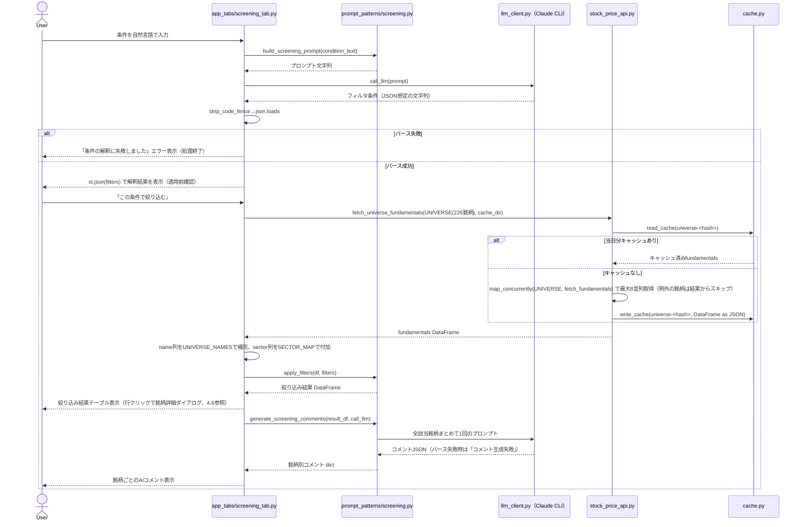
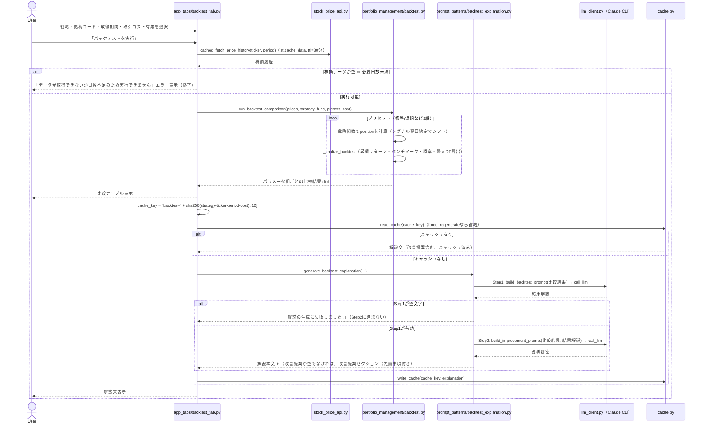
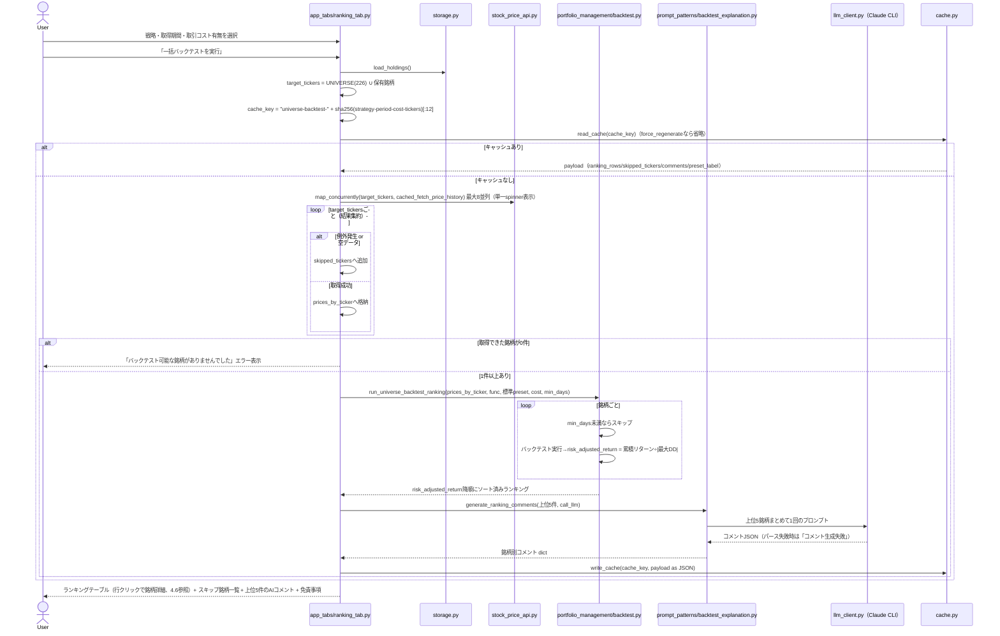
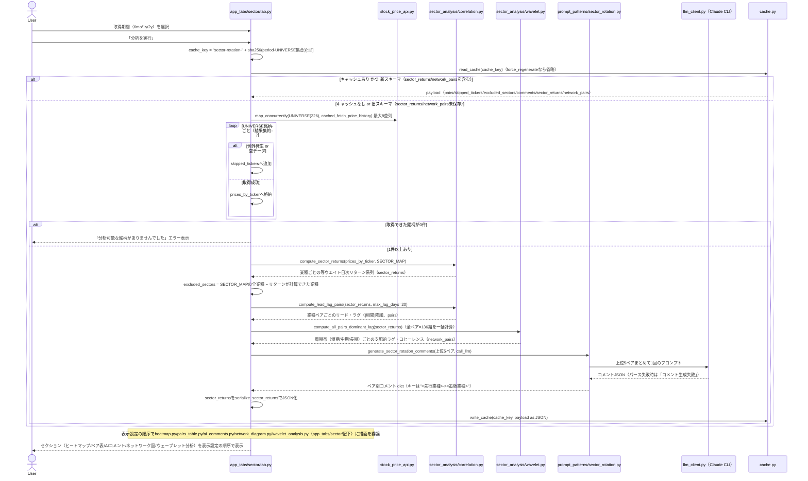
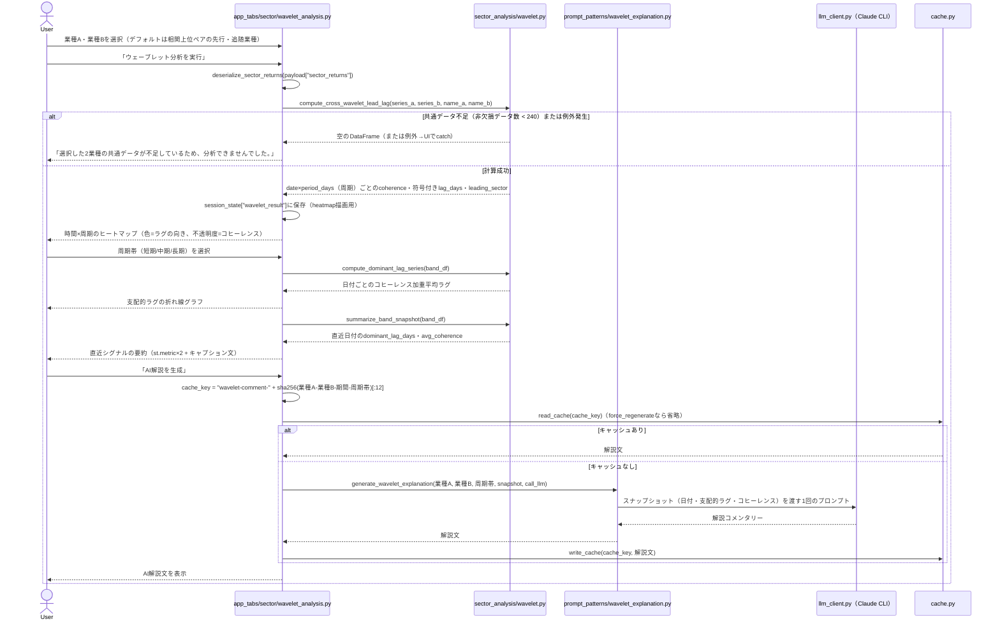
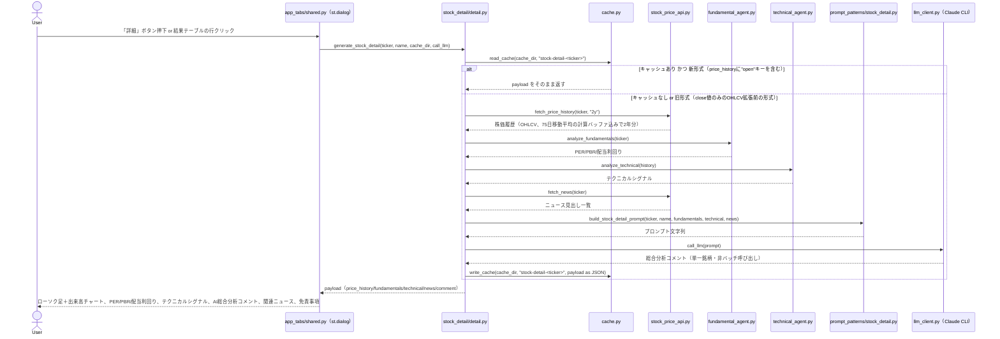
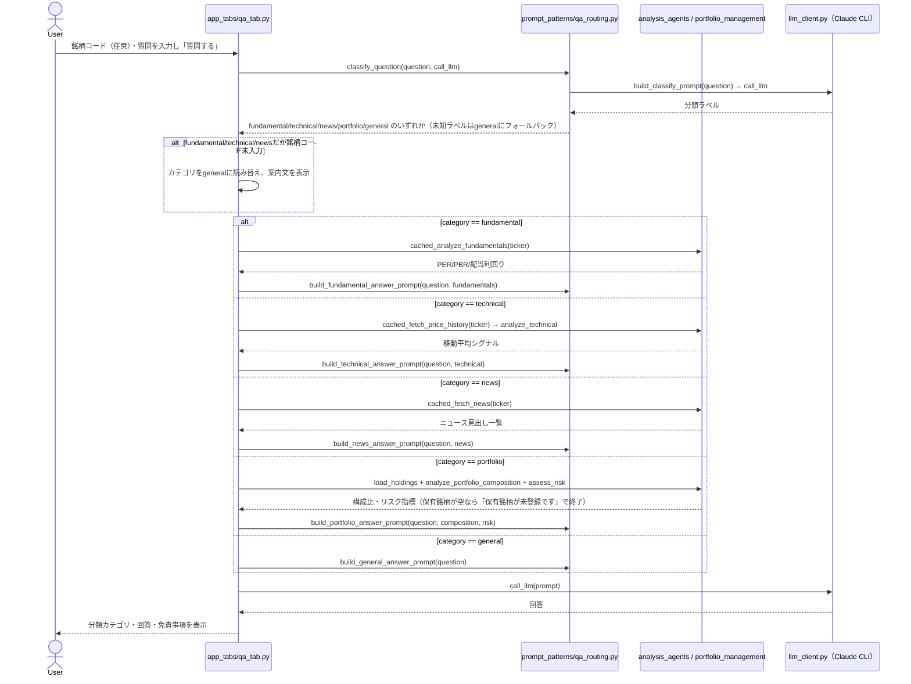

# 株投資リサーチアプリ 設計資料

> 本資料は `ai-stock-investing-tutorial/app` の実装済みコードから起こしたリファレンス設計書です。
> 個別機能の意思決定の経緯（検討した代替案など）は [`docs/superpowers/specs/`](superpowers/specs/) 配下の各設計書を参照してください。本資料はそれらを踏まえた**全体構成と現状の挙動**の整理を目的とします。

## 1. 概要

- [ai-stock-investing-tutorial](../../README.md) の教材内容（プロンプト設計・データAPI連携・分析エージェント・ポートフォリオ管理・バックテスト）を統合した、個人利用向けのStreamlit Webアプリ。
- 教育目的の参考実装であり、投資助言を目的としない。生成される全レポートに免責事項（[`common/disclaimer.py`](../common/disclaimer.py)）を明示する。
- LLM呼び出しはOpenAI/Anthropic APIキーを直接使わず、ログイン済みの **Claude Code CLI**（`claude -p`）をサブプロセスとして実行する方式を採る。

## 2. 構成

### 2.1 技術スタック

| 項目               | 内容                                                                                                       |
| ------------------ | ---------------------------------------------------------------------------------------------------------- |
| UI                 | Streamlit（`st.tabs` による7タブ切替 + `st.dialog` の銘柄詳細モーダル、単一プロセス）。`app.py` は起動処理とタブ生成のみを担い、各タブの描画は `app_tabs/` 配下のモジュールに分割 |
| データ処理         | pandas / numpy                                                                                             |
| チャート描画       | Altair（`st.altair_chart`。ローソク足＋出来高チャート＋移動平均線（5/25/75日）、業種間相関・ウェーブレット分析ヒートマップ。streamlit経由の間接依存） / Mermaid（業種間ネットワーク図。CDN読み込みの`mermaid.js`+`svg-pan-zoom.js`を`st.iframe`でパン・ズーム可能に埋め込み） |
| 株価・ニュース取得 | yfinance                                                                                                   |
| 日本語銘柄名取得   | Yahoo!ファイナンス日本版のHTMLタイトルを`requests` でスクレイピング                                      |
| LLM                | Claude Code CLI（`subprocess.run([executable, "--system-prompt", ..., "-p"], input=prompt)`）            |
| 並列処理           | `concurrent.futures.ThreadPoolExecutor`（`common/concurrency.py`の`map_concurrently`、最大8並列）    |
| ウェーブレット分析 | PyWavelets（`pywt.cwt`、複素モルレーウェーブレット`cmor1.5-1.0`によるクロスウェーブレット・コヒーレンス計算） |
| パッケージ管理     | uv（Python 3.14系）                                                                                        |
| テスト             | pytest（yfinance・`call_llm` はモック化）                                                                |

### 2.2 ディレクトリ構成

```
app/
  app.py                        # Streamlitエントリーポイント（set_page_config・起動時CLIチェック・7タブ生成 + 各タブ関数の呼び出しのみ）
  app_tabs/
    shared.py                    # 全タブ共通のキャッシュ付き取得関数、show_stock_detail_dialog（銘柄詳細ダイアログ）、
                                  # handle_table_selection（表クリック→ダイアログ起動）、データ保存先パス定数
    portfolio_tab.py              # render_portfolio_tab（ポートフォリオタブ）
    screening_tab.py              # render_screening_tab（スクリーニングタブ）
    backtest_tab.py                # render_backtest_tab（バックテストタブ）
    ranking_tab.py                 # render_ranking_tab（一括バックテストタブ）
    strategy_builder_tab.py        # render_strategy_builder_tab（AI戦略ビルダータブ）
    qa_tab.py                      # render_qa_tab（AI質問箱タブ）
    sector/
      tab.py                      # render_sector_tab（セクタータブのエントリーポイント。表示設定・分析実行・キャッシュ管理を担当し、
                                   # 個別グラフの描画は同ディレクトリの各モジュールに委譲する）
      heatmap.py                   # render_heatmap（業種間相関ヒートマップ）
      pairs_table.py               # render_pairs_table（リード・ラグ上位ペア表）
      ai_comments.py                # render_ai_comments（相関上位5ペアのAIコメント）
      network_diagram.py            # render_network_diagram（業種間ネットワーク図、Mermaid描画の_render_mermaidも含む）
      wavelet_analysis.py           # render_wavelet_analysis（ウェーブレット分析セクション）
  data_api/
    stock_price_api.py          # fetch_price_history / fetch_fundamentals / fetch_news /
                                 # fetch_japanese_name / fetch_universe_fundamentals（並列フェッチ・キャッシュ付き）
    llm_client.py                # call_llm, check_claude_cli_available（Claude Code CLIサブプロセス呼び出し）
  prompt_patterns/
    screening.py                 # build_screening_prompt, apply_filters, generate_screening_comments
    report_generation.py         # build_report_prompt（ポートフォリオレビュー用）
    backtest_explanation.py      # build_backtest_prompt, build_improvement_prompt（Prompt Chaining Step2）, generate_ranking_comments
    sector_rotation.py           # build_sector_rotation_prompt, generate_sector_rotation_comments
    stock_detail.py              # build_stock_detail_prompt（銘柄詳細ダイアログ用、単一銘柄）
    wavelet_explanation.py       # build_wavelet_prompt, generate_wavelet_explanation（ウェーブレット分析スナップショット解説）
    strategy_dialogue.py         # build_dialogue_prompt, parse_dialogue_response（AI戦略ビルダー対話）,
                                  # build_refinement_prompt（Evaluator-Optimizer改善ステップ）
    qa_routing.py                # classify_question, build_*_answer_prompt（AI質問箱、Routingパターン）
  analysis_agents/
    fundamental_agent.py         # analyze_fundamentals（PER/PBR/配当利回り）
    technical_agent.py           # analyze_technical（25/75日移動平均シグナル、RSI/ATR/ADX/OBV）
    news_research_agent.py       # research_news_batch（ニュース見出し→LLMセンチメント一括判定）
  portfolio_management/
    composition.py               # analyze_portfolio_composition（構成比・損益）
    risk.py                      # assess_risk（ボラティリティ・相関）
    review.py                    # generate_portfolio_review（事実データ統合＋LLM考察生成）
    storage.py                   # load_holdings / save_holdings（JSON永続化）
    ticker_names.py               # build_candidate_names（ユニバース名＋未知銘柄の名前解決）
    backtest.py                   # 戦略4種の実装、STRATEGIES定義、比較・ランキング関数、
                                   # generate_backtest_explanation（Prompt Chaining: 結果解説→改善提案の2段階）
  strategy_builder/
    conditions.py                  # apply_strategy_conditions, sort_by_strategy, build_match_reason
                                    # （indicator/operatorスキーマ、screening.pyのfield/記号演算子スキーマとは別）
    backtest.py                    # run_strategy_backtest（複数銘柄均等配分の簡易バックテスト）
    evaluation.py                  # build_evaluate_prompt, evaluate_strategy, run_evaluation_loop
                                    # （Evaluator-Optimizer: 確定候補の自動評価・改善ループ）
    sector_insight.py              # build_watchlist_from_rotation（業種ローテーションからの銘柄提案）
    storage.py                     # load_strategies / save_strategy（strategies.json永続化）
  screening/
    universe.py                   # 固定スクリーニング/バックテスト対象ユニバース（226銘柄＝日経225と既存銘柄の和集合、日本語名付き）
    sectors.py                    # SECTOR_MAP（UNIVERSE銘柄→東証17業種区分）
  sector_analysis/
    correlation.py                # compute_sector_returns, compute_lead_lag_pairs（業種別リターン・時差相関計算）
    wavelet.py                    # compute_cross_wavelet_lead_lag ほか（クロスウェーブレット・コヒーレンス、周期帯分類、全ペア集約）
    network.py                    # build_mermaid_lead_lag_graph（周期帯・コヒーレンス閾値でフィルタしたリード・ラグ関係のMermaid図生成）
    display_settings.py           # load/save_sector_display_settings（セクションの表示ON/OFF・順序・高さのJSON永続化）
  stock_detail/
    detail.py                     # generate_stock_detail（株価OHLCV/ファンダメンタル/テクニカル/ニュース統合＋AIコメント、キャッシュ付き）
  common/
    disclaimer.py                  # DISCLAIMER_NOTICE 定数
    cache.py                       # 日付キー付きファイルキャッシュのヘルパー
    concurrency.py                 # map_concurrently（ThreadPoolExecutorによる並列実行、例外は要素単位で捕捉）
    json_parsing.py                # strip_code_fence（LLM応答のコードフェンス除去）
  data/                             # 実行時生成データ（.gitignore対象）
    holdings.json                  # 保有銘柄
    sector_display_settings.json   # セクターローテーションタブの表示設定
    strategies.json                 # AI戦略ビルダーで確定・保存した戦略一覧
    cache/                          # 日付+ハッシュキー（一部は銘柄コードそのまま）のキャッシュファイル
  tests/                            # pytest
  docs/                             # 本資料・設計書一式、data_j.xls（JPX公式全銘柄一覧。SECTOR_MAPの元データ）
  pyproject.toml / uv.lock
```

### 2.3 モジュール依存関係

```mermaid
flowchart TB
    app["app.py（エントリーポイント）"]

    subgraph app_tabs["app_tabs"]
        shared_m["shared.py（共有キャッシュ関数 + 銘柄詳細ダイアログ）"]
        portfolio_tab_m["portfolio_tab.py"]
        screening_tab_m["screening_tab.py"]
        backtest_tab_m["backtest_tab.py"]
        ranking_tab_m["ranking_tab.py"]
        strategy_builder_tab_m["strategy_builder_tab.py"]
        qa_tab_m["qa_tab.py"]

        subgraph sector_pkg["sector/"]
            sector_tab_m["tab.py"]
            heatmap_m["heatmap.py"]
            pairs_table_m["pairs_table.py"]
            ai_comments_m["ai_comments.py"]
            network_diagram_m["network_diagram.py"]
            wavelet_analysis_m["wavelet_analysis.py"]
        end
    end

    subgraph prompt["prompt_patterns"]
        screening_p["screening.py"]
        report_p["report_generation.py"]
        backtest_p["backtest_explanation.py"]
        sector_p["sector_rotation.py"]
        detail_p["stock_detail.py"]
        wavelet_p["wavelet_explanation.py"]
        strategy_dialogue_p["strategy_dialogue.py"]
        qa_routing_p["qa_routing.py"]
    end

    subgraph agents["analysis_agents"]
        fundamental["fundamental_agent.py"]
        technical["technical_agent.py"]
        news["news_research_agent.py"]
    end

    subgraph pm["portfolio_management"]
        composition["composition.py"]
        risk["risk.py"]
        review["review.py"]
        storage["storage.py"]
        ticker_names["ticker_names.py"]
        backtest["backtest.py"]
    end

    subgraph sb["strategy_builder"]
        sb_conditions["conditions.py"]
        sb_backtest["backtest.py"]
        sb_evaluation["evaluation.py"]
        sb_sector_insight["sector_insight.py"]
        sb_storage["storage.py"]
    end

    subgraph api["data_api"]
        price_api["stock_price_api.py"]
        llm_client["llm_client.py"]
    end

    subgraph screening_dir["screening"]
        universe["universe.py"]
        sectors["sectors.py"]
    end

    subgraph sector_analysis["sector_analysis"]
        correlation["correlation.py"]
        wavelet["wavelet.py"]
        network["network.py"]
        display_settings["display_settings.py"]
    end

    subgraph stock_detail["stock_detail"]
        detail["detail.py"]
    end

    subgraph common["common"]
        cache["cache.py"]
        disclaimer["disclaimer.py"]
        json_parsing["json_parsing.py"]
        concurrency["concurrency.py"]
    end

    app --> portfolio_tab_m
    app --> screening_tab_m
    app --> backtest_tab_m
    app --> ranking_tab_m
    app --> sector_tab_m
    app --> strategy_builder_tab_m
    app --> qa_tab_m

    portfolio_tab_m --> shared_m
    screening_tab_m --> shared_m
    backtest_tab_m --> shared_m
    ranking_tab_m --> shared_m
    sector_tab_m --> shared_m
    wavelet_analysis_m --> shared_m
    strategy_builder_tab_m --> shared_m
    qa_tab_m --> shared_m

    sector_tab_m --> heatmap_m
    sector_tab_m --> pairs_table_m
    sector_tab_m --> ai_comments_m
    sector_tab_m --> network_diagram_m
    sector_tab_m --> wavelet_analysis_m

    shared_m --> agents
    shared_m --> api
    shared_m --> stock_detail
    shared_m --> common

    portfolio_tab_m --> agents
    portfolio_tab_m --> pm
    portfolio_tab_m --> api
    portfolio_tab_m --> common

    screening_tab_m --> prompt
    screening_tab_m --> screening_dir
    screening_tab_m --> api
    screening_tab_m --> common

    backtest_tab_m --> pm
    backtest_tab_m --> common

    ranking_tab_m --> pm
    ranking_tab_m --> prompt
    ranking_tab_m --> screening_dir
    ranking_tab_m --> common
    ranking_tab_m --> api

    sector_tab_m --> sector_analysis
    sector_tab_m --> prompt
    sector_tab_m --> screening_dir
    sector_tab_m --> common
    sector_tab_m --> api
    network_diagram_m --> sector_analysis
    wavelet_analysis_m --> sector_analysis
    wavelet_analysis_m --> prompt
    wavelet_analysis_m --> common
    wavelet_analysis_m --> api

    review --> composition
    review --> risk
    review --> report_p
    backtest --> backtest_p
    ticker_names --> universe
    ticker_names --> price_api

    fundamental --> price_api
    news --> json_parsing
    news --> llm_client
    screening_p --> json_parsing
    screening_p --> llm_client
    report_p --> disclaimer
    backtest_p --> disclaimer
    backtest_p --> json_parsing
    backtest_p --> llm_client
    review --> llm_client
    review --> disclaimer
    backtest --> llm_client
    backtest --> disclaimer
    price_api --> cache
    price_api --> concurrency

    sector_p --> json_parsing
    sector_p --> llm_client
    correlation --> sectors
    wavelet_p --> llm_client

    detail --> agents
    detail --> price_api
    detail --> detail_p
    detail --> llm_client
    detail --> cache

    strategy_builder_tab_m --> strategy_dialogue_p
    strategy_builder_tab_m --> sb
    strategy_builder_tab_m --> screening_dir
    strategy_builder_tab_m --> sector_analysis
    strategy_builder_tab_m --> api
    strategy_builder_tab_m --> common
    sb_evaluation --> strategy_dialogue_p
    sb_evaluation --> llm_client
    sb_evaluation --> json_parsing
    strategy_dialogue_p --> json_parsing
    sb_storage --> common

    qa_tab_m --> qa_routing_p
    qa_tab_m --> agents
    qa_tab_m --> pm
    qa_tab_m --> llm_client
    qa_tab_m --> common
    qa_routing_p --> llm_client
```



## 3. 機能一覧

| # | タブ                   | 概要                                                                                                                           |
| - | ---------------------- | ------------------------------------------------------------------------------------------------------------------------------ |
| 1 | ポートフォリオ         | 保有銘柄を登録し、構成比・損益・リスク・ファンダメンタル・テクニカル・ニュースセンチメントを統合したレビューレポートを生成する |
| 2 | スクリーニング         | 自然言語の投資条件をAIがフィルタ条件（JSON、per/pbr/dividend_yield_pct/sectorに対応）に変換し、確認後にUNIVERSE 226銘柄から絞り込む |
| 3 | バックテスト           | 指定銘柄に対し4戦略×2パラメータ組でベクトル化バックテストを実行し、AIによる結果解説と改善提案の2段階（Prompt Chaining）を表示する |
| 4 | 一括バックテスト       | UNIVERSE 226銘柄＋保有銘柄に対し標準プリセットで一括バックテストし、リスク調整済みリターン順にランキング表示する               |
| 5 | セクターローテーション | UNIVERSE銘柄を東証17業種に分類し、業種間の値動きの時差相関（リード・ラグ）・全ペアネットワーク図・ウェーブレット分析（時間変化するリード・ラグ）を過去の株価データから計算して表示する。表示するセクションのON/OFF・順序・高さはユーザーが設定可能 |
| 6 | AI戦略ビルダー         | 投資アイデアをAIとの対話で構造化条件（JSON）に詰め、確定候補は自動評価・改善ループ（Evaluator-Optimizer）を経てから確認・保存し、簡易バックテストと最新データでの銘柄選定までを一気通貫で行う |
| 7 | AI質問箱               | 自由記述の投資質問をAIが5カテゴリに分類し（Routing）、専用の分析エージェントへ振り分けて回答する |

上記5タブ（スクリーニング／一括バックテスト／セクターローテーションの結果テーブル、ポートフォリオの保有銘柄一覧、AI戦略ビルダーの銘柄選定結果テーブル）からは行クリックまたはボタンで**銘柄詳細ダイアログ**（[4.6](#46-銘柄詳細ダイアログクロスタブ機能)参照）を開ける。特定のタブに属さないクロスカッティングな機能のため、上表には独立行を設けていない。

共通の起動時チェックとして、`app.py` はStreamlit描画前に `check_claude_cli_available()` を呼び、Claude Code CLIが見つからない場合は `st.error` を表示して `st.stop()` で処理を止める（7タブ＋銘柄詳細ダイアログすべての前提条件）。

---

## 4. 機能ごとの詳細

### 4.1 ポートフォリオレビュー

#### シーケンス図


#### ステップ・分岐の説明

1. **保有銘柄の読み込み**: セッション初回のみ `load_holdings()` を呼ぶ。ファイルが無い、または壊れている（JSON decode失敗）場合は空リストにフォールバックし、初期行 `{"ticker": "", "shares": 0, "cost": 0.0}` を1件表示する。
2. **銘柄名候補の構築**: `UNIVERSE_NAMES`（226銘柄）に加え、保有銘柄のうちユニバース外のティッカーは `fetch_japanese_name` で名前解決する。この関数は `app_tabs/shared.py` の `cached_fetch_japanese_name`（`st.cache_data(ttl=24h)`）でラップされており、同一ティッカーへの重複リクエストを抑制する。
3. **銘柄の検索・追加**: セレクトボックスで `"ティッカー 銘柄名"` の形式から選び、「追加」ボタン押下時のみ `session_state["holdings_rows"]` に反映する。**既に一覧にあるティッカー**を選んだ場合は追加せず `st.info` で通知する（分岐）。
4. **編集・保存**: `st.data_editor` は行の追加・削除・編集を許可する（`num_rows="dynamic"`）。「保存」ボタンを押すまでファイルには反映されず、ティッカーが空の行は保存時に除外される。
5. **銘柄詳細ダイアログ**: 保存済み保有銘柄ごとに「詳細」ボタンが並び（`key=f"portfolio_detail_{i}_{ticker}"` で行インデックスをキーに含め、同一ティッカー重複時もボタンキーが衝突しないようにしている）、押下すると [4.6](#46-銘柄詳細ダイアログクロスタブ機能) のダイアログが開く。
6. **レビュー生成のキャッシュ判定**:
   - `cache_key` は `"portfolio-review-"` に保有銘柄の `ticker:shares:cost` を連結したSHA256の先頭12文字を付加したもの。**構成が変われば別キャッシュキーになる**。
   - `force_regenerate`（キャッシュを無視するチェックボックス）がオンなら `read_cache` 自体を呼ばない。
   - キャッシュヒットしても中身が **旧バージョン形式**（レポート文字列のみ）で `json.loads` が失敗する場合は、無視して再生成する（後方互換の分岐）。
   - `common/cache.py` の実装上、キャッシュファイル名には**当日の日付**が含まれるため、日付が変われば自動的に再生成対象になる。
7. **事実データの収集（キャッシュミス時）**: 銘柄ごとの株価履歴（6ヶ月）・fundamentals・technical・newsの取得は `_fetch_holding_data` にまとめられ、`common/concurrency.py::map_concurrently`（`ThreadPoolExecutor`, 最大8並列）で保有銘柄横断に**並列実行**される。個別銘柄の取得で例外が発生してもその銘柄の結果が `Exception` として捕捉されるだけで他銘柄の処理は継続し、`isinstance(result, Exception)` の銘柄は `continue` でスキップされる。株価履歴が空でも `current_prices`/`price_histories` への登録をスキップするのみで後続処理は継続する（銘柄単位の防御的実装）。株価履歴・fundamentals・newsの取得自体もそれぞれ `st.cache_data(ttl=30分)` の薄いラッパー（`app_tabs/shared.py` の `cached_fetch_price_history` / `cached_analyze_fundamentals` / `cached_fetch_news`）を経由し、同一セッション内の再取得コストを下げる（詳細は [5.2](#52-キャッシュ機構) 参照）。
8. **ニュースセンチメントのバッチ判定**: 全保有銘柄のニュース見出しを1つのプロンプトにまとめ、**1回のLLM呼び出し**でJSON形式のセンチメントを取得する（サブプロセス起動オーバーヘッド対策）。JSONパースに失敗した場合は空dictとなり、各銘柄のセンチメントは `None` 扱いになる。
9. **レビュー本文の生成**: `analyze_portfolio_composition`（構成比・損益、価格取得不可の銘柄は `None`）と `assess_risk`（銘柄間相関・ボラティリティ、年率換算）を「事実データ」としてPython側で計算し、これをJSONとしてプロンプトに埋め込んで初めてLLMに渡す。プロンプトは「観察事項の列挙のみ、売買推奨・目標株価の提示は禁止」を明示する。
10. **表示**: レポート本文の前後に `DISCLAIMER_NOTICE` を必ず付与する。センチメント判定の根拠として、銘柄ごとに参照ニュース一覧を折りたたみ表示する（ニュースが0件の場合は「ニュースが取得できませんでした」と表示）。

---

### 4.2 スクリーニング

#### シーケンス図



#### ステップ・分岐の説明

1. **条件のフィルタ変換**: `build_screening_prompt` は使用可能なfieldを `per` / `pbr` / `dividend_yield_pct` / `sector`（業種）の4つに限定するようプロンプト内で明示し、LLMにJSON配列のみを出力させる。`sector` を使う場合の `operator` は `==` のみとし、`value` は `SECTOR_MAP` の値（東証17業種区分）から表記ゆれを吸収して選ばせる。
2. **パース失敗時の分岐**: `strip_code_fence`（```json フェンス除去）後に `json.loads` が失敗すると `st.error` を出し、以降の絞り込み処理には進まない（ユーザーに条件の言い換えを促す）。
3. **確認ステップ（誤解釈対策）**: 解釈結果は `st.json` で必ず画面表示し、**「この条件で絞り込む」ボタンを押すまで実データには一切適用しない**。これによりAIの誤変換に早期に気づける。
4. **ユニバースfundamentalsの取得**: `fetch_universe_fundamentals` はUNIVERSE 226銘柄のティッカー集合のハッシュをキーに、**当日分**キャッシュがあれば再利用する（起動のたびに226回yfinance呼び出しをしない）。キャッシュミス時は `common/concurrency.py::map_concurrently` で最大8並列に取得し、個別銘柄の取得で例外が発生した場合はその銘柄を結果からスキップして処理を続ける（フィルタ対象の減少のみで処理全体は止めない）。`fetch_fundamentals` の日本語銘柄名は精度が低いため、`name` 列は `UNIVERSE_NAMES` の日本語名で上書き補完し、`sector` 列は `SECTOR_MAP` から付加する。
5. **フィルタ適用**: `apply_filters` は条件を1件ずつ順番にAND条件で適用する。`field` がDataFrameの列に存在しない、または `operator` が `<=`/`>=`/`<`/`>`/`==` のいずれでもない場合は**その条件だけを無視**して次の条件に進む（フィルタ全体を失敗させない防御的実装）。値が `None`（`NaN`）の行は `notna()` チェックで除外される。
6. **絞り込み結果テーブル**: `ticker`/`name`/`sector`/`per`/`pbr`/`dividend_yield_pct` に加え `market_cap`（時価総額）列も表示する。テーブルは `on_select="rerun"`・`selection_mode="single-row"` でクリック可能になっており、行を選ぶと [4.6](#46-銘柄詳細ダイアログクロスタブ機能) の銘柄詳細ダイアログが開く。
7. **AIコメント生成**: 絞り込み結果が0件なら `generate_screening_comments` は空dictを返しLLM呼び出し自体を行わない。0件でない場合は該当銘柄すべてをまとめた**1回のプロンプト**でコメントを一括生成し、JSONパースに失敗した場合は全銘柄に対し「コメント生成失敗」を表示する。

---

### 4.3 バックテスト（単一銘柄）

#### シーケンス図



#### ステップ・分岐の説明

1. **戦略の選択**: `STRATEGIES` に定義された4戦略（移動平均クロスオーバー／RSI逆張り／MACDクロスオーバー／ボリンジャーバンド逆張り）から選ぶ。各戦略は `func`・`presets`（2パラメータ組）・`min_days`（実行に必要な最小日数）を持つ。
2. **株価取得**: `app_tabs/shared.py` の `cached_fetch_price_history`（`st.cache_data(ttl=30分)`）経由で取得するため、同一銘柄・同一期間の再実行はセッション内では再フェッチしない。
3. **データ不足時の分岐**: 取得した株価が空、または `len(history) < strategy["min_days"]` の場合は即座にエラー表示して処理を終了する（例: MA戦略は75日、RSIは14日必要）。
4. **バックテスト計算（`_finalize_backtest`）**:
   - 各戦略は当日のシグナルに基づき `position`（0/1）を算出し、**1日シフトして翌日約定とする**（ルックアヘッドバイアス回避、全戦略共通のコメント付きロジック）。
   - `transaction_cost_pct` が0より大きい場合、ポジションが変化した日（`position.diff() != 0`）にのみ取引コスト（0.1%/回）を差し引く。
   - ベンチマークは常にBuy&Hold（`daily_return` の累積）。
   - 勝率は「ポジションを持っている日」のうちリターンがプラスだった日の割合。ポジションを一度も持たない場合は0.0。
   - 最大ドローダウンは累積リターン曲線の `cummax` からの下落率の最小値。
5. **RSI逆張り／ボリンジャーバンド逆張りのエントリー・エグジット**: いずれも「entry条件で1、exit条件で0を代入し `ffill` で保持」という共通パターン。RSIは「下から上に売られすぎ水準を回復した日にエントリー、買われすぎ水準到達で手仕舞い」。ボリンジャーは「下バンド割れでエントリー、中心線（移動平均）以上への回帰で手仕舞い」。
6. **キャッシュ判定**: `"backtest-"` + `strategy名-ticker-period-cost` のハッシュをキーとし、`force_regenerate` チェックボックスがオフかつ当日分キャッシュがあれば解説文（改善提案含む最終Markdown）をそのまま再利用し、LLM呼び出しをスキップする。`generate_backtest_explanation`のシグネチャ・戻り値の型（Markdown文字列）はStep2追加前と変わらないため、このキャッシュ機構・呼び出し元は無改修で機能する。
7. **AI解説の生成（Prompt Chaining: 2ステップ）**: Step1（`build_backtest_prompt`）は「1.パラメータ組ごとの戦略×ベンチマーク比較 2.勝率・最大DDの意味 3.過学習・取引コスト未考慮への注意喚起 4.パラメータ間の乖離が大きい場合の過学習リスク強調 5.追加確認指標の提案（実行はしない）」を必須項目として明示し、指示的な売買文言を禁止する。Step1の結果が空文字の場合はgate（検証）としてStep2を呼ばずエラーメッセージを返す。Step1が有効な場合のみ、その結果をStep2（`build_improvement_prompt`）に渡し、過学習リスク・取引コスト等の追加観点を提案させる。Step2の結果が空文字の場合は改善提案セクションのみ省略し、Step1の結果は失わない（Step2の失敗でStep1の価値ある結果まで失わせない設計）。

---

### 4.4 一括バックテスト（ランキング）

#### シーケンス図



#### ステップ・分岐の説明

1. **対象銘柄の決定**: `UNIVERSE`（226銘柄）と現在の保有銘柄ティッカーの**和集合**を対象にする。保有銘柄がユニバース外でも対象に含まれる。
2. **キャッシュ判定**: `"universe-backtest-"` + `strategy-period-cost-対象銘柄一覧` のハッシュをキーにする。**対象銘柄の集合が変わる**（保有銘柄の増減やUNIVERSEの更新）だけでもキャッシュキーが変わり再計算される。
3. **株価取得の並列化とエラーハンドリング**: `map_concurrently` で対象銘柄すべてを最大8並列に取得する（進捗バーは銘柄単位の逐次表示ではなく、並列バッチ全体を覆う単一の `st.spinner`）。取得中に例外が発生した銘柄、または空データだった銘柄は `skipped_tickers` に記録して処理を継続する。全銘柄が取得失敗した場合のみ致命的エラーとして扱う。
4. **標準プリセットのみ使用**: 単一銘柄バックテストと異なり、一括バックテストは各戦略の `presets[0]`（標準パラメータ）のみを使う（計算量削減のため）。
5. **ランキング計算**: 銘柄ごとに `min_days` に満たないものは除外。`risk_adjusted_return = total_return_pct / abs(max_drawdown_pct)`（ドローダウンが0の場合は `total_return_pct` をそのまま使用）を計算し、降順にソートする。
6. **AIコメントは上位5件のみ**: 全銘柄ではなく上位5件だけをまとめて1回のプロンプトでコメント生成する（コスト・待ち時間対策）。
7. **表示**: ランキング表には保有銘柄・ユニバース双方の日本語名を再解決して付与し、順位列を1から採番する。テーブルは行クリックで銘柄詳細ダイアログ（[4.6](#46-銘柄詳細ダイアログクロスタブ機能)）を開ける。スキップ銘柄がある場合はその一覧を表示し、末尾に免責事項を明示する。

---

### 4.5 セクターローテーション

5タブ中もっとも機能が多く、(a) 時差相関に基づく従来分析（ヒートマップ・上位ペア表・AIコメント）、(b) 全業種ペアを俯瞰する**ネットワーク図**、(c) 時間変化するリード・ラグを可視化する**ウェーブレット分析**の3層で構成される。表示するセクションの選択・並び順・チャート高さは「表示設定」expanderからユーザーが調整でき、設定は `data/sector_display_settings.json` に永続化される。

#### シーケンス図（分析実行〜結果保存）



#### ステップ・分岐の説明（分析実行）

1. **業種マッピング**: `screening/sectors.py::SECTOR_MAP` はUNIVERSE全226銘柄を東証17業種区分に分類したdict。JPX公式全銘柄一覧（`docs/data_j.xls`）の「17業種区分」列から抽出し、`data_j.xls` に未収録の1銘柄（`543A.T`）のみ手動で業種を割り当てている。UNIVERSE更新時は本ファイルも合わせて更新する必要がある（コード先頭コメントに明記）。
2. **キャッシュ判定**: `"sector-rotation-"` + `期間-UNIVERSE集合` のハッシュをキーにする。`force_regenerate` チェックボックスがオンなら読み込みをスキップする。キャッシュヒットしても `payload` に `sector_returns` または `network_pairs` キーが無い場合（ネットワーク図・ウェーブレット分析の追加前に生成された旧スキーマ）は無視して再計算する。
3. **株価取得**: UNIVERSE全226銘柄を `map_concurrently` で最大8並列に取得する（`cached_fetch_price_history` 経由で `st.cache_data(ttl=30分)` も併用）。取得失敗・空データの銘柄は `skipped_tickers` に記録し処理を継続、全滅時のみエラー表示。
4. **業種別リターンの計算（`compute_sector_returns`）**: 業種ごとに構成銘柄の日次リターン（`pct_change`）を等ウエイト平均する。`prices_by_ticker` に存在しない（取得失敗）銘柄はスキップし、構成銘柄が1件も取得できなかった業種は `sector_returns` から丸ごと除外される。除外された業種は `excluded_sectors`（`SECTOR_MAPの全業種 − sector_returnsのキー`）として記録され、画面下部に一覧表示する。
5. **リード・ラグ相関の計算（`compute_lead_lag_pairs`）**: 業種の全ペア（重複なし）について、`-20〜+20営業日` の範囲でラグをずらしながら相関係数を計算し、絶対値が最大となるラグを採用する。共通の非欠損日数が `max_lag_days`（20）未満のペアは結果から除外する。`lag > 0` は「一方の業種の過去の値がもう一方の現在値と相関する＝過去側の業種が先行（リード）、現在側が追随（ラグ）」と解釈し、`leading_sector`/`lagging_sector`/`lag_days`/`correlation` を持つdictのリストを、相関の絶対値降順で返す。
6. **全ペアのウェーブレット集約（`compute_all_pairs_dominant_lag`）**: 業種の全組み合わせ（17業種なら136ペア）について `compute_cross_wavelet_lead_lag`（後述）を実行し、周期帯（短期/中期/長期）ごとに直近20営業日分のコヒーレンス加重平均ラグへ集約する。個別ペアで例外が発生した場合、またはデータ不足で空の結果になった場合はそのペア・周期帯を結果からスキップし、処理全体は継続する。結果はネットワーク図の描画に使う `network_pairs` としてキャッシュされる。
7. **AIコメント生成**: 相関上位5ペアのみをまとめて1回のプロンプトでコメント生成する（他タブのAIコメントと同じ「上位N件バッチ」パターン）。プロンプトは「過去の統計的傾向の説明にとどめ、将来の値動きの保証や売買の指示的表現をしないこと」を明示する。JSONパースに失敗した場合は該当ペアすべてに「コメント生成失敗」を表示する。
8. **キャッシュへの保存**: `sector_returns`（業種別日次リターン系列）は `serialize_sector_returns` で日付ISO文字列＋数値リスト（NaNは`null`）のJSON可能な形に変換してから、他の計算結果と合わせて1つのJSONペイロードとして保存する。ウェーブレット分析タブはこの `sector_returns` を再利用するため、分析実行のたびに個別銘柄の株価から再計算する必要はない。

#### 表示設定（`sector_analysis/display_settings.py`）

- 「表示設定」expander内の `st.data_editor` で、5セクション（ヒートマップ／ペア表／AIコメント／ネットワーク図／ウェーブレット分析）それぞれの表示ON/OFFと表示順序（1〜5の整数）を編集できる。ヒートマップ・ネットワーク図・ウェーブレット分析の3セクションは、表示ONの場合のみチャート高さ（250〜900px）のスライダーも表示される。
- 編集結果が現在の設定と異なる場合のみ `save_sector_display_settings` でJSONファイル（`data/sector_display_settings.json`）に書き込み、次回起動時も設定が引き継がれる。
- `load_sector_display_settings` はファイル不在・JSON破損・型不正のいずれの場合も `DEFAULT_SECTOR_DISPLAY_SETTINGS`（全セクション表示ON、定義順、高さ500/400/400px）にフォールバックする。旧バージョン（`{"heatmap": true, ...}` のようなフラットなbool辞書のみ）のファイルも読み込み可能で、`visible` として扱い `order`/`height` はデフォルト値で補う。
- 実際の描画順序は `app_tabs/sector/tab.py` 側で `section_renderers` dictを `display_settings["order"]` の値でソートして決定する。ヒートマップ・ペア表・AIコメントの3セクションは、有効な業種ペア（`pairs`）が1件もない場合は表示設定に関わらずスキップされる。

#### 各セクションの内容

| セクション | 内容 | 実装モジュール |
| --- | --- | --- |
| 業種間相関ヒートマップ | `pairs` の全ペアから対称な相関行列（`\|correlation\|`）を構築し、Altairの `mark_rect` で描画する。 | `app_tabs/sector/heatmap.py`（`render_heatmap`） |
| リード・ラグ上位ペア | `leading_sector`/`lagging_sector`/`lag_days`/`correlation` の表と、リード・ラグの読み方を説明する `st.expander`。 | `app_tabs/sector/pairs_table.py`（`render_pairs_table`） |
| 相関上位5ペアのAIコメント | `payload["comments"]` を `"<先行業種>-><追随業種>"` キーで参照して表示する。 | `app_tabs/sector/ai_comments.py`（`render_ai_comments`） |
| 業種間ネットワーク（全ペア俯瞰） | 後述（ネットワーク図）。 | `app_tabs/sector/network_diagram.py`（`render_network_diagram`） |
| ウェーブレット分析 | 後述（ウェーブレット分析）。 | `app_tabs/sector/wavelet_analysis.py`（`render_wavelet_analysis`） |

有効な業種ペアが1件もない場合は「有効な業種ペアがありませんでした」と表示する。スキップ銘柄一覧・除外業種一覧・免責事項はセクションの表示設定に関わらず常に末尾に表示する。本タブの結果テーブル（ヒートマップ・ペア表）からは、他タブと異なり**銘柄詳細ダイアログへの導線はない**（対象が「業種」であり個別銘柄ではないため）。

#### ネットワーク図（`sector_analysis/network.py`, `build_mermaid_lead_lag_graph`）

- キャッシュ済みの `network_pairs`（全136ペア×3周期帯のウェーブレット集約結果）から、ユーザーが選んだ**周期帯**（短期/中期/長期のセレクトボックス）と**コヒーレンス閾値**（0〜1のスライダー、デフォルト0.5）でフィルタし、Mermaidの `flowchart LR` 有向グラフ定義文字列を組み立てる。業種名はMermaidのノードID規則に使えない文字（「・」等）を含みうるため、`S0`, `S1`, ... の合成IDをノードIDとし、業種名はラベルとしてのみ使う。エッジには先行→追随の矢印とラグ日数・コヒーレンスを付与する。フィルタ後にエッジが0件になった場合は `None` を返し、UI側は「十分な確信度を持つ関係が見つかりませんでした。閾値を下げてみてください。」と案内する。
- 生成したMermaidコードは `_render_mermaid`（`app_tabs/sector/network_diagram.py`）が、CDNから読み込んだ `mermaid.js` と `svg-pan-zoom.js` を使い `st.iframe` 経由でHTML埋め込みとして描画する。業種間ネットワークは横に広がりやすいため、単純な自動フィットではなく「縦方向優先で拡大しつつ、全体表示時倍率の2倍を上限とする」独自ロジックでズーム倍率を決めており、はみ出した部分はドラッグ・ホイールで閲覧する。

#### ウェーブレット分析（`sector_analysis/wavelet.py`）

通常の時差相関（4節参照）は期間全体で1つの数値しか出せないのに対し、ウェーブレット分析は値動きを周期の長さ（短期/中期/長期）ごとに分解し、時間軸に沿ってリード・ラグ関係の変化を追跡する。ユーザーが業種A・業種Bの組み合わせを選び、明示的にボタンを押した時点で計算する（分析実行時に全ペア分を計算する4.5前半のネットワーク図用集計とは別処理）。



##### ステップ・分岐の説明（ウェーブレット分析）

1. **クロスウェーブレット・コヒーレンス計算（`compute_cross_wavelet_lead_lag`）**: 複素モルレーウェーブレット（`cmor1.5-1.0`）を用いた連続ウェーブレット変換（`pywt.cwt`）を2系列（業種A・業種B）それぞれに適用し、クロスパワースペクトル・自己パワースペクトルを周期の長さに比例した窓幅のboxcarフィルタで時間軸方向に平滑化した上で、コヒーレンス（0〜1、平滑化なしでは常に1になるため必須）と位相差から符号付きラグ（`lag_days`、正なら業種Aが先行）を周期ごとに算出する。周期の探索範囲は4〜120営業日（1オクターブあたり4ボイス）。共通の非欠損データ数が `max_period_days * 2`（240）未満の場合は空のDataFrameを返し、UI側は「選択した2業種の共通データが不足しているため、分析できませんでした。」と案内する。
2. **周期帯の分類（`classify_period_band`）**: 算出した各周期（`period_days`）を短期（4〜10営業日未満）／中期（10〜40営業日未満）／長期（40〜120営業日）の3帯に分類する。範囲外の周期は結果から除外される。
3. **ヒートマップ描画**: 横軸=日付、縦軸=周期（`period_days`、降順）、色（`redblue`スケール、中央値0）=ラグの符号と大きさ、不透明度=コヒーレンス（0〜1を0.05〜1にマッピングし、確からしさが低い部分を視覚的に弱める）で描画する。
4. **支配的ラグの算出（`compute_dominant_lag_series`）**: 選択した周期帯のデータについて、日付ごとにコヒーレンスで加重平均したラグ（`dominant_lag_days`）と、その日の周期方向の単純平均コヒーレンス（`avg_coherence`）を計算する。コヒーレンス合計が0の日付は結果から除外する。
5. **直近シグナルの要約（`summarize_band_snapshot`）**: `compute_dominant_lag_series` の結果のうち最新日付の値をスナップショットとして返す（AIを使わない機械的な数値表示）。有効なデータがなければ `None` を返し、UI側は要約パネルを表示しない。周期帯のセレクトボックスを変更するたびに自動的に再計算される。
6. **AI解説の生成とキャッシュ**: 「AI解説を生成」ボタン押下時のみLLMを呼び出す（自動生成しない）。キャッシュキーは `"wavelet-comment-"` + `業種A-業種B-取得期間-周期帯` のSHA256先頭12桁。`generate_wavelet_explanation`（`build_wavelet_prompt`）は算出済みのスナップショット（日付・支配的ラグ・コヒーレンス）だけをプロンプトに渡し、LLM側での再計算は求めない。表示中の業種ペア・周期帯と異なる古いコメントが残らないよう、`session_state["wavelet_comment"]` には生成時のキー（業種A・業種B・取得期間・周期帯のタプル）も一緒に保持し、現在の選択と一致する場合のみ表示する。

---

### 4.6 銘柄詳細ダイアログ（クロスタブ機能）

特定のタブに属さず、`app_tabs/shared.py` の `@st.dialog`（`show_stock_detail_dialog`）で実装されたモーダル。同じく `shared.py` の `handle_table_selection` を経由して、ポートフォリオタブの保有銘柄一覧（「詳細」ボタンから直接呼び出し）、スクリーニング結果テーブル（行クリック）、一括バックテストのランキングテーブル（行クリック）の3箇所から共通して呼び出される。

#### シーケンス図



#### ステップ・分岐の説明

1. **キャッシュキー**: 他機能と異なり `"stock-detail-" + ticker` という**ハッシュ化しないキー**を使う（銘柄コードそのものをキーに含める）。当日日付とキー文字列でファイル名が決まる点は他機能と共通（[5.2](#52-キャッシュ機構) 参照）が、**「キャッシュを無視して再生成する」チェックボックスは存在しない**（他4つのキャッシュ利用機能と異なる点）。
2. **旧形式キャッシュの扱い**: OHLCV対応前（終値のみを保存していた時期）のキャッシュには `price_history` に `"open"` キーが存在しないため、`"open" in payload["price_history"]` が偽の場合はキャッシュを無視して再取得・再生成する（ポートフォリオレビューの旧形式フォールバックと同種のパターン）。同様に、`technical` にRSI/ADX/ATRの時系列（`"rsi_series"`）が無い旧形式キャッシュも無効として再生成する。
3. **データ取得**: 株価履歴（OHLCV）・fundamentals・technical・newsを取得する。株価履歴は `fetch_price_history(ticker, "2y")` で**2年分**取得する（75日移動平均線・RSI/ADX/ATRの計算に必要なバッファを確保するため）。株価データが空の場合、チャートは描画せず `st.info("株価データを取得できませんでした。")` を表示するのみで、他の情報（fundamentals・technical・news・AIコメント）の表示は継続する。
4. **チャート描画**: 取得したOHLCVから `direction`（陽線/陰線）列を作り、Altairでローソク足（`mark_rule` による高値-安値のヒゲ + `mark_bar` による始値-終値の実体）と出来高バーチャートを重ねて表示する（陽線 `#26a69a`／陰線 `#ef5350`）。ローソク足には5日/25日/75日の単純移動平均線（`chart_df["close"].rolling(window=N).mean()`）も重ね描画する（色は青/オレンジ/紫）。移動平均は2年分の取得データ全体で計算してから、表示範囲（直近6ヶ月）に絞り込むため、表示開始時点から途切れなく描画される。続けてRSI（0〜100、70/30に破線）・ADX（25に破線）・ATR%の3つを、`technical["rsi_series"]`/`"adx_series"`/`"atr_pct_series"`（`analyze_technical`が全期間分を計算済み）を同じ直近6ヶ月に絞り込んだ折れ線チャートとして、価格チャートの下に個別のパネルで表示する。
5. **AIコメント生成**: `build_stock_detail_prompt` は「PER/PBR/配当利回り/テクニカルシグナル（移動平均線）/RSI/ADX/ATR/OBV/直近ニュース見出し」を渡し、断定的な売買判断を含めない3〜4文程度の総合分析コメントを1銘柄単位で生成する。他機能（ニュースセンチメント・スクリーニングコメント・ランキングコメント・セクターローテーションコメント）が複数対象を1回のプロンプトにまとめる「バッチ処理」なのに対し、本機能は**ダイアログを開くたびに単一銘柄分だけ**LLMを呼び出す点が異なる。
6. **表示**: PER/PBR/配当利回りは `st.metric`、値が `None` の場合は「―」を表示する。RSI/ADX/ATR/OBVも `st.metric`（4列）で、値の下に信号ラベル（例: 「買われすぎ」「強いトレンド」）を表示する。関連ニュースが0件の場合は「ニュースが取得できませんでした。」と表示する。末尾に免責事項を表示する。

---

### 4.7 AI戦略ビルダー

投資アイデアの入力からAIとの対話によるロジック構築、簡易バックテスト、最新データでの銘柄選定までを1つの画面で完結させる、①〜④の4ステップ構成のタブ。②の対話で確定候補が生成された直後には、確認前にEvaluator-Optimizerパターンによる自動評価・改善ループを1回だけ実行する。

#### シーケンス図（②AIとの対話でロジックを構築 〜 確定）


#### ステップ・分岐の説明

1. **①投資アイデアの入力**: テンプレートボタン（バリュー株/グロース株/配当株の3種）、または「業種ローテーションから本日の注目銘柄を提案」expander（セクターローテーションタブと同じ `run_or_load_sector_rotation` を共有し、本日の値上がり銘柄→先行業種→追随業種→候補銘柄を `strategy_builder/sector_insight.py::build_watchlist_from_rotation` で洗い出す）のいずれかから自由記述の投資アイデア欄に反映できる。「対話を始める」ボタン押下時にのみ対話セッション（`strategy_chat_history`）を初期化する。
2. **②対話の実行**: `call_llm` はステートレスなサブプロセス呼び出しのため、ターンごとに会話全履歴を`build_dialogue_prompt`でまとめて再送信する。最後のターンがユーザー発言で確定候補が未確定の場合のみLLMを呼ぶ（同一状態での再実行時に重複呼び出ししないための判定）。
3. **確定候補の判定（`parse_dialogue_response`）**: LLM応答が`strategy_name`と`conditions`を含むJSONコードブロックとしてパースできれば`kind: "strategy"`、それ以外（パース不可・キー欠落を含む）は`kind: "question"`として会話に追加する。この判定自体が「ユーザーと合意できるまで確定させない」緩やかな確認プロセスとして機能する。
4. **確定候補の自動評価・改善（Evaluator-Optimizer、`strategy_builder/evaluation.py`）**: `kind: "strategy"`と判定された直後、`run_evaluation_loop`を1回だけ実行する。評価基準は (a) 条件が具体的か (b) 対象銘柄が0件になりそうな過度な絞り込みでないか (c) 断定的な投資助言表現を含まないか、の3点で、`evaluate_strategy`がJSONパースに失敗、または`pass`キーを含まない場合は安全側に倒し不合格として扱う。不合格時は`build_refinement_prompt`（対話ペルソナ指示は使わない軽量プロンプト）で修正案を生成し、応答が無効なJSON、または`conditions`キーを欠く場合はそのイテレーションをスキップし直前の候補のまま次の評価に進む。最大3イテレーションで打ち切り、最後の評価の後には改善案を生成しない（無駄な`call_llm`を避ける）。
5. **確認ステップ（Verification、既存の確認UIとの統合）**: 評価・改善ループ後の最終案を`st.json`で表示する（`iterations > 0`の場合は「AIによる自動改善を行いました。」というキャプションと評価フィードバックを追加表示）。**「この条件で確定する」ボタンを押すまで`strategies.json`には一切保存されない**。「さらに対話を続ける」を選んだ場合は候補・評価結果をクリアし対話を継続する。
6. **保存済み戦略の読み込み**: `load_strategies`で`strategies.json`から一覧を取得し、選択後「この戦略を読み込む」を押すと`strategy_confirmed`に直接反映される（この経路は既に確定・保存済みのためEvaluator-Optimizerループを経由しない）。
7. **③バックテスト検証**: `strategy_confirmed`（②で確定、または読み込んだ戦略）が無ければ実行不可。`apply_strategy_conditions`でUNIVERSE 226銘柄を現在の財務指標で絞り込み、該当銘柄群を`run_strategy_backtest`（各銘柄をその銘柄自身の開始日=100に正規化して均等配分・保有した場合の資産推移）でシミュレーションする。過去の各時点で同条件を満たしていたかは考慮しないため**先読みバイアスを含む**旨をキャプションと免責事項で明示する。
8. **④最新データでの銘柄選定**: `apply_strategy_conditions`→`sort_by_strategy`→`build_match_reason`（LLMを呼ばず条件と実測値から機械的に判定理由を組み立てる、決定的な処理）の順に実行し、結果テーブルは行クリックで銘柄詳細ダイアログ（[4.6](#46-銘柄詳細ダイアログクロスタブ機能)）を開ける。選定銘柄が属する業種のネットワーク図（[4.5 セクターローテーション](#45-セクターローテーション)のネットワーク図と同じ`build_mermaid_lead_lag_graph`を再利用）も表示する。

---

### 4.8 AI質問箱

自由記述の投資質問を5カテゴリ（fundamental/technical/news/portfolio/general）に分類し、専用の分析エージェントへ振り分けて回答する（Routingパターン）。既存の分析エージェント（ファンダメンタルズ・テクニカル・ニュース・ポートフォリオ構成/リスク）をほぼそのまま再利用し、新規ドメインロジックを増やさない設計。

#### シーケンス図



#### ステップ・分岐の説明

1. **分類（Routing）**: `classify_question`は質問文を`build_classify_prompt`で5カテゴリのいずれかに分類させ、未知のラベルや空応答は安全側の`general`にフォールバックする。分類自体も1回のLLM呼び出し。
2. **銘柄コード未入力時のフォールバック**: `fundamental`/`technical`/`news`に分類されたが銘柄コードが未入力の場合は`general`に読み替え、「個別銘柄について聞く場合は銘柄コードを入力してください。一般的な回答を表示します。」と案内する（分類は正しいが実行に必要な入力が欠けているケースへの安全側フォールバック）。
3. **事実データの取得と回答生成**: カテゴリごとに既存の分析エージェント・集計関数（`cached_analyze_fundamentals`/`analyze_technical`/`cached_fetch_news`/`analyze_portfolio_composition`+`assess_risk`）で取得・計算した事実データを、対応する`build_*_answer_prompt`でプロンプトに埋め込んでから2回目のLLM呼び出しで回答させる（事実/考察分離の既存規約に従う）。`portfolio`カテゴリで保有銘柄が0件の場合はLLMを呼ばず「保有銘柄が未登録です。ポートフォリオタブで銘柄を追加してください。」で終了する。
4. **表示専用の低リスク機能**: 誤分類・誤回答があっても実データの操作には影響しないため、確認ステップは設けていない。日次ファイルキャッシュも使わず、質問のたびに毎回LLMを呼び出す（他機能と異なりキャッシュ層の対象外）。

---

## 5. 横断的な設計事項

### 5.1 LLM連携（Claude Code CLI）

- `call_llm(prompt, timeout=120)` は `_resolve_claude_executable()`（内部で `shutil.which("claude")`）で解決した実行パスを使い、`subprocess.run([executable, "--system-prompt", ..., "-p"], input=prompt, ...)` の形でプロンプトを**標準入力経由**で渡す。Windowsでは `claude` がnpmの `.cmd` シムに解決されバッチ引数展開でダブルクォート入りのJSONプロンプトが壊れるため、あえてargvではなくstdin経由にしている。
- CLI未検出時は `ClaudeCLINotFoundError`（`shutil.which` が `None` を返した場合）、サブプロセスの非0終了時は `ClaudeCLIError` を送出する。前者は起動時の `check_claude_cli_available()` と、`call_llm()` 呼び出し直前の両方で発生しうる（アプリ起動後にCLIが削除された場合など）。
- 起動時に `check_claude_cli_available()` でCLIの存在を確認し、無ければ全機能を使わせずアプリを停止する。
- JSON形式の応答が必要な箇所（スクリーニング条件変換、各種コメント一括生成、ニュースセンチメント）は共通して「コードブロック不要・JSONのみ出力」と明示し、`common/json_parsing.strip_code_fence` でコードフェンスを除去してから `json.loads` する。パース失敗時は**機能ごとに定めたフォールバック**（「コメント生成失敗」文字列、空dict、エラー表示など）に倒す。
- 複数対象に対する処理（ニュースセンチメント・スクリーニングコメント・ランキングコメント・セクターローテーションコメント）は個別呼び出しではなく**必ず1回のプロンプトにまとめてバッチ処理**する（サブプロセス起動オーバーヘッドの削減）。唯一の例外は銘柄詳細ダイアログのAIコメント（[4.6](#46-銘柄詳細ダイアログクロスタブ機能)）で、こちらは性質上つねに単一銘柄分だけを都度呼び出す。
- 単一のAugmented LLM呼び出しでは表現しづらい構造には、複数LLM呼び出しを組み合わせるパターンを採用している。バックテスト解説（[4.3](#43-バックテスト単一銘柄)）は結果解説→改善提案の**Prompt Chaining**、AI質問箱（[4.8](#48-ai質問箱)）は分類→専用処理の**Routing**、AI戦略ビルダーの確定フロー（[4.7](#47-ai戦略ビルダー)）は評価→改善の**Evaluator-Optimizer**をそれぞれ使う。残りの機能はすべて単発またはバッチの1回呼び出しに留めている。

### 5.2 キャッシュ機構

本アプリには性質の異なる2層のキャッシュが存在する。

**(a) セッション内メモリキャッシュ（`st.cache_data`, TTLベース）**

`app_tabs/shared.py` で以下の薄いラッパー関数として定義され、Streamlitのセッション内で同一引数の呼び出し結果をメモリ上に保持する。ブラウザタブを開いている間、同一銘柄への重複した外部呼び出し（yfinance・スクレイピング）を抑制する目的で、ポートフォリオ・バックテスト・一括バックテスト・セクターローテーションの各タブモジュールから共通してインポートされる。

| 関数                             | ラップ対象               | TTL    |
| -------------------------------- | ------------------------ | ------ |
| `cached_fetch_japanese_name`  | `fetch_japanese_name`  | 24時間 |
| `cached_fetch_price_history`  | `fetch_price_history`  | 30分   |
| `cached_analyze_fundamentals` | `analyze_fundamentals` | 30分   |
| `cached_fetch_news`           | `fetch_news`           | 30分   |

**(b) 日次ファイルキャッシュ（`common/cache.py`, 日付ベース）**

- キャッシュキーは「当日日付＋呼び出し元が指定するキー文字列」で構成されるファイルパス（`data/cache/YYYY-MM-DD-<key>.txt`）。
- 日付が変わると自動的にキャッシュミスになる（同日内のみ再利用）。
- 利用箇所: ポートフォリオレビュー・ユニバースfundamentals・単一銘柄バックテスト解説（Step1・Step2の結果を結合した1つの文字列として保存、[4.3](#43-バックテスト単一銘柄)参照）・一括バックテストランキング・セクターローテーション分析結果（ネットワーク図データ含む）・ウェーブレット分析AI解説・銘柄詳細情報（詳細は [5.3](#53-データ永続化) の一覧表を参照）。**AI質問箱（[4.8](#48-ai質問箱)）とAI戦略ビルダーの対話・評価ループはこの層を使わない**（質問・対話のたびに毎回LLMを呼び出す）。
- キー文字列は基本的にSHA256ハッシュの先頭12桁だが、**銘柄詳細情報のみ例外**で `stock-detail-<ticker>` という非ハッシュのキーを使う（銘柄単位で1エントリのため衝突の懸念がなく、ハッシュ化する意味が薄いため）。
- 各タブ（およびウェーブレット分析セクションのAI解説）に「キャッシュを無視して再生成する」チェックボックスがあり、オンの場合は読み込みをスキップして必ず再計算する（書き込みは常に行われ、既存キャッシュを上書きする）。**銘柄詳細ダイアログのみこのチェックボックスが無く**、常に同日キャッシュがあれば再利用する。
- AI戦略ビルダーで保存する`strategies.json`（[5.3](#53-データ永続化)参照）は、この日次ファイルキャッシュとは別物の**ユーザー入力データ**（明示的な「確定する」操作でのみ更新され、日付が変わっても消えない永続データ）である。

### 5.3 データ永続化

すべてローカルのファイルシステムに保存する（DB・KVSは使用しない）。DBは使わずファイルのみで完結させることで、個人利用のセットアップ負荷をゼロにしている。保存先はすべて `data/` 配下にまとまっており、**丸ごと `.gitignore` 対象**でGitには一切コミットされない。実行のたびにローカルで生成される「使い捨て」データという位置付け。

```
data/
  holdings.json                  # 保有銘柄（「ユーザー入力データ」）
  sector_display_settings.json   # セクターローテーションタブの表示設定（同じくユーザー入力データ）
  strategies.json                 # AI戦略ビルダーで確定・保存した戦略一覧（同じくユーザー入力データ）
  cache/                          # LLM呼び出し・API呼び出し結果の日次キャッシュ（すべて再生成可能）
    YYYY-MM-DD-<種別>-<hash または ticker>.txt
```

#### データ一覧

| データ                         | 保存先                                                 | キー・形式                                                                                                                                                 | 生成元                                               |
| ------------------------------ | ------------------------------------------------------ | ---------------------------------------------------------------------------------------------------------------------------------------------------------- | ---------------------------------------------------- |
| 保有銘柄                       | `data/holdings.json`                                 | `[{"ticker": str, "shares": int, "cost": float}, ...]`                                                                                                   | ポートフォリオタブの「保存」ボタン（`storage.py`） |
| セクターローテーション表示設定 | `data/sector_display_settings.json`                  | JSON文字列`{"visible": {...}, "order": {...}, "height": {...}}`（セクションキーごとのbool/int/int）                                                     | セクターローテーションタブ「表示設定」expander（`sector_analysis/display_settings.py`） |
| 保存済み戦略                   | `data/strategies.json`                                | `[{"strategy_name", "conditions", "sort_by", "order"}, ...]`。同名戦略は上書き                                                                             | AI戦略ビルダータブ「この条件で確定する」（`strategy_builder/storage.py`） |
| ポートフォリオレビュー結果     | `data/cache/YYYY-MM-DD-portfolio-review-<hash>.txt`  | JSON文字列`{"report", "news_by_ticker", "news_sentiment_by_ticker"}`。キーは保有銘柄の `ticker:shares:cost` 連結のSHA256先頭12桁                       | ポートフォリオタブ「レビューを生成」                 |
| ユニバースfundamentals         | `data/cache/YYYY-MM-DD-universe-<hash>.txt`          | DataFrameをJSON化した文字列。キーは対象226銘柄集合のSHA256先頭12桁                                                                                         | スクリーニングタブ（絞り込み実行時）                 |
| 単一銘柄バックテスト解説       | `data/cache/YYYY-MM-DD-backtest-<hash>.txt`          | 解説文＋改善提案（プレーンテキスト、Prompt Chaining Step1・Step2を結合した1つの文字列）。キーは戦略名・銘柄・期間・取引コストのSHA256先頭12桁             | バックテストタブ「バックテストを実行」               |
| 一括バックテストランキング     | `data/cache/YYYY-MM-DD-universe-backtest-<hash>.txt` | JSON文字列`{"ranking_rows", "skipped_tickers", "comments", "preset_label"}`。キーは戦略・期間・コスト・対象銘柄一覧のSHA256先頭12桁                      | 一括バックテストタブ「一括バックテストを実行」       |
| セクターローテーション分析結果 | `data/cache/YYYY-MM-DD-sector-rotation-<hash>.txt`   | JSON文字列`{"pairs", "skipped_tickers", "excluded_sectors", "comments", "sector_returns", "network_pairs"}`。キーは期間・UNIVERSE集合のSHA256先頭12桁。`sector_returns`は業種別日次リターン系列（ウェーブレット分析の再計算元）、`network_pairs`は全ペア×周期帯の支配的ラグ集約（ネットワーク図の描画元） | セクターローテーションタブ「分析を実行」             |
| ウェーブレット分析AI解説       | `data/cache/YYYY-MM-DD-wavelet-comment-<hash>.txt`   | 解説文（プレーンテキスト）。キーは業種A・業種B・取得期間・周期帯のSHA256先頭12桁                                                                           | ウェーブレット分析セクション「AI解説を生成」         |
| 銘柄詳細情報                   | `data/cache/YYYY-MM-DD-stock-detail-<ticker>.txt`    | JSON文字列`{"ticker", "name", "price_history"(OHLCV), "fundamentals", "technical", "news", "comment"}`。キーはハッシュ化せず**ティッカーそのまま** | 銘柄詳細ダイアログ（`stock_detail/detail.py`）     |

#### 保管方式のポイント（`common/cache.py`）

- ファイル名は `data/cache/<今日の日付>-<呼び出し元指定のキー>.txt` という規則で、パスそのものが「キャッシュキー」を兼ねる単純な仕組み（DB不要）。
- **日付がファイル名の一部**のため、日をまたぐと自動的にキャッシュミス扱いになり再生成される（同日内のみ再利用、TTL管理などは行わない）。
- 各タブの「キャッシュを無視して再生成する」チェックボックスをオンにすると読み込みをスキップし、常に再計算のうえ同名ファイルを上書きする（銘柄詳細ダイアログを除く）。
- `holdings.json` の読み込み失敗（ファイル無し・JSON破損・リスト以外の型）時は空リストにフォールバックし、キャッシュファイルの旧形式（JSONDecodeError、または銘柄詳細情報の場合はOHLCV拡張前の `price_history` 形式）もキャッシュミスとして扱われ再生成される。

#### 外部送信について

- 保有銘柄・キャッシュデータはローカルファイルに留まり、外部サーバーへの送信は行わない。
- 例外は **LLM呼び出し時**で、事実データ（構成比・リスク指標・株価・ニュース見出しなど）がプロンプトの一部としてClaude Code CLI経由でAnthropicへ送信される。これは各機能のシーケンス図中の `call_llm` 呼び出しに該当する。

### 5.4 免責事項の扱い

- `DISCLAIMER_NOTICE` をサイドバーに常時表示するほか、ポートフォリオレビュー・バックテスト解説の本文冒頭と末尾、一括バックテストランキング画面の末尾、セクターローテーション分析結果（表示設定に関わらず常に表示）の末尾、銘柄詳細ダイアログの末尾に必ず挿入する。
- 各種プロンプトで「売買の推奨・指示・目標株価の提示をしないこと」を明示し、AIの考察はPython側で計算した「事実データ」と表示上分離する。

### 5.5 エラーハンドリング一覧

| 事象                                                   | 挙動                                                                                                         |
| ------------------------------------------------------ | ------------------------------------------------------------------------------------------------------------ |
| Claude Code CLI未検出                                  | アプリ起動時に`st.error` 表示＋`st.stop()`（`ClaudeCLINotFoundError`）                                 |
| LLMサブプロセスの非0終了                               | `ClaudeCLIError` を送出（呼び出し元でエラー表示）                                                          |
| LLM応答のJSONパース失敗（スクリーニング条件）          | 「条件の解釈に失敗しました」エラー表示、以降の処理を行わない                                                 |
| LLM応答のJSONパース失敗（各種コメント・センチメント）  | 該当箇所のみ「生成失敗」文字列や空値にフォールバックし、他の表示は継続                                       |
| `holdings.json` 破損・読み込み失敗                   | 空リストにフォールバック                                                                                     |
| 個別銘柄の株価データ取得失敗（ポートフォリオ）         | `map_concurrently` が例外を捕捉、その銘柄の`current_prices`/`price_histories` を欠落させたまま処理継続 |
| 個別銘柄のfundamentals取得失敗（スクリーニング）       | `fetch_universe_fundamentals` 内で該当銘柄を結果からスキップし処理継続                                     |
| 個別銘柄の株価データ取得失敗（一括バックテスト）       | `skipped_tickers` に記録し処理継続、全滅時のみエラー表示                                                   |
| 個別銘柄の株価データ取得失敗（セクターローテーション） | `skipped_tickers` に記録、構成銘柄が全滅した業種は `excluded_sectors` に記録、全滅時のみエラー表示       |
| ペア単位のウェーブレット集約失敗（ネットワーク図データ計算） | `compute_all_pairs_dominant_lag` 内で該当ペア・周期帯を結果からスキップし処理継続                        |
| ネットワーク図でコヒーレンス閾値を満たすペアが0件      | `build_mermaid_lead_lag_graph` が`None`を返し、「十分な確信度を持つ関係が見つかりませんでした。閾値を下げてみてください。」と表示 |
| ウェーブレット分析で2業種の共通データが不足/計算例外   | 空のDataFrame（または例外をUI側でcatch）を経て「選択した2業種の共通データが不足しているため、分析できませんでした。」と表示 |
| 銘柄詳細ダイアログで株価データが空                     | `st.info("株価データを取得できませんでした。")` のみでチャート省略、他情報は表示継続                       |
| バックテスト対象の日数不足                             | エラー表示のみで実行しない                                                                                   |
| バックテスト解説Step1（結果解説）が空文字             | Step2（改善提案）に進まず「解説の生成に失敗しました。」を返す                                                |
| バックテスト解説Step2（改善提案）が空文字             | 改善提案セクションのみ省略し、Step1の結果解説は表示する                                                      |
| AI質問箱の分類ラベルが未知/空、または個別銘柄カテゴリで銘柄コード未入力 | `general`にフォールバックし、後者は案内文を表示                                                |
| AI質問箱でポートフォリオ質問時に保有銘柄が0件           | LLMを呼ばず「保有銘柄が未登録です。」と表示                                                                  |
| AI戦略ビルダーの評価（`evaluate_strategy`）がJSONパース失敗、または`pass`キー欠落 | 不合格として扱い改善ループを継続（安全側フォールバック）                                    |
| AI戦略ビルダーの改善案（`build_refinement_prompt`応答）が無効なJSON、または`conditions`キー欠落 | そのイテレーションをスキップし直前の戦略のままループ継続                                    |
| 旧形式キャッシュ（フォーマット非互換）                 | JSONDecodeError、（銘柄詳細情報の場合）`"open"`キー欠落、または（セクターローテーションの場合）`sector_returns`/`network_pairs`キー欠落として扱い再生成 |

### 5.6 テスト方針

- `data_api` / `analysis_agents` / `portfolio_management` / `prompt_patterns` / `screening` / `sector_analysis` / `stock_detail` / `strategy_builder` / `common` の純粋関数を pytest でユニットテストする（`tests/` 配下、機能ごとに1ファイル対応。`test_concurrency.py`・`test_sectors.py`・`test_sector_correlation.py`・`test_sector_rotation_prompt.py`・`test_stock_detail.py`・`test_stock_detail_prompt.py`・`test_universe.py`・`test_sector_display_settings.py`・`test_sector_network.py`・`test_sector_wavelet.py`・`test_wavelet_explanation_prompt.py`・`test_qa_routing.py`・`test_strategy_builder_conditions.py`・`test_strategy_builder_backtest.py`・`test_strategy_builder_evaluation.py`・`test_strategy_builder_sector_insight.py`・`test_strategy_builder_storage.py`・`test_strategy_dialogue_prompt.py` など新規モジュールにも1:1でテストファイルが対応している）。ループ制御（`run_evaluation_loop`）のようにUIから独立させられるロジックは、純粋関数として切り出したうえでユニットテストする。
- yfinance呼び出し・`call_llm`（サブプロセス）は各テストでモック化し、外部通信やCLI起動なしに検証する。
- Streamlit UI（`app.py` + `app_tabs/` 配下の各タブモジュール）自体はロジックを持たせず、テスト可能な関数への薄い呼び出しに留め、UI動作は `uv run python -m streamlit run app.py` での手動確認に委ねる。

## 6. 未実装・将来課題（README・既存設計書からの補足）

- MCPサーバー経由でのデータ取得への置き換え
- レポートのメール/Slack自動送信
- 複数ユーザー対応・認証
- UNIVERSE（日経225構成銘柄、現在226銘柄）の定期的な見直し・入れ替え反映（`screening/universe.py` に実装時点＝2026年7月時点のスナップショットである旨のコメントあり。日経225の定期見直し・臨時入れ替えに追従する仕組みは未実装で、公式発表との定期照合が手作業前提。銘柄追加時は `screening/sectors.py::SECTOR_MAP` の追随更新も手作業）
