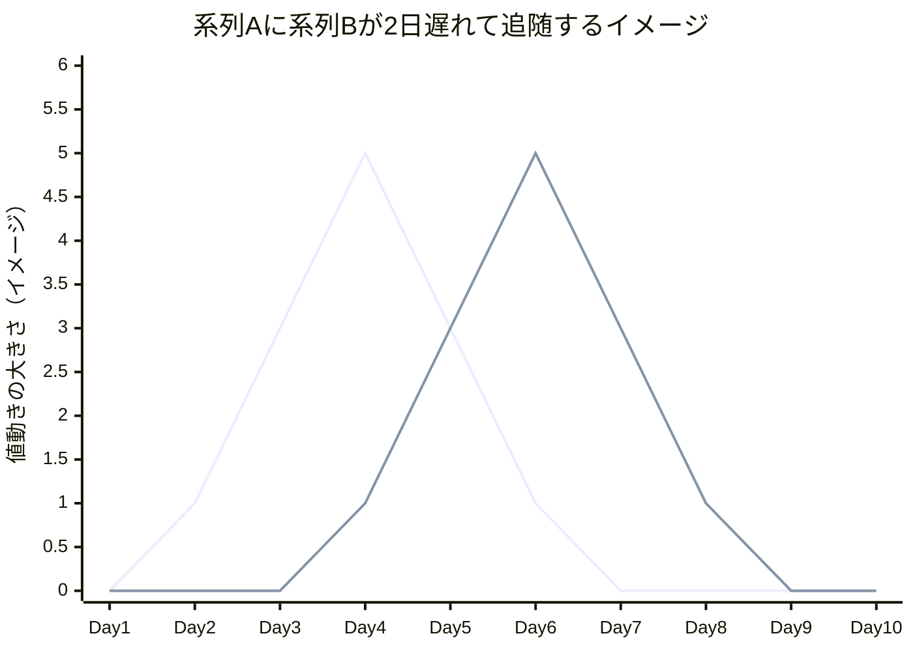
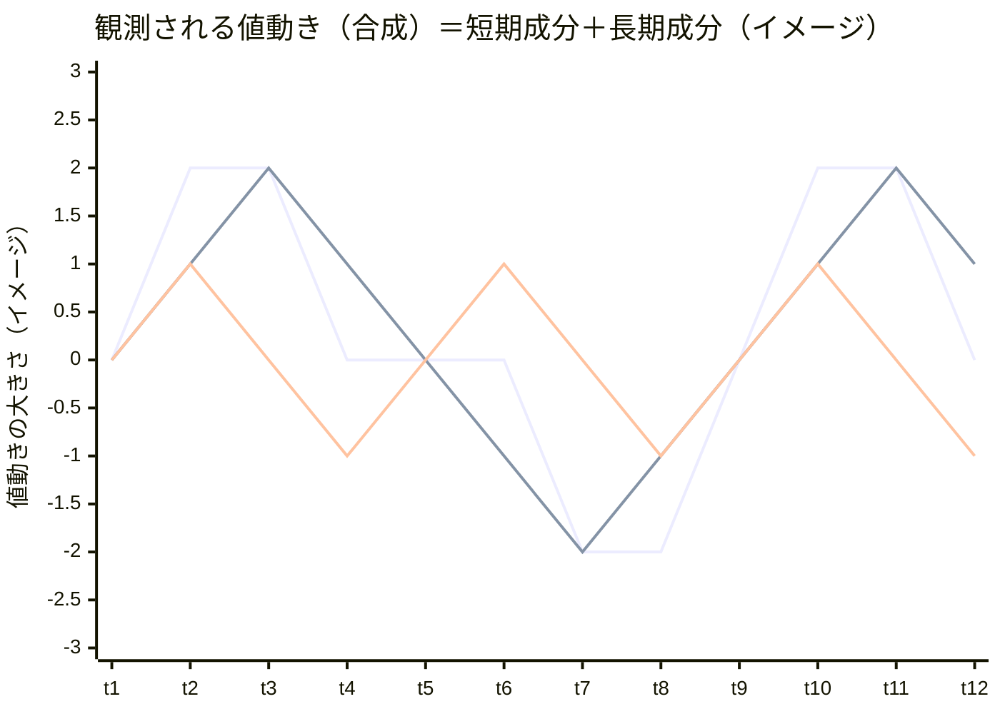

# チュートリアル教材04・05へのMermaid図追加 Implementation Plan

> **For agentic workers:** REQUIRED SUB-SKILL: Use superpowers:subagent-driven-development (recommended) or superpowers:executing-plans to implement this plan task-by-task. Steps use checkbox (`- [ ]`) syntax for tracking.

**Goal:** `docs/05-portfolio-management/04-lead-lag-correlation.md`と`05-wavelet-cycle-analysis.md`に、それぞれ1点ずつMermaid `xychart-beta`図を追加し、リード・ラグと周期分解という文章だけでは伝わりにくい概念を視覚化する。

**Architecture:** 既存2ファイルへの見出し挿入のみ。新規ファイルは作らない。図は`docs/app-design.md`が既に使っているMermaid記法を踏襲し、`xychart-beta`（折れ線グラフ）で仮想データを描画する。

**Tech Stack:** Markdown + Mermaid（`xychart-beta`）。コード変更・新規依存なし。

## Global Constraints

- 追加するのは各ファイル1箇所の新規小見出し（`### イメージ図: ...`）とその配下のMermaid図＋キャプション文のみ。既存の見出し・本文・演習課題・理解度チェック・フッターは一切変更しない。
- 図のデータはすべて説明用の仮想データであり、キャプションで「イメージ」であることを明記する。
- Mermaidの`xychart-beta`は凡例を描画しないため、図の直後に「何本目の線が何を表すか」を必ず文章で説明する。
- 図2（教材05）のデータは「合成＝長期成分＋短期成分」を満たすこと（設計書の検算表と一致させる）。

---

### Task 1: 教材04にリード・ラグのイメージ図を追加

**Files:**
- Modify: `ai-stock-investing-tutorial/docs/05-portfolio-management/04-lead-lag-correlation.md`

**Interfaces:**
- Consumes: なし
- Produces: なし（他タスクから依存されない独立編集）

- [ ] **Step 1: 「主要概念・パラメータ解説」の表の直後に新規小見出しを挿入する**

以下の既存テキストを:

```markdown
| `max_lag_days` | 探索するラグの最大日数。長すぎると計算コストが増え、短すぎると長い周期の関係を見逃す |

### シフト相関の限界（次教材への橋渡し）
```

以下に置き換える。

```markdown
| `max_lag_days` | 探索するラグの最大日数。長すぎると計算コストが増え、短すぎると長い周期の関係を見逃す |

### イメージ図: リード・ラグの視覚化



1本目の折れ線が系列A、2本目の折れ線が系列B（系列Aと同じ形が2日分右にずれている＝2日遅れて追随）を表す仮想データです。実際のリターンはこれほど単純な形にはならず、日々のノイズが混ざります。

### シフト相関の限界（次教材への橋渡し）
```

（プラン内の外側のMarkdownコードフェンス表記は引用のためのものであり、実ファイルには内側の`mermaid`コードブロックとキャプション文を含む本文をそのまま追加する。）

- [ ] **Step 2: Mermaidコードブロックが正しく囲われていることを確認する**

```bash
cd ai-stock-investing-tutorial
grep -c '^```' docs/05-portfolio-management/04-lead-lag-correlation.md
```

Expected: 偶数（既存の`python`/`text`コードブロック6個×2 + 今回追加した`mermaid`ブロック1個×2 = 14）

- [ ] **Step 3: 見出し構成を確認する**

```bash
cd ai-stock-investing-tutorial
grep '^###\?#* ' docs/05-portfolio-management/04-lead-lag-correlation.md
```

Expected: `### イメージ図: リード・ラグの視覚化`が`## 主要概念・パラメータ解説`の直下、`### シフト相関の限界（次教材への橋渡し）`の直前に表示される。

- [ ] **Step 4: コミット**

```bash
cd ai-stock-investing-tutorial
git add docs/05-portfolio-management/04-lead-lag-correlation.md
git commit -m "$(cat <<'EOF'
Add lead-lag visualization diagram to tutorial lesson 04

Adds a Mermaid xychart-beta diagram showing series A and a 2-day-lagged
series B as overlaid line charts, making the shift-correlation concept
visible instead of text-only.
EOF
)"
```

---

### Task 2: 教材05に周期分解のイメージ図を追加

**Files:**
- Modify: `ai-stock-investing-tutorial/docs/05-portfolio-management/05-wavelet-cycle-analysis.md`

**Interfaces:**
- Consumes: なし
- Produces: なし（他タスクから依存されない独立編集）

- [ ] **Step 1: 「概要」の発展オプション注記の直後、「位置づけ」見出しの前に新規小見出しを挿入する**

以下の既存テキストを:

```markdown
> 本教材は**発展・オプション**です。スキップしても06-real-world-examplesに進めます。

## 位置づけ
```

以下に置き換える。

```markdown
> 本教材は**発展・オプション**です。スキップしても06-real-world-examplesに進めます。

### イメージ図: 周期分解のイメージ



1本目の折れ線が観測される値動き（合成）、2本目が長期成分、3本目が短期成分を表す仮想データです（合成＝長期成分＋短期成分になるよう作成しています）。ウェーブレット分析は、この合成された値動きから周期の長さごとの成分を取り出す手法です。

## 位置づけ
```

（プラン内の外側のMarkdownコードフェンス表記は引用のためのものであり、実ファイルには内側の`mermaid`コードブロックとキャプション文を含む本文をそのまま追加する。）

- [ ] **Step 2: 合成データが「長期成分＋短期成分」と一致することを確認する**

```bash
cd ai-stock-investing-tutorial
uv run --project app python - <<'PYEOF'
composite = [0, 2, 2, 0, 0, 0, -2, -2, 0, 2, 2, 0]
long_comp = [0, 1, 2, 1, 0, -1, -2, -1, 0, 1, 2, 1]
short_comp = [0, 1, 0, -1, 0, 1, 0, -1, 0, 1, 0, -1]
computed = [l + s for l, s in zip(long_comp, short_comp)]
assert computed == composite, f"mismatch: {computed} != {composite}"
print("composite data verified OK")
PYEOF
```

Expected: `composite data verified OK`

- [ ] **Step 3: Mermaidコードブロックが正しく囲われていることを確認する**

```bash
cd ai-stock-investing-tutorial
grep -c '^```' docs/05-portfolio-management/05-wavelet-cycle-analysis.md
```

Expected: 偶数（既存の`python`/`text`コードブロック5個×2 + 今回追加した`mermaid`ブロック1個×2 = 12）

- [ ] **Step 4: 見出し構成を確認する**

```bash
cd ai-stock-investing-tutorial
grep '^###\?#* ' docs/05-portfolio-management/05-wavelet-cycle-analysis.md
```

Expected: `### イメージ図: 周期分解のイメージ`が発展オプションの注記の直後、`## 位置づけ`の直前に表示される。

- [ ] **Step 5: コミット**

```bash
cd ai-stock-investing-tutorial
git add docs/05-portfolio-management/05-wavelet-cycle-analysis.md
git commit -m "$(cat <<'EOF'
Add cycle-decomposition visualization diagram to tutorial lesson 05

Adds a Mermaid xychart-beta diagram showing a composite signal as the
sum of a long-cycle and a short-cycle component, making the core
wavelet-decomposition idea visible before the CWT code sample.
EOF
)"
```

---

## Self-Review Notes

- **Spec coverage:** 図1（教材04、配置・データ・キャプション）→ Task 1。図2（教材05、配置・データ・キャプション・検算）→ Task 2。設計書の「エラーハンドリング・留意点」（凡例なし対応のキャプション、仮想データ明記）は両タスクの本文にそのまま反映済み。ヒートマップ図はスコープ外のため対応タスクなし（意図通り）。
- **プレースホルダー確認:** 各Stepに実際のMarkdown内容・検算コード・grepコマンドを記載済み。曖昧な指示なし。
- **型・シグネチャの一貫性:** Task 2 Step 2の検算コードのデータ配列は、Task 2 Step 1で挿入するMermaid図のデータ配列と完全に一致している（`composite`/`long_comp`/`short_comp`の値を1対1で転記）。
