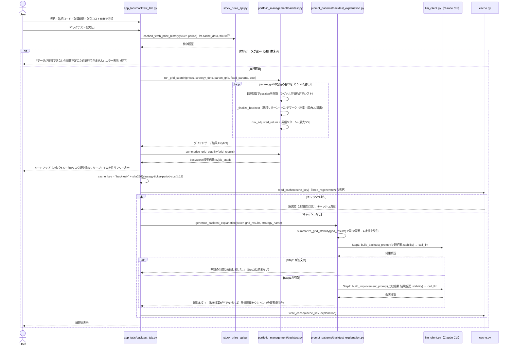
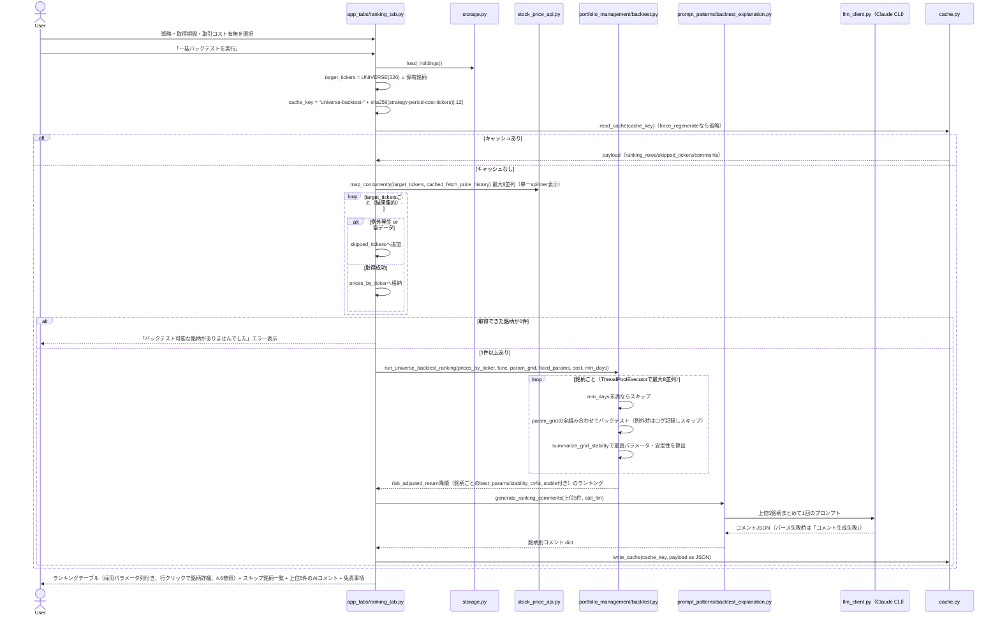

# バックテスト パラメータ最適化（グリッドサーチ・近傍安定性チェック） Implementation Plan

> **For agentic workers:** REQUIRED SUB-SKILL: Use superpowers:subagent-driven-development (recommended) or superpowers:executing-plans to implement this plan task-by-task. Steps use checkbox (`- [ ]`) syntax for tracking.

**Goal:** 固定2プリセット比較を廃止し、各戦略の近傍パラメータを格子状（グリッド）に総当たりでバックテストして、結果の安定性（過学習リスク）を可視化する機能を実装する。

**Architecture:** `portfolio_management/backtest.py` にグリッドサーチ・安定性判定の計算ロジックを追加し、単一銘柄タブ（ヒートマップ＋安定性サマリー）と一括バックテストタブ（銘柄ごとに最良パラメータを探索してランキング）の両方から利用する。LLM解説（Prompt Chaining）にも安定性情報を渡す。

**Tech Stack:** Python 3.14 / pandas / Streamlit / Altair（ヒートマップ）/ pytest / `concurrent.futures.ThreadPoolExecutor`（銘柄ごとの並列グリッドサーチ）

**設計書:** [2026-08-10-backtest-parameter-grid-search-design.md](../specs/2026-08-10-backtest-parameter-grid-search-design.md)

## Global Constraints

- 対象戦略は4つ固定: 移動平均クロスオーバー／RSI逆張り／MACDクロスオーバー／ボリンジャーバンド逆張り
- グリッド探索範囲（`param_grid`）はコード側（`STRATEGIES`）に固定し、UI上での動的調整は行わない
- グリッド全体の組み合わせ数は概ね15〜40通りに収める（一括バックテストで452銘柄×グリッドの計算コストを抑えるため）
- 安定性判定は変動係数（標準偏差 ÷ |平均|、母標準偏差を使用）を用い、`cv < 0.5` を安定の目安とする。平均が0近傍（`abs(mean) < 1e-6`）の場合は判定不可として `is_stable=False`
- 数値計算は必ずPython側で完結させ、LLMには計算済み数値の解釈のみを行わせる（既存方針を踏襲）
- LLM解説には `DISCLAIMER_NOTICE`（免責事項）を先頭と末尾に必ず付与する（既存方針を踏襲）
- 既存の `_finalize_backtest` および4つの戦略関数（`run_ma_crossover_backtest` 等）のシグネチャ・内部ロジックは変更しない
- `app_tabs/*.py` にはユニットテストが存在しない（リポジトリの既存方針）。UI変更の検証は手動確認（`uv run python -m streamlit run app.py`）とテストスイート全体のパスで行う

---

## Task 1: `run_grid_search` の追加（グリッドサーチの計算コア）

**Files:**
- Modify: `app/portfolio_management/backtest.py`
- Test: `app/tests/test_backtest.py`

**Interfaces:**
- Consumes: 既存の `_finalize_backtest`（変更なし）、`logger`・`log_duration`（既存）
- Produces:
  - `_risk_adjusted_return(result: dict) -> float`（内部関数）
  - `_run_grid_combinations(prices, backtest_func, keys: list[str], combos: list[tuple], fixed_params: dict, transaction_cost_pct: float) -> list[dict]`（内部関数、ログ出力なし）
  - `run_grid_search(prices: pd.Series, backtest_func, param_grid: dict, fixed_params: dict | None = None, transaction_cost_pct: float = 0.0) -> list[dict]`（公開関数、ログ出力あり）
  - 各要素の形: `{"params": {...}, "total_return_pct": float, "benchmark_return_pct": float, "win_rate_pct": float, "max_drawdown_pct": float, "trade_days": int, "risk_adjusted_return": float}`

**設計メモ:** `_run_grid_combinations` を「ログを出さない内部エンジン」として切り出すのは、Task 6で一括バックテスト（452銘柄）が銘柄ごとにグリッドサーチを行う際、`run_grid_search` 自体をそのまま452回呼ぶと `log_duration` のINFOログが904行出力されてしまうため。`run_universe_backtest_ranking` は `_run_grid_combinations` を直接使い、全体を1回の `log_duration` で包む。

- [ ] **Step 1: 失敗するテストを書く**

`app/tests/test_backtest.py` の `from portfolio_management.backtest import (...)` に `run_grid_search` を追加し、末尾（`test_run_universe_backtest_ranking_logs_duration` の後）に以下を追加する。

```python
def test_run_grid_search_returns_result_for_each_combination_in_cartesian_product():
    dates = pd.date_range("2026-01-01", periods=4, freq="D")
    prices = pd.Series([100, 100, 102, 102], index=dates)

    grid_results = run_grid_search(
        prices,
        run_ma_crossover_backtest,
        param_grid={"short_window": [1], "long_window": [2, 3]},
    )

    assert len(grid_results) == 2
    assert {row["params"]["long_window"] for row in grid_results} == {2, 3}
    assert all(row["params"]["short_window"] == 1 for row in grid_results)


def test_run_grid_search_computes_risk_adjusted_return_per_combination():
    dates = pd.date_range("2026-01-01", periods=4, freq="D")
    prices = pd.Series([100, 100, 102, 102], index=dates)

    grid_results = run_grid_search(
        prices,
        run_ma_crossover_backtest,
        param_grid={"short_window": [1], "long_window": [2]},
    )

    assert grid_results == [
        {
            "params": {"short_window": 1, "long_window": 2},
            "total_return_pct": 0.0,
            "benchmark_return_pct": 2.0,
            "win_rate_pct": 0.0,
            "max_drawdown_pct": 0.0,
            "trade_days": 1,
            "risk_adjusted_return": 0.0,
        }
    ]


def test_run_grid_search_applies_fixed_params_to_every_combination():
    dates = pd.date_range("2026-01-01", periods=9, freq="D")
    prices = pd.Series([100, 90, 80, 70, 90, 110, 130, 130, 130], index=dates)
    captured_kwargs = []

    def fake_backtest_func(prices, transaction_cost_pct=0.0, **params):
        captured_kwargs.append(params)
        return {
            "total_return_pct": 0.0,
            "benchmark_return_pct": 0.0,
            "win_rate_pct": 0.0,
            "max_drawdown_pct": 0.0,
            "trade_days": 0,
        }

    run_grid_search(
        prices,
        fake_backtest_func,
        param_grid={"period": [3, 5]},
        fixed_params={"oversold": 30, "overbought": 70},
    )

    assert captured_kwargs == [
        {"period": 3, "oversold": 30, "overbought": 70},
        {"period": 5, "oversold": 30, "overbought": 70},
    ]


def test_run_grid_search_logs_duration(caplog):
    dates = pd.date_range("2026-01-01", periods=80, freq="D")
    prices = pd.Series(range(100, 180), index=dates, dtype=float)

    with caplog.at_level(logging.INFO, logger="portfolio_management.backtest"):
        run_grid_search(
            prices,
            run_ma_crossover_backtest,
            param_grid={"short_window": [5], "long_window": [25]},
        )

    assert "グリッドサーチ計算" in caplog.text
    assert "を開始" in caplog.text
    assert "が完了しました" in caplog.text
```

- [ ] **Step 2: テストが失敗することを確認**

Run: `cd app && uv run pytest tests/test_backtest.py -k run_grid_search -v`
Expected: FAIL（`ImportError: cannot import name 'run_grid_search'`）

- [ ] **Step 3: 最小実装を書く**

`app/portfolio_management/backtest.py` のファイル先頭 import 群に以下を追加する（既存の `import logging` / `import pandas as pd` の間、アルファベット順を保つ）。

```python
from itertools import product
```

`_finalize_backtest` 関数の直後（`run_ma_crossover_backtest` の直前）に以下を追加する。

```python
def _risk_adjusted_return(result: dict) -> float:
    """収益率をリスク（最大ドローダウン）で調整した値を返す。
    ドローダウンが0の場合はゼロ除算を避け、収益率をそのまま返す。"""
    drawdown = abs(result["max_drawdown_pct"])
    risk_adjusted = result["total_return_pct"] / drawdown if drawdown else result["total_return_pct"]
    return round(risk_adjusted, 2)


def _run_grid_combinations(
    prices: pd.Series,
    backtest_func,
    keys: list[str],
    combos: list[tuple],
    fixed_params: dict,
    transaction_cost_pct: float,
) -> list[dict]:
    """param_gridの組み合わせ（あらかじめ計算済みのデカルト積）ごとにバックテストを
    実行する内部処理。ログ出力は呼び出し元（run_grid_search / run_universe_backtest_ranking）
    の責務とし、この関数自体はログを出さない（一括バックテストで銘柄数だけ呼ばれても
    ログが大量出力されないようにするため）。"""
    grid_results = []
    for combo in combos:
        params = dict(zip(keys, combo))
        result = backtest_func(
            prices, transaction_cost_pct=transaction_cost_pct, **params, **fixed_params
        )
        grid_results.append(
            {
                "params": params,
                **result,
                "risk_adjusted_return": _risk_adjusted_return(result),
            }
        )
    return grid_results
```

`STRATEGIES` レジストリの直前（現在の `run_backtest_comparison` があった付近、Task 5で削除される関数の代わり）に以下を追加する。まだ `STRATEGIES` は変更しないので、このタスクでは既存の `STRATEGIES`（`presets`のまま）はそのまま残す。

```python
def run_grid_search(
    prices: pd.Series,
    backtest_func,
    param_grid: dict,
    fixed_params: dict | None = None,
    transaction_cost_pct: float = 0.0,
) -> list[dict]:
    """param_gridの全組み合わせ（デカルト積）でバックテストを実行し、
    組み合わせごとのパラメータ・成績・リスク調整済みリターンをまとめて返す。"""
    fixed_params = fixed_params or {}
    keys = list(param_grid.keys())
    combos = list(product(*(list(param_grid[key]) for key in keys)))
    with log_duration(logger, f"グリッドサーチ計算（{len(combos)}通り）"):
        return _run_grid_combinations(
            prices, backtest_func, keys, combos, fixed_params, transaction_cost_pct
        )
```

- [ ] **Step 4: テストが通ることを確認**

Run: `cd app && uv run pytest tests/test_backtest.py -v`
Expected: PASS（全件、既存テストも壊れていないこと）

- [ ] **Step 5: コミット**

```bash
git add app/portfolio_management/backtest.py app/tests/test_backtest.py
git commit -m "$(cat <<'EOF'
feat: バックテストに近傍グリッドサーチのコア計算を追加

run_grid_searchを新設し、param_gridの全組み合わせでバックテストを実行して
リスク調整済みリターンを付与する。銘柄ごとに繰り返し呼ばれる際のログ肥大化を
避けるため、ログ出力なしの内部エンジン（_run_grid_combinations）と、
それを1回のlog_durationで包む公開関数（run_grid_search）に分離した。
EOF
)"
```

---

## Task 2: `summarize_grid_stability` の追加（安定性判定）

**Files:**
- Modify: `app/portfolio_management/backtest.py`
- Test: `app/tests/test_backtest.py`

**Interfaces:**
- Consumes: Task 1で追加した `grid_results`（`list[dict]`、各要素に `params` と `risk_adjusted_return` を含む）
- Produces: `summarize_grid_stability(grid_results: list[dict]) -> dict`
  - 戻り値: `{"best": dict, "worst": dict, "cv": float | None, "is_stable": bool, "grid_size": int}`

- [ ] **Step 1: 失敗するテストを書く**

`test_backtest.py` の import に `summarize_grid_stability` を追加し、以下のテストを追加する。

```python
def test_summarize_grid_stability_picks_best_and_worst_by_risk_adjusted_return():
    grid_results = [
        {"params": {"short_window": 5}, "risk_adjusted_return": 3.0},
        {"params": {"short_window": 6}, "risk_adjusted_return": 9.0},
        {"params": {"short_window": 7}, "risk_adjusted_return": 1.0},
    ]

    summary = summarize_grid_stability(grid_results)

    assert summary["best"]["params"] == {"short_window": 6}
    assert summary["worst"]["params"] == {"short_window": 7}
    assert summary["grid_size"] == 3


def test_summarize_grid_stability_is_stable_when_coefficient_of_variation_is_low():
    grid_results = [
        {"params": {"a": 1}, "risk_adjusted_return": 10.0},
        {"params": {"a": 2}, "risk_adjusted_return": 10.0},
        {"params": {"a": 3}, "risk_adjusted_return": 10.0},
    ]

    summary = summarize_grid_stability(grid_results)

    assert summary["cv"] == 0.0
    assert summary["is_stable"] is True


def test_summarize_grid_stability_is_unstable_at_cv_boundary():
    grid_results = [
        {"params": {"a": 1}, "risk_adjusted_return": 5.0},
        {"params": {"a": 2}, "risk_adjusted_return": 15.0},
    ]

    summary = summarize_grid_stability(grid_results)

    assert summary["cv"] == 0.5
    assert summary["is_stable"] is False


def test_summarize_grid_stability_marks_unjudgeable_when_mean_near_zero():
    grid_results = [
        {"params": {"a": 1}, "risk_adjusted_return": 1.0},
        {"params": {"a": 2}, "risk_adjusted_return": -1.0},
    ]

    summary = summarize_grid_stability(grid_results)

    assert summary["cv"] is None
    assert summary["is_stable"] is False
```

- [ ] **Step 2: テストが失敗することを確認**

Run: `cd app && uv run pytest tests/test_backtest.py -k summarize_grid_stability -v`
Expected: FAIL（`ImportError: cannot import name 'summarize_grid_stability'`）

- [ ] **Step 3: 最小実装を書く**

`backtest.py` のファイル先頭 import 群に以下を追加する。

```python
import statistics
```

`run_grid_search` の直後に以下を追加する。

```python
def summarize_grid_stability(grid_results: list[dict]) -> dict:
    """グリッド全体のリスク調整済みリターンから、最良・最悪の組み合わせと
    近傍全体の安定性（変動係数）を求める。"""
    returns = [row["risk_adjusted_return"] for row in grid_results]
    best = max(grid_results, key=lambda row: row["risk_adjusted_return"])
    worst = min(grid_results, key=lambda row: row["risk_adjusted_return"])

    mean = statistics.mean(returns)
    # 母集団（グリッド全体）のばらつきを見るため、標本標準偏差ではなく母標準偏差を使う。
    stdev = statistics.pstdev(returns)
    if abs(mean) < 1e-6:
        cv = None
        is_stable = False
    else:
        cv = round(abs(stdev / mean), 4)
        is_stable = cv < 0.5

    return {
        "best": best,
        "worst": worst,
        "cv": cv,
        "is_stable": is_stable,
        "grid_size": len(grid_results),
    }
```

- [ ] **Step 4: テストが通ることを確認**

Run: `cd app && uv run pytest tests/test_backtest.py -v`
Expected: PASS（全件）

- [ ] **Step 5: コミット**

```bash
git add app/portfolio_management/backtest.py app/tests/test_backtest.py
git commit -m "$(cat <<'EOF'
feat: グリッドサーチ結果から安定性（変動係数）を判定する関数を追加

近傍グリッド全体のrisk_adjusted_returnから最良/最悪の組み合わせと
変動係数（標準偏差÷|平均|）を算出し、cv<0.5を安定の目安とする
summarize_grid_stabilityを追加した。
EOF
)"
```

---

## Task 3: `build_backtest_prompt`/`build_improvement_prompt` に安定性情報を渡す

**Files:**
- Modify: `app/prompt_patterns/backtest_explanation.py`
- Test: `app/tests/test_backtest_explanation.py`

**Interfaces:**
- Consumes: なし（Task 1/2の関数には依存しない。呼び出し元がTask 4で `stability` dict を組み立てて渡す）
- Produces:
  - `build_backtest_prompt(ticker: str, comparison: dict[str, dict], stability: dict, strategy_name: str = "移動平均クロスオーバー") -> str`
  - `build_improvement_prompt(ticker: str, comparison: dict[str, dict], explanation: str, stability: dict, strategy_name: str = "移動平均クロスオーバー") -> str`
  - `stability` の形: `{"cv": float | None, "is_stable": bool, "grid_size": int}`

**注意:** 引数の並びは `(ticker, comparison, stability, strategy_name=...)` および `(ticker, comparison, explanation, stability, strategy_name=...)` とする（`strategy_name` はデフォルト値を持つため、デフォルトなしの `stability` より後ろに置けない）。

- [ ] **Step 1: 失敗するテストを書く**

`app/tests/test_backtest_explanation.py` の既存テストを以下の内容に置き換える（ファイル全体を書き換える）。

```python
from common.disclaimer import DISCLAIMER_NOTICE
from prompt_patterns.backtest_explanation import (
    build_backtest_prompt,
    build_improvement_prompt,
    build_ranking_comment_prompt,
    generate_ranking_comments,
)


def test_build_backtest_prompt_includes_ticker_and_facts():
    comparison = {"最良（short_window=27, long_window=75）": {"total_return_pct": 18.4, "trade_days": 312}}
    stability = {"cv": 0.3, "is_stable": True, "grid_size": 30}

    prompt = build_backtest_prompt("7203.T", comparison, stability)

    assert "7203.T" in prompt
    assert "18.4" in prompt
    assert "312" in prompt
    assert DISCLAIMER_NOTICE in prompt


def test_build_backtest_prompt_includes_stability_info():
    comparison = {"最良（short_window=27, long_window=75）": {"total_return_pct": 18.4}}
    stability = {"cv": 0.62, "is_stable": False, "grid_size": 30}

    prompt = build_backtest_prompt("7203.T", comparison, stability)

    assert "0.62" in prompt
    assert "is_stable" in prompt


def test_build_backtest_prompt_instructs_overfitting_and_no_directive_language():
    comparison = {"最良（short_window=27, long_window=75）": {"total_return_pct": 18.4}}
    stability = {"cv": 0.3, "is_stable": True, "grid_size": 30}

    prompt = build_backtest_prompt("7203.T", comparison, stability)

    assert "過学習" in prompt
    assert "取引コスト" in prompt
    assert "売買" in prompt
    assert "パラメータ" in prompt


def test_build_backtest_prompt_uses_default_strategy_name_when_omitted():
    comparison = {"最良（short_window=27, long_window=75）": {"total_return_pct": 18.4}}
    stability = {"cv": 0.3, "is_stable": True, "grid_size": 30}

    prompt = build_backtest_prompt("7203.T", comparison, stability)

    assert "移動平均クロスオーバー戦略" in prompt


def test_build_backtest_prompt_uses_given_strategy_name():
    comparison = {"最良（period=14, oversold=30）": {"total_return_pct": 5.0}}
    stability = {"cv": 0.3, "is_stable": True, "grid_size": 36}

    prompt = build_backtest_prompt("7203.T", comparison, stability, strategy_name="RSI逆張り")

    assert "RSI逆張り戦略" in prompt
    assert "移動平均クロスオーバー戦略" not in prompt


def test_build_ranking_comment_prompt_includes_ticker_data_and_json_output_instruction():
    ranking_rows = [{"ticker": "AAA.T", "total_return_pct": 20.0, "risk_adjusted_return": 6.0}]

    prompt = build_ranking_comment_prompt(ranking_rows)

    assert "AAA.T" in prompt
    assert "20.0" in prompt
    assert "6.0" in prompt


def test_generate_ranking_comments_returns_empty_dict_for_empty_ranking():
    assert generate_ranking_comments([]) == {}


def test_generate_ranking_comments_parses_llm_json_response():
    ranking_rows = [
        {"ticker": "AAA.T", "total_return_pct": 20.0, "risk_adjusted_return": 6.0},
        {"ticker": "BBB.T", "total_return_pct": 10.0, "risk_adjusted_return": 2.0},
    ]
    fake_call_llm = lambda prompt: '{"AAA.T": "好調でした。", "BBB.T": "堅調でした。"}'

    result = generate_ranking_comments(ranking_rows, call_llm=fake_call_llm)

    assert result == {"AAA.T": "好調でした。", "BBB.T": "堅調でした。"}


def test_generate_ranking_comments_falls_back_on_invalid_json():
    ranking_rows = [{"ticker": "AAA.T", "total_return_pct": 20.0, "risk_adjusted_return": 6.0}]
    fake_call_llm = lambda prompt: "not json"

    result = generate_ranking_comments(ranking_rows, call_llm=fake_call_llm)

    assert result == {"AAA.T": "コメント生成失敗"}


def test_build_improvement_prompt_includes_ticker_facts_and_prior_explanation():
    comparison = {"最良（short_window=27, long_window=75）": {"total_return_pct": 18.4, "trade_days": 312}}
    stability = {"cv": 0.3, "is_stable": True, "grid_size": 30}

    prompt = build_improvement_prompt(
        "7203.T", comparison, "これまでの解説文です。", stability, "移動平均クロスオーバー"
    )

    assert "7203.T" in prompt
    assert "18.4" in prompt
    assert "これまでの解説文です。" in prompt
    assert DISCLAIMER_NOTICE in prompt


def test_build_improvement_prompt_instructs_overfitting_and_no_directive_language():
    comparison = {"最良（short_window=27, long_window=75）": {"total_return_pct": 18.4}}
    stability = {"cv": 0.3, "is_stable": True, "grid_size": 30}

    prompt = build_improvement_prompt("7203.T", comparison, "解説文", stability, "移動平均クロスオーバー")

    assert "過学習" in prompt
    assert "取引コスト" in prompt
    assert "売買" in prompt


def test_build_improvement_prompt_uses_default_strategy_name_when_omitted():
    comparison = {"最良（short_window=27, long_window=75）": {"total_return_pct": 18.4}}
    stability = {"cv": 0.3, "is_stable": True, "grid_size": 30}

    prompt = build_improvement_prompt("7203.T", comparison, "解説文", stability)

    assert "移動平均クロスオーバー戦略" in prompt
```

- [ ] **Step 2: テストが失敗することを確認**

Run: `cd app && uv run pytest tests/test_backtest_explanation.py -v`
Expected: FAIL（`TypeError: build_backtest_prompt() missing 1 required positional argument: 'stability'` 等）

- [ ] **Step 3: 最小実装を書く**

`app/prompt_patterns/backtest_explanation.py` の `build_backtest_prompt` と `build_improvement_prompt` を以下に置き換える（`build_ranking_comment_prompt`・`generate_ranking_comments` は変更しない）。

```python
def build_backtest_prompt(
    ticker: str,
    comparison: dict[str, dict],
    stability: dict,
    strategy_name: str = "移動平均クロスオーバー",
) -> str:
    # 再計算を防ぐため、Python側で算出済みのバックテスト結果をJSONとしてそのまま埋め込む。
    comparison_json = json.dumps(comparison, ensure_ascii=False, indent=2, default=str)
    stability_json = json.dumps(stability, ensure_ascii=False, indent=2, default=str)
    return (
        f"以下は{strategy_name}戦略のバックテスト結果です"
        "（Python側でパラメータの近傍グリッドサーチまで計算済みのため再計算は不要です）。\n\n"
        f"【対象銘柄】{ticker}\n"
        f"【近傍グリッド内の最良/最悪パラメータの結果（JSON）】\n{comparison_json}\n\n"
        f"【近傍グリッド全体の安定性（JSON、Python側で算出済み）】\n{stability_json}\n\n"
        "この結果を投資初心者にも分かる言葉で説明してください。\n"
        "以下を必ず含めてください。\n"
        "1. 最良パラメータの戦略リターンとベンチマーク（Buy&Hold）の比較\n"
        "2. 勝率・最大ドローダウンの意味\n"
        "3. 過去の結果が将来の成績を保証しないこと、"
        "および過学習・取引コストやスリッページを考慮しきれていない可能性への注意喚起\n"
        "4. 近傍グリッド全体の安定性（is_stableとcvの値）を踏まえ、"
        "is_stableがfalseの場合は特にパラメータ選択に対する過学習リスクを強調すること\n"
        "5. 追加で確認する価値がある指標やシナリオの提案（実行はしない）\n\n"
        # 投資助言と誤解されないよう、指示的な表現を明示的に禁止する。
        "出力は事実の説明と教育的な提案にとどめ、「買うべき」「このルールで"
        "今すぐ売買すべき」のような指示的な表現は使わないでください。\n\n"
        f"{DISCLAIMER_NOTICE}"
    )


def build_improvement_prompt(
    ticker: str,
    comparison: dict[str, dict],
    explanation: str,
    stability: dict,
    strategy_name: str = "移動平均クロスオーバー",
) -> str:
    # Step1（結果解説）の出力を入力として受け取り、追加で検討すべき観点を
    # 生成させる2段階目のプロンプト（Prompt Chaining）。
    comparison_json = json.dumps(comparison, ensure_ascii=False, indent=2, default=str)
    stability_json = json.dumps(stability, ensure_ascii=False, indent=2, default=str)
    return (
        f"以下は{strategy_name}戦略のバックテスト結果（Python側で計算済み）と、"
        "その結果について別のAIが作成した解説文です。\n\n"
        f"【対象銘柄】{ticker}\n"
        f"【近傍グリッド内の最良/最悪パラメータの結果（JSON）】\n{comparison_json}\n\n"
        f"【近傍グリッド全体の安定性（JSON、Python側で算出済み）】\n{stability_json}\n\n"
        f"【既存の解説】\n{explanation}\n\n"
        "この解説を踏まえ、投資家が追加で検討する価値がある観点を"
        "日本語で2〜3個、簡潔に提案してください。\n"
        "以下を必ず考慮してください。\n"
        "1. is_stableがfalseの場合、過学習を避けるために確認すべき追加のデータ期間やパラメータ幅\n"
        "2. 取引コストやスリッページなど、本バックテストが考慮していない要因\n\n"
        "出力は教育的な提案にとどめ、「買うべき」「このルールで今すぐ売買すべき」"
        "のような指示的な表現は使わないでください。\n\n"
        f"{DISCLAIMER_NOTICE}"
    )
```

- [ ] **Step 4: テストが通ることを確認**

Run: `cd app && uv run pytest tests/test_backtest_explanation.py -v`
Expected: PASS（全件）

- [ ] **Step 5: コミット**

```bash
git add app/prompt_patterns/backtest_explanation.py app/tests/test_backtest_explanation.py
git commit -m "$(cat <<'EOF'
feat: バックテスト解説プロンプトに近傍グリッドの安定性情報を追加

build_backtest_prompt/build_improvement_promptにstability引数を追加し、
変動係数(cv)・安定判定(is_stable)をPython側で計算済みの値としてLLMに渡す。
is_stable=falseの場合は過学習リスクをより強調するよう指示文を更新した。
EOF
)"
```

---

## Task 4: `generate_backtest_explanation` を `grid_results` ベースに書き換え

**Files:**
- Modify: `app/portfolio_management/backtest.py`
- Test: `app/tests/test_backtest.py`

**Interfaces:**
- Consumes:
  - Task 2: `summarize_grid_stability(grid_results) -> dict`
  - Task 3: `build_backtest_prompt(ticker, comparison, stability, strategy_name)`, `build_improvement_prompt(ticker, comparison, explanation, stability, strategy_name)`
- Produces:
  - `_format_params(params: dict) -> str`（内部関数）
  - `generate_backtest_explanation(ticker: str, grid_results: list[dict], strategy_name: str = "移動平均クロスオーバー", call_llm=default_call_llm) -> str`（`prices`/`backtest_func`/`presets`/`transaction_cost_pct` 引数は廃止）

- [ ] **Step 1: 失敗するテストを書く**

`test_backtest.py` の既存の `generate_backtest_explanation` 関連テスト（`test_generate_backtest_explanation_includes_disclaimer_and_commentary` から `test_generate_backtest_explanation_omits_improvement_section_when_step2_empty` まで、および `test_generate_backtest_explanation_uses_default_ma_strategy_when_omitted`）をすべて削除し、以下に置き換える。

```python
def test_generate_backtest_explanation_includes_disclaimer_and_commentary():
    grid_results = [
        {
            "params": {"short_window": 1, "long_window": 2},
            "total_return_pct": 0.0,
            "benchmark_return_pct": 2.0,
            "win_rate_pct": 0.0,
            "max_drawdown_pct": 0.0,
            "trade_days": 1,
            "risk_adjusted_return": 0.0,
        }
    ]
    fake_call_llm = lambda prompt: "テスト用のバックテスト解説です。"

    result = generate_backtest_explanation("AAA.T", grid_results, call_llm=fake_call_llm)

    assert result.count(DISCLAIMER_NOTICE) == 2
    assert "テスト用のバックテスト解説です。" in result


def test_generate_backtest_explanation_passes_ticker_and_comparison_to_prompt():
    grid_results = [
        {
            "params": {"short_window": 1, "long_window": 2},
            "total_return_pct": 0.0,
            "benchmark_return_pct": 2.0,
            "win_rate_pct": 0.0,
            "max_drawdown_pct": 0.0,
            "trade_days": 1,
            "risk_adjusted_return": 0.0,
        }
    ]
    captured_prompts = []

    def fake_call_llm(prompt):
        captured_prompts.append(prompt)
        return "解説"

    generate_backtest_explanation("AAA.T", grid_results, call_llm=fake_call_llm)

    assert "AAA.T" in captured_prompts[0]
    assert "short_window=1" in captured_prompts[0]


def test_generate_backtest_explanation_passes_strategy_name_to_prompt():
    grid_results = [
        {
            "params": {"period": 3, "oversold": 30},
            "total_return_pct": 22.22,
            "benchmark_return_pct": 30.0,
            "win_rate_pct": 100.0,
            "max_drawdown_pct": 0.0,
            "trade_days": 1,
            "risk_adjusted_return": 22.22,
        }
    ]
    captured_prompts = []

    def fake_call_llm(prompt):
        captured_prompts.append(prompt)
        return "解説"

    generate_backtest_explanation(
        "AAA.T", grid_results, strategy_name="RSI逆張り", call_llm=fake_call_llm
    )

    assert "RSI逆張り戦略" in captured_prompts[0]


def test_generate_backtest_explanation_passes_stability_info_to_prompt():
    grid_results = [
        {
            "params": {"short_window": 1, "long_window": 2},
            "total_return_pct": 0.0,
            "benchmark_return_pct": 2.0,
            "win_rate_pct": 0.0,
            "max_drawdown_pct": 0.0,
            "trade_days": 1,
            "risk_adjusted_return": 0.0,
        },
        {
            "params": {"short_window": 1, "long_window": 3},
            "total_return_pct": 5.0,
            "benchmark_return_pct": 2.0,
            "win_rate_pct": 100.0,
            "max_drawdown_pct": 0.0,
            "trade_days": 1,
            "risk_adjusted_return": 5.0,
        },
    ]
    captured_prompts = []

    def fake_call_llm(prompt):
        captured_prompts.append(prompt)
        return "解説"

    generate_backtest_explanation("AAA.T", grid_results, call_llm=fake_call_llm)

    assert "is_stable" in captured_prompts[0]
    assert "grid_size" in captured_prompts[0]


def test_generate_backtest_explanation_calls_llm_twice_and_includes_improvement_section():
    grid_results = [
        {
            "params": {"short_window": 1, "long_window": 2},
            "total_return_pct": 0.0,
            "benchmark_return_pct": 2.0,
            "win_rate_pct": 0.0,
            "max_drawdown_pct": 0.0,
            "trade_days": 1,
            "risk_adjusted_return": 0.0,
        }
    ]
    responses = iter(["結果の解説です。", "追加提案です。"])
    call_count = {"n": 0}

    def fake_call_llm(prompt):
        call_count["n"] += 1
        return next(responses)

    result = generate_backtest_explanation("AAA.T", grid_results, call_llm=fake_call_llm)

    assert call_count["n"] == 2
    assert "結果の解説です。" in result
    assert "追加提案です。" in result
    assert "## 追加で検討したい観点" in result


def test_generate_backtest_explanation_second_prompt_includes_first_explanation():
    grid_results = [
        {
            "params": {"short_window": 1, "long_window": 2},
            "total_return_pct": 0.0,
            "benchmark_return_pct": 2.0,
            "win_rate_pct": 0.0,
            "max_drawdown_pct": 0.0,
            "trade_days": 1,
            "risk_adjusted_return": 0.0,
        }
    ]
    captured_prompts = []
    responses = iter(["最初の解説文です。", "改善提案文です。"])

    def fake_call_llm(prompt):
        captured_prompts.append(prompt)
        return next(responses)

    generate_backtest_explanation("AAA.T", grid_results, call_llm=fake_call_llm)

    assert "最初の解説文です。" in captured_prompts[1]
    assert "AAA.T" in captured_prompts[1]


def test_generate_backtest_explanation_gate_skips_second_call_when_explanation_empty():
    grid_results = [
        {
            "params": {"short_window": 1, "long_window": 2},
            "total_return_pct": 0.0,
            "benchmark_return_pct": 2.0,
            "win_rate_pct": 0.0,
            "max_drawdown_pct": 0.0,
            "trade_days": 1,
            "risk_adjusted_return": 0.0,
        }
    ]
    call_count = {"n": 0}

    def fake_call_llm(prompt):
        call_count["n"] += 1
        return "   "

    result = generate_backtest_explanation("AAA.T", grid_results, call_llm=fake_call_llm)

    assert call_count["n"] == 1
    assert result == "解説の生成に失敗しました。"


def test_generate_backtest_explanation_omits_improvement_section_when_step2_empty():
    grid_results = [
        {
            "params": {"short_window": 1, "long_window": 2},
            "total_return_pct": 0.0,
            "benchmark_return_pct": 2.0,
            "win_rate_pct": 0.0,
            "max_drawdown_pct": 0.0,
            "trade_days": 1,
            "risk_adjusted_return": 0.0,
        }
    ]
    responses = iter(["結果の解説です。", "  "])

    def fake_call_llm(prompt):
        return next(responses)

    result = generate_backtest_explanation("AAA.T", grid_results, call_llm=fake_call_llm)

    assert "結果の解説です。" in result
    assert "## 追加で検討したい観点" not in result
```

- [ ] **Step 2: テストが失敗することを確認**

Run: `cd app && uv run pytest tests/test_backtest.py -k generate_backtest_explanation -v`
Expected: FAIL（既存の `generate_backtest_explanation` が `prices` を第2引数に取る古いシグネチャのため `KeyError`/`AttributeError` 等で失敗）

- [ ] **Step 3: 最小実装を書く**

`backtest.py` の `_run_grid_combinations` の直後（`run_grid_search` の前）に以下を追加する。

```python
def _format_params(params: dict) -> str:
    return ", ".join(f"{key}={value}" for key, value in params.items())
```

`generate_backtest_explanation` を以下に置き換える。

```python
def generate_backtest_explanation(
    ticker: str,
    grid_results: list[dict],
    strategy_name: str = "移動平均クロスオーバー",
    call_llm=default_call_llm,
) -> str:
    """グリッドサーチ結果をLLMに渡し、投資家向けの解説レポート（Markdown）を
    生成する。免責事項を先頭と末尾に必ず付与する。

    Prompt Chaining: Step1で結果解説を生成し、その出力をgate（空文字チェック）
    で検証したうえで、Step2でStep1の解説を踏まえた改善提案を生成する。
    Step1が空文字の場合はStep2に進まずエラーメッセージを返す。Step2が
    空文字の場合は改善提案セクションを省略し、Step1の結果のみ返す。
    """
    summary = summarize_grid_stability(grid_results)
    best, worst = summary["best"], summary["worst"]
    comparison = {
        f"最良（{_format_params(best['params'])}）": {
            key: value for key, value in best.items() if key != "params"
        },
        f"近傍最悪（{_format_params(worst['params'])}）": {
            key: value for key, value in worst.items() if key != "params"
        },
    }
    stability = {
        "cv": summary["cv"],
        "is_stable": summary["is_stable"],
        "grid_size": summary["grid_size"],
    }

    # Step1: 結果解説
    explanation = call_llm(
        build_backtest_prompt(ticker, comparison, stability, strategy_name)
    ).strip()
    if not explanation:
        return "解説の生成に失敗しました。"

    sections = [
        DISCLAIMER_NOTICE,
        "",
        f"# バックテスト結果解説（{ticker}）",
        "",
        explanation,
    ]

    # Step2: 改善提案（Step1の解説を入力として渡す）
    improvement_prompt = build_improvement_prompt(
        ticker, comparison, explanation, stability, strategy_name
    )
    improvement = call_llm(improvement_prompt).strip()
    if improvement:
        sections += [
            "",
            "## 追加で検討したい観点",
            "",
            improvement,
        ]

    sections += [
        "",
        "---",
        "",
        DISCLAIMER_NOTICE,
    ]
    return "\n".join(sections)
```

ここでは `summarize_grid_stability` を呼ぶだけなので `run_grid_search` より前でも後でも定義順は問題ないが、既存の並び（`generate_backtest_explanation` は元々 `run_backtest_comparison` の後）に合わせ、`run_grid_search`/`summarize_grid_stability` の後ろに置く。

- [ ] **Step 4: テストが通ることを確認**

Run: `cd app && uv run pytest tests/test_backtest.py -v`
Expected: PASS（全件）

- [ ] **Step 5: コミット**

```bash
git add app/portfolio_management/backtest.py app/tests/test_backtest.py
git commit -m "$(cat <<'EOF'
refactor: generate_backtest_explanationをgrid_results受け取り方式に変更

prices/backtest_func/presets引数を廃止し、呼び出し元で計算済みの
grid_resultsを受け取る形にした。表示用ヒートマップと解説生成で同じ
グリッドサーチ結果を再利用できるようになり、二重計算がなくなる。
内部でsummarize_grid_stabilityを呼び、最良/最悪の2点と安定性情報を
プロンプトに渡す。
EOF
)"
```

---

## Task 5: `STRATEGIES` レジストリを `param_grid`/`fixed_params` 方式に変更し、`run_backtest_comparison` を削除

**Files:**
- Modify: `app/portfolio_management/backtest.py`
- Test: `app/tests/test_backtest.py`

**Interfaces:**
- Produces: `STRATEGIES: dict[str, dict]`（各値は `func`・`param_grid`（2キー）・`min_days`、RSI/MACDのみ追加で `fixed_params`）

**設計メモ:** 設計書のSTRATEGIES例（短期MA=20〜30全刻み×長期MA=65,70,75,80,85＝55通り、MACDのfast=8〜14×slow=20,22,...,30＝42通り）はGlobal Constraintsの「概ね15〜40通り」という制約と矛盾していたため、以下の値に調整する（設計書側も「具体的な範囲・刻みは実装時に微調整してよい」と明記済み）。

- 移動平均クロスオーバー: `short_window` 6値（20,22,...,30）× `long_window` 5値（65,70,...,85）= 30通り
- RSI逆張り: `period` 9値（10〜18）× `oversold` 4値（20,25,30,35）= 36通り
- MACDクロスオーバー: `fast` 4値（8,10,12,14）× `slow` 6値（20,22,...,30）= 24通り
- ボリンジャーバンド逆張り: `window` 6値（15,17,...,25）× `num_std` 5値（1.5,1.75,...,2.5）= 30通り

- [ ] **Step 1: 失敗するテストを書く**

`test_backtest.py` の import から `run_backtest_comparison` を削除する（`STRATEGIES` はそのまま）。

`test_strategies_registry_entries_have_func_two_presets_and_min_days` を削除し、以下に置き換える。

```python
def test_strategies_registry_entries_have_func_param_grid_and_min_days():
    for definition in STRATEGIES.values():
        assert callable(definition["func"])
        assert isinstance(definition["param_grid"], dict)
        assert len(definition["param_grid"]) == 2
        assert isinstance(definition["min_days"], int)


def test_strategies_registry_fixed_params_only_for_three_parameter_strategies():
    assert "fixed_params" not in STRATEGIES["移動平均クロスオーバー"]
    assert STRATEGIES["RSI逆張り"]["fixed_params"] == {"overbought": 70}
    assert STRATEGIES["MACDクロスオーバー"]["fixed_params"] == {"signal": 9}
    assert "fixed_params" not in STRATEGIES["ボリンジャーバンド逆張り"]


def test_strategies_registry_param_grid_sizes_are_within_grid_search_budget():
    for definition in STRATEGIES.values():
        combo_count = 1
        for values in definition["param_grid"].values():
            combo_count *= len(list(values))
        assert 15 <= combo_count <= 40
```

`test_run_backtest_comparison_returns_result_per_preset_label` と `test_run_backtest_comparison_logs_duration` を削除する（`run_backtest_comparison` 自体を削除するため）。

- [ ] **Step 2: テストが失敗することを確認**

Run: `cd app && uv run pytest tests/test_backtest.py -k "strategies_registry" -v`
Expected: FAIL（`KeyError: 'param_grid'`、既存の `presets` キーしか無いため）

- [ ] **Step 3: 最小実装を書く**

`backtest.py` の `STRATEGIES` レジストリを以下に置き換える。

```python
# 画面（UI）に表示する戦略の一覧。各戦略の実行関数・グリッドサーチの探索範囲・
# バックテストに最低限必要な日数（min_days）を紐付けて管理する。
# param_gridは近傍グリッドサーチで探索する2軸パラメータ。fixed_paramsは
# 3パラメータ戦略（RSI・MACD）で探索対象外として固定する値。
STRATEGIES: dict[str, dict] = {
    "移動平均クロスオーバー": {
        "func": run_ma_crossover_backtest,
        "param_grid": {"short_window": range(20, 31, 2), "long_window": range(65, 86, 5)},
        "min_days": 85,
    },
    "RSI逆張り": {
        "func": run_rsi_reversal_backtest,
        "param_grid": {"period": range(10, 19), "oversold": range(20, 36, 5)},
        "fixed_params": {"overbought": 70},
        "min_days": 18,
    },
    "MACDクロスオーバー": {
        "func": run_macd_crossover_backtest,
        "param_grid": {"fast": range(8, 15, 2), "slow": range(20, 31, 2)},
        "fixed_params": {"signal": 9},
        "min_days": 30,
    },
    "ボリンジャーバンド逆張り": {
        "func": run_bollinger_reversal_backtest,
        "param_grid": {"window": range(15, 26, 2), "num_std": [1.5, 1.75, 2.0, 2.25, 2.5]},
        "min_days": 25,
    },
}
```

続けて、`run_backtest_comparison` 関数全体を削除する（`STRATEGIES` の直後にあった、以下の関数）。

```python
def run_backtest_comparison(
    prices: pd.Series,
    backtest_func,
    presets: list[tuple[str, dict]],
    transaction_cost_pct: float = 0.0,
) -> dict[str, dict]:
    ...
```

- [ ] **Step 4: テストが通ることを確認**

Run: `cd app && uv run pytest tests/test_backtest.py -v`
Expected: PASS（全件）

- [ ] **Step 5: コミット**

```bash
git add app/portfolio_management/backtest.py app/tests/test_backtest.py
git commit -m "$(cat <<'EOF'
refactor: STRATEGIESのpresetsをparam_grid/fixed_paramsに置き換え

固定2プリセット比較を廃止し、近傍グリッドサーチの探索範囲を
STRATEGIESにコードで固定した（グリッド件数は各戦略15〜40通りに調整）。
用途がなくなったrun_backtest_comparisonを削除した。
EOF
)"
```

---

## Task 6: `run_universe_backtest_ranking` を銘柄ごとの近傍グリッドサーチ方式に変更

**Files:**
- Modify: `app/portfolio_management/backtest.py`
- Test: `app/tests/test_backtest.py`

**Interfaces:**
- Consumes: Task 1の `_run_grid_combinations`、Task 2の `summarize_grid_stability`
- Produces: `run_universe_backtest_ranking(prices_by_ticker: dict[str, pd.Series], backtest_func, param_grid: dict, fixed_params: dict | None = None, transaction_cost_pct: float = 0.0, min_days: int = 0, max_workers: int = 8) -> list[dict]`
  - 各行に `ticker`・`total_return_pct`・`benchmark_return_pct`・`win_rate_pct`・`max_drawdown_pct`・`trade_days`・`risk_adjusted_return`・`best_params`・`stability_cv`・`is_stable` を含む

**設計メモ:** 452銘柄×グリッドの計算を高速化するため、銘柄ごとの計算を `concurrent.futures.ThreadPoolExecutor` で並列化する。`common/concurrency.py::map_concurrently` はStreamlitの `ScriptRunContext` 伝播を行う実装で `streamlit` パッケージに依存しており、`portfolio_management` はビジネスロジック層としてStreamlit非依存を保っているため、ここでは標準ライブラリの `ThreadPoolExecutor` を直接使う（グリッドサーチ自体はpandas/numpyのベクトル化演算でStreamlit APIを呼ばないため、コンテキスト伝播は不要）。個別銘柄のグリッドサーチが例外を送出した場合はログに記録してその銘柄をランキングから除外する。

- [ ] **Step 1: 失敗するテストを書く**

`test_backtest.py` の既存の `run_universe_backtest_ranking` 関連テスト4件（`test_run_universe_backtest_ranking_sorts_by_risk_adjusted_return_and_skips_short_history`、`test_run_universe_backtest_ranking_falls_back_to_total_return_when_drawdown_is_zero`、`test_run_universe_backtest_ranking_logs_duration`、および冒頭の対応するもの）を以下に置き換える。

```python
def test_run_universe_backtest_ranking_sorts_by_risk_adjusted_return_and_skips_short_history():
    dates3 = pd.date_range("2026-01-01", periods=3, freq="D")
    dates1 = pd.date_range("2026-01-01", periods=1, freq="D")
    prices_by_ticker = {
        "AAA.T": pd.Series([20.0, 20.0, 20.0], index=dates3),
        "BBB.T": pd.Series([60.0, 60.0, 60.0], index=dates3),
        "CCC.T": pd.Series([999.0], index=dates1),
    }

    def fake_backtest_func(prices, transaction_cost_pct=0.0, **params):
        marker = float(prices.iloc[0])
        return {
            "total_return_pct": marker,
            "benchmark_return_pct": 0.0,
            "win_rate_pct": 100.0,
            "max_drawdown_pct": -10.0,
            "trade_days": 1,
        }

    result = run_universe_backtest_ranking(
        prices_by_ticker, fake_backtest_func, param_grid={"x": [1]}, min_days=2
    )

    assert [row["ticker"] for row in result] == ["BBB.T", "AAA.T"]
    assert result[0]["risk_adjusted_return"] == 6.0
    assert result[1]["risk_adjusted_return"] == 2.0
    assert result[0]["best_params"] == {"x": 1}


def test_run_universe_backtest_ranking_falls_back_to_total_return_when_drawdown_is_zero():
    dates = pd.date_range("2026-01-01", periods=2, freq="D")
    prices_by_ticker = {"AAA.T": pd.Series([10.0, 10.0], index=dates)}

    def fake_backtest_func(prices, transaction_cost_pct=0.0, **params):
        return {
            "total_return_pct": 15.0,
            "benchmark_return_pct": 0.0,
            "win_rate_pct": 100.0,
            "max_drawdown_pct": 0.0,
            "trade_days": 1,
        }

    result = run_universe_backtest_ranking(
        prices_by_ticker, fake_backtest_func, param_grid={"x": [1]}, min_days=1
    )

    assert result[0]["risk_adjusted_return"] == 15.0


def test_run_universe_backtest_ranking_picks_best_params_per_ticker_and_reports_stability():
    dates = pd.date_range("2026-01-01", periods=2, freq="D")
    prices_by_ticker = {"AAA.T": pd.Series([10.0, 10.0], index=dates)}

    def fake_backtest_func(prices, transaction_cost_pct=0.0, **params):
        return {
            "total_return_pct": float(params["x"]) * 10,
            "benchmark_return_pct": 0.0,
            "win_rate_pct": 100.0,
            "max_drawdown_pct": -5.0,
            "trade_days": 1,
        }

    result = run_universe_backtest_ranking(
        prices_by_ticker, fake_backtest_func, param_grid={"x": [1, 2, 3]}, min_days=1
    )

    assert result[0]["best_params"] == {"x": 3}
    assert result[0]["risk_adjusted_return"] == 6.0
    assert "stability_cv" in result[0]
    assert "is_stable" in result[0]


def test_run_universe_backtest_ranking_applies_fixed_params():
    dates = pd.date_range("2026-01-01", periods=2, freq="D")
    prices_by_ticker = {"AAA.T": pd.Series([10.0, 10.0], index=dates)}
    captured_kwargs = []

    def fake_backtest_func(prices, transaction_cost_pct=0.0, **params):
        captured_kwargs.append(params)
        return {
            "total_return_pct": 0.0,
            "benchmark_return_pct": 0.0,
            "win_rate_pct": 0.0,
            "max_drawdown_pct": 0.0,
            "trade_days": 0,
        }

    run_universe_backtest_ranking(
        prices_by_ticker,
        fake_backtest_func,
        param_grid={"x": [1]},
        fixed_params={"y": 9},
        min_days=1,
    )

    assert captured_kwargs == [{"x": 1, "y": 9}]


def test_run_universe_backtest_ranking_skips_ticker_when_grid_search_raises(caplog):
    dates = pd.date_range("2026-01-01", periods=2, freq="D")
    prices_by_ticker = {
        "AAA.T": pd.Series([10.0, 10.0], index=dates),
        "BBB.T": pd.Series([20.0, 20.0], index=dates),
    }

    def fake_backtest_func(prices, transaction_cost_pct=0.0, **params):
        if float(prices.iloc[0]) == 10.0:
            raise ValueError("計算失敗")
        return {
            "total_return_pct": 5.0,
            "benchmark_return_pct": 0.0,
            "win_rate_pct": 100.0,
            "max_drawdown_pct": -1.0,
            "trade_days": 1,
        }

    with caplog.at_level(logging.ERROR, logger="portfolio_management.backtest"):
        result = run_universe_backtest_ranking(
            prices_by_ticker, fake_backtest_func, param_grid={"x": [1]}, min_days=1
        )

    assert [row["ticker"] for row in result] == ["BBB.T"]


def test_run_universe_backtest_ranking_logs_duration(caplog):
    dates = pd.date_range("2026-01-01", periods=80, freq="D")
    prices_by_ticker = {"AAA.T": pd.Series(range(100, 180), index=dates, dtype=float)}

    with caplog.at_level(logging.INFO, logger="portfolio_management.backtest"):
        run_universe_backtest_ranking(
            prices_by_ticker,
            run_ma_crossover_backtest,
            param_grid={"short_window": [5], "long_window": [25]},
        )

    assert "ユニバース一括バックテスト" in caplog.text
    assert "を開始" in caplog.text
    assert "が完了しました" in caplog.text
```

- [ ] **Step 2: テストが失敗することを確認**

Run: `cd app && uv run pytest tests/test_backtest.py -k universe_backtest_ranking -v`
Expected: FAIL（既存実装は `preset_params: dict` を単一パラメータ組として直接使うため、`param_grid`/`best_params` 等の新シグネチャに合わない）

- [ ] **Step 3: 最小実装を書く**

`backtest.py` のファイル先頭 import 群に以下を追加する。

```python
from concurrent.futures import ThreadPoolExecutor
```

`run_universe_backtest_ranking` を以下に置き換える。

```python
def run_universe_backtest_ranking(
    prices_by_ticker: dict[str, pd.Series],
    backtest_func,
    param_grid: dict,
    fixed_params: dict | None = None,
    transaction_cost_pct: float = 0.0,
    min_days: int = 0,
    max_workers: int = 8,
) -> list[dict]:
    """銘柄ユニバース全体に対し、銘柄ごとに近傍グリッドサーチで最良パラメータを
    探索し、そのリスク調整後リターン（収益率÷最大ドローダウン）でランキングする。
    銘柄ごとの計算はCPUバウンドなベクトル化演算（pandas/numpy）のため、
    スレッド並列でも一定の高速化が見込める。"""
    fixed_params = fixed_params or {}
    keys = list(param_grid.keys())
    combos = list(product(*(list(param_grid[key]) for key in keys)))

    def _rank_one(item: tuple[str, pd.Series]) -> dict | None:
        ticker, prices = item
        if len(prices) < min_days:
            return None
        try:
            grid_results = _run_grid_combinations(
                prices, backtest_func, keys, combos, fixed_params, transaction_cost_pct
            )
        except Exception:
            logger.exception("銘柄 %s のグリッドサーチに失敗したためスキップします", ticker)
            return None
        summary = summarize_grid_stability(grid_results)
        best = summary["best"]
        return {
            "ticker": ticker,
            "total_return_pct": best["total_return_pct"],
            "benchmark_return_pct": best["benchmark_return_pct"],
            "win_rate_pct": best["win_rate_pct"],
            "max_drawdown_pct": best["max_drawdown_pct"],
            "trade_days": best["trade_days"],
            "risk_adjusted_return": best["risk_adjusted_return"],
            "best_params": best["params"],
            "stability_cv": summary["cv"],
            "is_stable": summary["is_stable"],
        }

    with log_duration(logger, f"ユニバース一括バックテスト（{len(prices_by_ticker)}銘柄）"):
        rows = []
        worker_count = min(max_workers, len(prices_by_ticker) or 1)
        with ThreadPoolExecutor(max_workers=worker_count) as executor:
            for row in executor.map(_rank_one, prices_by_ticker.items()):
                if row is not None:
                    rows.append(row)
        return sorted(rows, key=lambda row: row["risk_adjusted_return"], reverse=True)
```

- [ ] **Step 4: テストが通ることを確認**

Run: `cd app && uv run pytest tests/test_backtest.py -v`
Expected: PASS（全件）

- [ ] **Step 5: コミット**

```bash
git add app/portfolio_management/backtest.py app/tests/test_backtest.py
git commit -m "$(cat <<'EOF'
feat: 一括バックテストを銘柄ごとの近傍グリッドサーチ方式に変更

preset_params引数を廃止し、param_grid/fixed_paramsを受け取って
銘柄ごとに近傍グリッドサーチで最良パラメータを探索してランキングする
方式にした。各行にbest_params/stability_cv/is_stableを追加。
452銘柄規模の計算を見込みThreadPoolExecutorで並列化し、個別銘柄の
グリッドサーチ失敗はログに記録してスキップする。
EOF
)"
```

---

## Task 7: `app_tabs/backtest_tab.py` をヒートマップ＋安定性サマリー表示に変更

**Files:**
- Modify: `app/app_tabs/backtest_tab.py`（全体書き換え）

**Interfaces:**
- Consumes: Task 1の `run_grid_search`、Task 2の `summarize_grid_stability`、Task 4の `generate_backtest_explanation(ticker, grid_results, strategy_name=...)`、Task 5の `STRATEGIES[...]["param_grid"]`/`["fixed_params"]`
- Produces: なし（UI関数、自動テストなし）

**注意:** このタブに対する自動テストはリポジトリに存在しない（`app_tabs/*.py` はユニットテスト対象外という既存方針）。このタスクの検証は手動確認で行う。

- [ ] **Step 1: 実装する**

`app/app_tabs/backtest_tab.py` の全体を以下に置き換える。

```python
"""バックテストタブ: 単一銘柄・単一戦略のバックテスト実行。"""

import hashlib
import logging

import altair as alt
import pandas as pd
import streamlit as st

from common.cache import read_cache, write_cache
from common.logging_config import log_duration
from portfolio_management.backtest import (
    STRATEGIES,
    generate_backtest_explanation,
    run_grid_search,
    summarize_grid_stability,
)

from app_tabs.shared import CACHE_DIR, cached_fetch_price_history

logger = logging.getLogger(__name__)


def _render_grid_heatmap(grid_results: list[dict], param_grid: dict) -> None:
    x_key, y_key = list(param_grid.keys())
    grid_df = pd.DataFrame(
        [
            {
                x_key: row["params"][x_key],
                y_key: row["params"][y_key],
                "risk_adjusted_return": row["risk_adjusted_return"],
                "total_return_pct": row["total_return_pct"],
                "win_rate_pct": row["win_rate_pct"],
                "max_drawdown_pct": row["max_drawdown_pct"],
            }
            for row in grid_results
        ]
    )
    heatmap = (
        alt.Chart(grid_df)
        .mark_rect()
        .encode(
            x=alt.X(f"{x_key}:O", title=x_key),
            y=alt.Y(f"{y_key}:O", title=y_key),
            color=alt.Color("risk_adjusted_return:Q", title="リスク調整済みリターン"),
            tooltip=[
                x_key,
                y_key,
                "risk_adjusted_return",
                "total_return_pct",
                "win_rate_pct",
                "max_drawdown_pct",
            ],
        )
    )
    st.altair_chart(heatmap, width="stretch")


def _render_stability_summary(summary: dict) -> None:
    best = summary["best"]
    st.subheader("近傍グリッドサーチ・安定性チェック")
    metric_cols = st.columns(3)
    metric_cols[0].metric("最良パラメータの累積リターン(%)", best["total_return_pct"])
    metric_cols[1].metric("最良パラメータの最大DD(%)", best["max_drawdown_pct"])
    metric_cols[2].metric("グリッド件数", summary["grid_size"])

    best_params_text = "、".join(f"{key}={value}" for key, value in best["params"].items())
    st.caption(f"最良パラメータ: {best_params_text}")

    if summary["cv"] is None:
        st.info("グリッド全体の平均成績が0近傍のため、安定性を判定できませんでした。")
    elif summary["is_stable"]:
        st.success(f"近傍グリッド内で結果は安定しています（変動係数={summary['cv']}）。")
    else:
        st.warning(
            "近傍グリッド内で結果のばらつきが大きく、過学習の可能性があります"
            f"（変動係数={summary['cv']}）。"
        )


def render_backtest_tab() -> None:
    logger.info("バックテストタブを表示")
    st.header("バックテスト")

    # 単一銘柄・単一戦略に対するバックテスト条件の入力
    backtest_strategy = st.selectbox(
        "戦略", list(STRATEGIES.keys()), key="backtest_strategy"
    )
    backtest_ticker = st.text_input(
        "銘柄コード", placeholder="7203.T", key="backtest_ticker"
    )
    backtest_period = st.selectbox(
        "取得期間", ["1y", "3y", "5y"], index=1, key="backtest_period"
    )
    apply_transaction_cost = st.checkbox(
        "取引コストを考慮する（1回あたり0.1%）", key="backtest_cost_checkbox"
    )
    backtest_force_regenerate = st.checkbox(
        "キャッシュを無視して再生成する", key="backtest_force_regenerate"
    )

    if backtest_ticker and st.button("バックテストを実行"):
        strategy = STRATEGIES[backtest_strategy]
        transaction_cost_pct = 0.1 if apply_transaction_cost else 0.0
        history = cached_fetch_price_history(backtest_ticker, backtest_period)

        # 戦略が要求する最低データ日数を満たさない場合は実行できない旨を伝える
        if history.empty or len(history) < strategy["min_days"]:
            logger.warning(
                "バックテスト実行不可（%s, データ日数不足または取得失敗）", backtest_ticker
            )
            st.error(
                "株価データが取得できないか、バックテストに必要な日数"
                f"（{strategy['min_days']}日）に満たないため実行できません。"
            )
        else:
            with log_duration(
                logger, f"バックテスト実行（{backtest_ticker}, {backtest_strategy}）"
            ):
                prices = history["Close"]

                grid_results = run_grid_search(
                    prices,
                    strategy["func"],
                    strategy["param_grid"],
                    strategy.get("fixed_params"),
                    transaction_cost_pct,
                )
                summary = summarize_grid_stability(grid_results)

                if "fixed_params" in strategy:
                    fixed_text = "、".join(
                        f"{key}={value}" for key, value in strategy["fixed_params"].items()
                    )
                    st.caption(f"以下のパラメータは近傍探索の対象外とし固定しています: {fixed_text}")

                st.subheader("パラメータ組み合わせのヒートマップ")
                _render_grid_heatmap(grid_results, strategy["param_grid"])
                _render_stability_summary(summary)

                # バックテスト条件（戦略・銘柄・期間・コスト）が同一ならAI解説をキャッシュ再利用する
                cache_key = "backtest-" + hashlib.sha256(
                    f"{backtest_strategy}-{backtest_ticker}-{backtest_period}-{transaction_cost_pct}".encode(
                        "utf-8"
                    )
                ).hexdigest()[:12]
                cached_explanation = (
                    None if backtest_force_regenerate else read_cache(CACHE_DIR, cache_key)
                )

                if cached_explanation is not None:
                    explanation = cached_explanation
                else:
                    explanation = generate_backtest_explanation(
                        backtest_ticker,
                        grid_results,
                        strategy_name=backtest_strategy,
                    )
                    write_cache(CACHE_DIR, cache_key, explanation)

                st.markdown(explanation)
```

- [ ] **Step 2: テストスイート全体を実行し、回帰がないことを確認**

Run: `cd app && uv run pytest -v`
Expected: PASS（全件。このファイルは自動テスト対象外だが、他モジュールへの影響がないことを確認する）

- [ ] **Step 3: 手動で動作確認する**

Run: `cd app && uv run python -m streamlit run app.py`

ブラウザで以下を確認する。
1. 「バックテスト」タブを開き、戦略「移動平均クロスオーバー」・銘柄コード（例: `7203.T`）・取得期間「3y」を選び「バックテストを実行」を押す
2. 「パラメータ組み合わせのヒートマップ」が表示され、マス目にツールチップで指標が出ること
3. 「近傍グリッドサーチ・安定性チェック」に最良パラメータ・変動係数・安定/不安定のバッジが表示されること
4. 戦略を「RSI逆張り」に切り替えて実行し、「以下のパラメータは近傍探索の対象外とし固定しています: overbought=70」のキャプションが出ること
5. AIによる解説文が表示され、免責事項が含まれること

- [ ] **Step 4: コミット**

```bash
git add app/app_tabs/backtest_tab.py
git commit -m "$(cat <<'EOF'
feat: バックテストタブをヒートマップ＋安定性サマリー表示に変更

固定2プリセット比較の表を廃止し、近傍グリッドサーチの結果をAltairの
ヒートマップと安定性サマリー（最良パラメータ・変動係数・安定判定）で
表示するようにした。同じgrid_resultsをAI解説生成にもそのまま渡し、
表示用と解説用の二重計算をなくした。
EOF
)"
```

---

## Task 8: `app_tabs/ranking_tab.py` を銘柄ごとの近傍グリッドサーチ方式に変更

**Files:**
- Modify: `app/app_tabs/ranking_tab.py`（全体書き換え）

**Interfaces:**
- Consumes: Task 6の `run_universe_backtest_ranking(prices_by_ticker, backtest_func, param_grid, fixed_params, transaction_cost_pct, min_days)`、Task 5の `STRATEGIES[...]["param_grid"]`/`["fixed_params"]`
- Produces: なし（UI関数、自動テストなし）

- [ ] **Step 1: 実装する**

`app/app_tabs/ranking_tab.py` の全体を以下に置き換える。

```python
"""一括バックテストタブ: ユニバース銘柄+保有銘柄を対象にした戦略ランキング。"""

import hashlib
import json
import logging

import pandas as pd
import streamlit as st

from common.cache import read_cache, write_cache
from common.concurrency import map_concurrently
from common.disclaimer import DISCLAIMER_NOTICE
from common.logging_config import log_duration
from data_api.llm_client import call_llm
from portfolio_management.backtest import STRATEGIES, run_universe_backtest_ranking
from portfolio_management.storage import load_holdings
from portfolio_management.ticker_names import build_candidate_names
from prompt_patterns.backtest_explanation import generate_ranking_comments
from screening.universe import UNIVERSE

from app_tabs.shared import (
    CACHE_DIR,
    HOLDINGS_PATH,
    cached_fetch_japanese_name,
    cached_fetch_price_history,
    handle_table_selection,
)

logger = logging.getLogger(__name__)


def render_ranking_tab() -> None:
    logger.info("一括バックテストタブを表示")
    st.header("複数銘柄一括バックテスト・ランキング")
    st.caption(
        "主要銘柄（UNIVERSE）と保有銘柄を対象に、選択した戦略について銘柄ごとに"
        "近傍グリッドサーチで最良パラメータを探索してバックテストし、リスク調整済み"
        "リターン（累積リターン÷|最大ドローダウン|）の高い順に並べます。"
    )

    ranking_strategy = st.selectbox(
        "戦略", list(STRATEGIES.keys()), key="ranking_strategy"
    )
    ranking_period = st.selectbox(
        "取得期間", ["1y", "3y", "5y"], index=1, key="ranking_period"
    )
    ranking_apply_cost = st.checkbox(
        "取引コストを考慮する（1回あたり0.1%）", key="ranking_cost_checkbox"
    )
    ranking_force_regenerate = st.checkbox(
        "キャッシュを無視して再生成する", key="ranking_force_regenerate"
    )

    if st.button("一括バックテストを実行"):
        strategy = STRATEGIES[ranking_strategy]
        transaction_cost_pct = 0.1 if ranking_apply_cost else 0.0

        # 分析対象はユニバース銘柄と保有銘柄の和集合とする
        holdings = load_holdings(HOLDINGS_PATH)
        holdings_tickers = [h["ticker"] for h in holdings if h.get("ticker")]
        target_tickers = sorted(set(UNIVERSE) | set(holdings_tickers))

        # 戦略・期間・コスト・対象銘柄集合が同一なら結果をキャッシュから再利用する
        cache_key = "universe-backtest-" + hashlib.sha256(
            f"{ranking_strategy}-{ranking_period}-{transaction_cost_pct}-"
            f"{'-'.join(target_tickers)}".encode("utf-8")
        ).hexdigest()[:12]
        cached_payload = None if ranking_force_regenerate else read_cache(CACHE_DIR, cache_key)

        payload = json.loads(cached_payload) if cached_payload is not None else None

        if payload is None:
            with log_duration(
                logger, f"一括バックテスト実行（{ranking_strategy}, {len(target_tickers)}銘柄）"
            ):
                prices_by_ticker = {}
                skipped_tickers = []
                # 多数の銘柄の株価取得を並列化して待ち時間を短縮する
                with st.spinner(f"株価データを取得中...（{len(target_tickers)}銘柄）"):
                    price_results = map_concurrently(
                        target_tickers,
                        lambda ticker: cached_fetch_price_history(ticker, ranking_period),
                    )
                # データ取得に失敗・不足した銘柄はランキング対象から除外し、後で案内する
                for ticker in target_tickers:
                    history = price_results[ticker]
                    if isinstance(history, Exception) or history is None or history.empty:
                        skipped_tickers.append(ticker)
                    else:
                        prices_by_ticker[ticker] = history["Close"]

                if not prices_by_ticker:
                    logger.warning("一括バックテスト実行不可（対象銘柄が0件）")
                    st.error("バックテスト可能な銘柄がありませんでした。")
                    payload = None
                else:
                    # 銘柄ごとに近傍グリッドサーチで最良パラメータを探索してランキング化する
                    with st.spinner(f"パラメータを最適化中...（{len(prices_by_ticker)}銘柄）"):
                        ranking_rows = run_universe_backtest_ranking(
                            prices_by_ticker,
                            strategy["func"],
                            strategy["param_grid"],
                            strategy.get("fixed_params"),
                            transaction_cost_pct=transaction_cost_pct,
                            min_days=strategy["min_days"],
                        )
                    comments = generate_ranking_comments(ranking_rows[:5], call_llm=call_llm)
                    payload = {
                        "ranking_rows": ranking_rows,
                        "skipped_tickers": skipped_tickers,
                        "comments": comments,
                    }
                    write_cache(CACHE_DIR, cache_key, json.dumps(payload, ensure_ascii=False))

        if payload is not None:
            # 再実行後もランキング結果を表示し続けられるようセッションに保持する
            st.session_state["ranking_payload"] = payload
            st.session_state["ranking_strategy_label"] = ranking_strategy
            st.session_state["ranking_selected_row"] = None
            st.session_state["ranking_table"] = {"selection": {"rows": [], "columns": []}}

    if st.session_state.get("ranking_payload") is not None:
        payload = st.session_state["ranking_payload"]
        ranking_strategy_label = st.session_state["ranking_strategy_label"]

        candidate_names = build_candidate_names(
            load_holdings(HOLDINGS_PATH), resolve_name=cached_fetch_japanese_name
        )
        ranking_df = pd.DataFrame(payload["ranking_rows"])
        ranking_df["name"] = ranking_df["ticker"].map(candidate_names).fillna("")
        ranking_df["best_params_text"] = ranking_df["best_params"].map(
            lambda params: "、".join(f"{key}={value}" for key, value in params.items())
        )
        ranking_df.insert(0, "順位", range(1, len(ranking_df) + 1))
        ranking_df = ranking_df[
            [
                "順位",
                "ticker",
                "name",
                "total_return_pct",
                "benchmark_return_pct",
                "win_rate_pct",
                "max_drawdown_pct",
                "risk_adjusted_return",
                "best_params_text",
            ]
        ]

        st.subheader(f"{ranking_strategy_label}（銘柄ごとに近傍グリッドで最適化）ランキング")
        st.caption("行をクリックすると銘柄詳細を表示します。")
        event = st.dataframe(
            ranking_df,
            column_config={
                "ticker": st.column_config.TextColumn("銘柄コード"),
                "name": st.column_config.TextColumn("銘柄名"),
                "total_return_pct": st.column_config.NumberColumn("累積リターン(%)"),
                "benchmark_return_pct": st.column_config.NumberColumn("ベンチマーク(%)"),
                "win_rate_pct": st.column_config.NumberColumn("勝率(%)"),
                "max_drawdown_pct": st.column_config.NumberColumn("最大DD(%)"),
                "risk_adjusted_return": st.column_config.NumberColumn("リスク調整済みリターン"),
                "best_params_text": st.column_config.TextColumn("採用パラメータ"),
            },
            hide_index=True,
            on_select="rerun",
            selection_mode="single-row",
            key="ranking_table",
        )
        handle_table_selection("ranking_selected_row", event, ranking_df)

        if payload["skipped_tickers"]:
            st.info(
                "データ取得・データ不足によりスキップした銘柄: "
                + ", ".join(payload["skipped_tickers"])
            )

        st.subheader("上位5銘柄のAIコメント")
        for row in payload["ranking_rows"][:5]:
            ticker = row["ticker"]
            st.write(f"**{ticker}**: {payload['comments'].get(ticker, 'コメント生成失敗')}")

        st.markdown(DISCLAIMER_NOTICE)
```

- [ ] **Step 2: テストスイート全体を実行し、回帰がないことを確認**

Run: `cd app && uv run pytest -v`
Expected: PASS（全件）

- [ ] **Step 3: 手動で動作確認する**

Run: `cd app && uv run python -m streamlit run app.py`（Task 7から継続していれば起動済みのものでよい）

ブラウザで以下を確認する。
1. 「一括バックテスト」タブを開き、戦略「ボリンジャーバンド逆張り」・取得期間「1y」を選び「一括バックテストを実行」を押す
2. 「株価データを取得中...」の後に「パラメータを最適化中...」のスピナーが表示されること（452銘柄規模のため数十秒かかる場合がある）
3. ランキング表に「採用パラメータ」列が表示され、銘柄ごとに異なる値になり得ること
4. 「キャッシュを無視して再生成する」を外した状態で再実行すると、2回目はキャッシュから即座に表示されること

- [ ] **Step 4: コミット**

```bash
git add app/app_tabs/ranking_tab.py
git commit -m "$(cat <<'EOF'
feat: 一括バックテストタブを銘柄ごとの近傍グリッドサーチ方式に変更

標準プリセット固定だったランキング計算を、銘柄ごとに近傍グリッドサーチで
最良パラメータを探索する方式に変更した。ランキング表に「採用パラメータ」
列を追加し、銘柄ごとに何が選ばれたか分かるようにした。
EOF
)"
```

---

## Task 9: `app/docs/app-design.md` を実装に合わせて更新

**Files:**
- Modify: `app/docs/app-design.md`

**Interfaces:**
- Consumes: なし（ドキュメントのみ）

- [ ] **Step 1: 機能一覧表を更新する**

4章冒頭の機能一覧表のうち、「バックテスト」「一括バックテスト」の行（現在の3〜4行目）を以下に置き換える。

変更前:
```
| 3 | バックテスト           | 指定銘柄に対し4戦略×2パラメータ組でベクトル化バックテストを実行し、AIによる結果解説と改善提案の2段階（Prompt Chaining）を表示する |
| 4 | 一括バックテスト       | UNIVERSE 226銘柄＋保有銘柄に対し標準プリセットで一括バックテストし、リスク調整済みリターン順にランキング表示する               |
```

変更後:
```
| 3 | バックテスト           | 指定銘柄に対し4戦略について近傍グリッドサーチ（15〜40通り）でベクトル化バックテストを実行し、ヒートマップと安定性チェック（変動係数）を表示したうえで、AIによる結果解説と改善提案の2段階（Prompt Chaining）を表示する |
| 4 | 一括バックテスト       | UNIVERSE 226銘柄＋保有銘柄に対し、選択した戦略について銘柄ごとに近傍グリッドサーチで最良パラメータを探索して一括バックテストし、リスク調整済みリターン順にランキング表示する               |
```

（「UNIVERSE 226銘柄」の表記は実際の銘柄数と既に乖離しているが、本タスクと無関係な既存の記載漏れのため変更しない。）

- [ ] **Step 2: 「4.3 バックテスト（単一銘柄）」のシーケンス図を更新する**

「4.3 バックテスト（単一銘柄）」節の mermaid シーケンス図全体を以下に置き換える。



- [ ] **Step 3: 「4.3」のステップ・分岐の説明を更新する**

「4.3」の「ステップ・分岐の説明」箇条書き（1〜7項目）を以下に置き換える。

```
1. **戦略の選択**: `STRATEGIES` に定義された4戦略（移動平均クロスオーバー／RSI逆張り／MACDクロスオーバー／ボリンジャーバンド逆張り）から選ぶ。各戦略は `func`・`param_grid`（探索する2軸パラメータ）・`min_days`（実行に必要な最小日数）を持ち、RSI・MACDは3つ目のパラメータを `fixed_params` で固定する。
2. **株価取得**: `app_tabs/shared.py` の `cached_fetch_price_history`（`st.cache_data(ttl=30分)`）経由で取得するため、同一銘柄・同一期間の再実行はセッション内では再フェッチしない。
3. **データ不足時の分岐**: 取得した株価が空、または `len(history) < strategy["min_days"]` の場合は即座にエラー表示して処理を終了する（例: MA戦略は85日、RSIは18日必要）。
4. **バックテスト計算（`_finalize_backtest`）**:
   - 各戦略は当日のシグナルに基づき `position`（0/1）を算出し、**1日シフトして翌日約定とする**（ルックアヘッドバイアス回避、全戦略共通のコメント付きロジック）。
   - `transaction_cost_pct` が0より大きい場合、ポジションが変化した日（`position.diff() != 0`）にのみ取引コスト（0.1%/回）を差し引く。
   - ベンチマークは常にBuy&Hold（`daily_return` の累積）。
   - 勝率は「ポジションを持っている日」のうちリターンがプラスだった日の割合。ポジションを一度も持たない場合は0.0。
   - 最大ドローダウンは累積リターン曲線の `cummax` からの下落率の最小値。
5. **RSI逆張り／ボリンジャーバンド逆張りのエントリー・エグジット**: いずれも「entry条件で1、exit条件で0を代入し `ffill` で保持」という共通パターン。RSIは「下から上に売られすぎ水準を回復した日にエントリー、買われすぎ水準到達で手仕舞い」。ボリンジャーは「下バンド割れでエントリー、中心線（移動平均）以上への回帰で手仕舞い」。
6. **近傍グリッドサーチと安定性チェック**: `run_grid_search` が `param_grid` の全組み合わせ（デカルト積）でバックテストを実行し、各組み合わせに `risk_adjusted_return`（収益率÷|最大DD|）を付与する。`summarize_grid_stability` が、その中の最良/最悪の組み合わせと、変動係数（標準偏差÷|平均|）による安定性判定（`cv < 0.5` で安定）を求める。UIはこの結果をヒートマップ（2軸パラメータ×色=リスク調整済みリターン）と安定性バッジで表示する。
7. **キャッシュ判定**: `"backtest-"` + `strategy名-ticker-period-cost` のハッシュをキーとし、`force_regenerate` チェックボックスがオフかつ当日分キャッシュがあれば解説文（改善提案含む最終Markdown）をそのまま再利用し、LLM呼び出しをスキップする。
8. **AI解説の生成（Prompt Chaining: 2ステップ）**: `generate_backtest_explanation` は `grid_results` を受け取り、内部で `summarize_grid_stability` を呼んで最良/最悪の2点と安定性情報（`cv`・`is_stable`）を整形する。Step1（`build_backtest_prompt`）は「1.最良パラメータの戦略×ベンチマーク比較 2.勝率・最大DDの意味 3.過学習・取引コスト未考慮への注意喚起 4.安定性（is_stable/cv）を踏まえた過学習リスクの強調 5.追加確認指標の提案（実行はしない）」を必須項目として明示し、指示的な売買文言を禁止する。Step1の結果が空文字の場合はgate（検証）としてStep2を呼ばずエラーメッセージを返す。Step1が有効な場合のみ、その結果と安定性情報をStep2（`build_improvement_prompt`）に渡し、過学習リスク・取引コスト等の追加観点を提案させる。Step2の結果が空文字の場合は改善提案セクションのみ省略し、Step1の結果は失わない。
```

- [ ] **Step 4: 「4.4 一括バックテスト（ランキング）」のシーケンス図を更新する**

「4.4 一括バックテスト（ランキング）」節の mermaid シーケンス図全体を以下に置き換える。



- [ ] **Step 5: 「4.4」のステップ・分岐の説明を更新する**

「4.4」の「ステップ・分岐の説明」箇条書きのうち4・5・7項目を以下に置き換える（1〜3・6は変更なし）。

```
4. **銘柄ごとに近傍グリッドで最良パラメータを探索**: 単一銘柄バックテストと同様の `param_grid`/`fixed_params` を使い、銘柄ごとに全組み合わせをバックテストして `risk_adjusted_return` が最大の組み合わせを採用する（計算は `ThreadPoolExecutor` で最大8並列）。個別銘柄のグリッドサーチで例外が発生した場合はログに記録しその銘柄をランキングから除外する。
5. **ランキング計算**: 銘柄ごとに `min_days` に満たないものは除外。採用した最良パラメータの `risk_adjusted_return` で降順にソートする。各行に採用パラメータ（`best_params`）・変動係数（`stability_cv`）・安定判定（`is_stable`）を保持する。
7. **表示**: ランキング表には保有銘柄・ユニバース双方の日本語名を再解決して付与し、順位列を1から採番する。「採用パラメータ」列に銘柄ごとに探索された最良パラメータを表示する。テーブルは行クリックで銘柄詳細ダイアログ（[4.6](#46-銘柄詳細ダイアログクロスタブ機能)）を開ける。スキップ銘柄がある場合はその一覧を表示し、末尾に免責事項を明示する。
```

- [ ] **Step 6: コミット**

```bash
git add app/docs/app-design.md
git commit -m "$(cat <<'EOF'
docs: app-design.mdをグリッドサーチ・安定性チェックの実装に合わせて更新

機能一覧表、4.3/4.4節のシーケンス図とステップ説明を、presets/
run_backtest_comparison/標準プリセットのみ使用という記述から、
param_grid/run_grid_search/summarize_grid_stabilityによる
近傍グリッドサーチ・安定性チェックの内容に更新した。
EOF
)"
```

---

## Task 10: `app/README.md` の機能説明を更新

**Files:**
- Modify: `app/README.md`

**Interfaces:**
- Consumes: なし（ドキュメントのみ）

- [ ] **Step 1: 機能説明を更新する**

「バックテスト」タブと「一括バックテスト」タブの説明行を以下に置き換える。

変更前:
```
- **バックテスト**タブ: 銘柄コードを入力すると、選択した戦略（移動平均クロスオーバー、RSI逆張り、MACDクロスオーバー、ボリンジャーバンド逆張りの4種類）を2パラメータ組でベクトル化バックテストし、累積リターン・ベンチマーク（Buy&Hold）・勝率・最大ドローダウンを比較表示します。取引コスト（1回あたり0.1%）を考慮した計算にも対応し、AIによる結果解説（過学習・取引コスト未考慮などバックテストの限界への注意喚起を含む）を表示します。
- **一括バックテスト**タブ: 主要銘柄（UNIVERSE、228銘柄）と保有銘柄を対象に、選択した戦略の標準プリセットで一括バックテストし、リスク調整済みリターン（累積リターン÷|最大ドローダウン|）の高い順にランキング表示します。上位5銘柄にはAIによる一言コメントを表示します。ランキング表の行をクリックすると、個別銘柄の詳細情報をモーダル表示できます。
```

変更後:
```
- **バックテスト**タブ: 銘柄コードを入力すると、選択した戦略（移動平均クロスオーバー、RSI逆張り、MACDクロスオーバー、ボリンジャーバンド逆張りの4種類）について、標準パラメータ近傍のグリッドサーチ（15〜40通り）でベクトル化バックテストを実行し、ヒートマップと安定性チェック（変動係数による過学習リスクの目安）を表示します。取引コスト（1回あたり0.1%）を考慮した計算にも対応し、AIによる結果解説（過学習・取引コスト未考慮などバックテストの限界への注意喚起を含む）を表示します。
- **一括バックテスト**タブ: 主要銘柄（UNIVERSE、228銘柄）と保有銘柄を対象に、選択した戦略について銘柄ごとに近傍グリッドサーチで最良パラメータを探索して一括バックテストし、リスク調整済みリターン（累積リターン÷|最大ドローダウン|）の高い順にランキング表示します。ランキング表には銘柄ごとに採用したパラメータも表示します。上位5銘柄にはAIによる一言コメントを表示します。ランキング表の行をクリックすると、個別銘柄の詳細情報をモーダル表示できます。
```

- [ ] **Step 2: コミット**

```bash
git add app/README.md
git commit -m "$(cat <<'EOF'
docs: README.mdのバックテスト機能説明をグリッドサーチ方式に更新
EOF
)"
```

---

## Task 11: `docs/05-portfolio-management/03-backtest-automation.md`（チュートリアル本体）を拡充

**Files:**
- Modify: `docs/05-portfolio-management/03-backtest-automation.md`

**Interfaces:**
- Consumes: なし（教材ドキュメントのみ、`app/`のコードとは独立した最小実装のコード例を追加する）

- [ ] **Step 1: 「戦略のバリエーション」節を新設する**

`## 主要概念・パラメータ解説`（現在の34行目）の直後、`### バックテスト結果の指標`（現在の36行目）の直前に、以下を挿入する。

```markdown
### 戦略のバリエーション

本教材のコード例は移動平均クロスオーバーを扱いますが、同じ「Python側で指標を計算し
売買ルールに変換する」考え方で、他の指標も戦略化できます。指標そのものの計算方法は
[04-analysis-agents/02-technical-analysis-agent.md](../04-analysis-agents/02-technical-analysis-agent.md)
を参照してください。ここでは「指標をどう売買ルールに変換するか」に絞って整理します。

MACD（Moving Average Convergence Divergence）は短期EMAと長期EMAの差（MACD線）と、
その移動平均（シグナル線）の関係からトレンド転換を捉える指標です。ボリンジャーバンドは
移動平均線を中心に、標準偏差の倍数だけ上下に引いたバンドで、価格がバンド外に出る動きを
「行き過ぎ」とみなす指標です。

| 戦略 | エントリー条件 | エグジット条件 | 主なパラメータ |
|---|---|---|---|
| 移動平均クロスオーバー | 短期移動平均線が長期移動平均線を上抜け（ゴールデンクロス） | 短期移動平均線が長期移動平均線を下抜け（デッドクロス） | 短期/長期の期間（日数） |
| RSI逆張り | RSIが売られすぎ水準（例: 30）を下から上に回復 | RSIが買われすぎ水準（例: 70）に到達 | 計算期間、売られすぎ/買われすぎ閾値 |
| MACDクロスオーバー | MACD線がシグナル線を上抜け | MACD線がシグナル線を下抜け | 短期/長期EMA期間、シグナル期間 |
| ボリンジャーバンド逆張り | 終値が下バンド（中心線−n×標準偏差）を下回る | 終値が中心線（移動平均）以上に回帰する | 移動平均期間、標準偏差の倍率n |

```

- [ ] **Step 2: 「注意すべき点」表の過学習の行を更新する**

現在の「### バックテストで注意すべき点」表（45〜52行目）にある過学習の行を以下に置き換える。

変更前:
```
| 過学習                 | パラメータを過去データに合わせすぎると将来性能が劣化しやすい |
```

変更後:
```
| 過学習                 | パラメータを過去データに合わせすぎると将来性能が劣化しやすい（→ 具体的な確認方法は後述） |
```

- [ ] **Step 3: 「パラメータの安定性チェック（近傍グリッドサーチ）」節を新設する**

「### 実行結果例」節の末尾（現在の171〜172行目、`explain_backtest_result` の実行結果テキストブロックの直後）、「### 良い例と悪い例」（現在の173行目）の直前に、以下を挿入する。

```markdown
### パラメータの安定性チェック（近傍グリッドサーチ）

上の演習課題2で体験するように、パラメータ（短期/長期の移動平均期間など）を少し変えるだけで
バックテスト結果は変動します。単一の「最良パラメータ」だけを採用すると、そのパラメータが
たまたま過去データのノイズに適合しただけ（過学習）である危険があります。

そこで、候補パラメータの近傍範囲を格子状（グリッド）に総当たりでバックテストし、
結果が近傍全体で連続的・滑らかに安定しているかを確認する方法があります。一点だけ突出した
成績（鋭いピーク）は過学習を疑い、近傍全体で安定した成績が出るパラメータ帯はより頑健
（ロバスト）と判断できます。安定性は「変動係数」（標準偏差 ÷ 平均の絶対値）で数値化できます。

```python
import statistics


def run_grid_search_stability_check(
    ticker: str,
    short_window_range: range,
    long_window_range: range,
    period: str = "3y",
) -> dict:
    """短期/長期移動平均の近傍範囲を格子状に総当たりし、
    リスク調整済みリターンの安定性（変動係数）を確認する。"""
    results = []
    for short_window in short_window_range:
        for long_window in long_window_range:
            stats = run_ma_crossover_backtest(
                ticker, short_window=short_window, long_window=long_window, period=period
            )
            drawdown = abs(stats["max_drawdown"])
            risk_adjusted = stats["total_return"] / drawdown if drawdown else stats["total_return"]
            results.append(
                {"short_window": short_window, "long_window": long_window, "risk_adjusted": risk_adjusted}
            )

    returns = [r["risk_adjusted"] for r in results]
    mean = statistics.mean(returns)
    stdev = statistics.pstdev(returns)
    cv = abs(stdev / mean) if abs(mean) > 1e-6 else None

    best = max(results, key=lambda r: r["risk_adjusted"])
    return {
        "best": best,
        "coefficient_of_variation": cv,
        "is_stable": cv is not None and cv < 0.5,
        "grid_size": len(results),
    }


if __name__ == "__main__":
    summary = run_grid_search_stability_check("7203.T", range(20, 31, 2), range(65, 86, 5))
    print(summary)
```

変動係数が小さいほど、近傍全体で成績が似通っている＝結果が特定のパラメータへの過学習ではなく
頑健であることを示唆します。逆に変動係数が大きい場合は、そのパラメータが過去データのノイズに
たまたま適合しただけの可能性を疑うべきサインです。ただしこれはあくまで過学習の可能性を推定する
ヒューリスティックであり、安定していることが将来の成績を保証するわけではない点に注意してください。

> 関連: 発展版の実装例（`app/`）では、この考え方をバックテストタブに組み込み、
> ヒートマップと安定性バッジで可視化しています。詳細は
> [app/docs/app-design.md の4.3節](../../app/docs/app-design.md#43-バックテスト単一銘柄)を参照してください。
> （このリンクは本ファイルから見た相対パスです。）

```

- [ ] **Step 4: 演習課題2の文言を更新する**

現在の「## 演習課題」内の項目2（196〜197行目）を以下に置き換える。

変更前:
```
2. 短期/長期の移動平均期間を変えて複数パターンでバックテストし、
   結果が大きく変動するかどうかを確認してください。
```

変更後:
```
2. 短期/長期の移動平均期間を近傍の範囲で複数パターン試し、
   結果が連続的に安定しているかどうかを手動で確認してください
   （後述の「パラメータの安定性チェック（近傍グリッドサーチ）」は、この作業を自動化したものです）。
```

- [ ] **Step 5: 理解度チェックに項目を追加する**

現在の「## 理解度チェック」（201〜205行目）の末尾に以下を追加する。

```markdown
- [ ] 近傍グリッドサーチによる安定性チェック（変動係数）が、何を検出するための手法か説明できる
```

- [ ] **Step 6: コミット**

```bash
git add docs/05-portfolio-management/03-backtest-automation.md
git commit -m "$(cat <<'EOF'
docs: バックテスト教材に戦略のバリエーションと安定性チェック節を追加

RSI/MACD/ボリンジャーバンドの3戦略が2026-07-20のv2拡張でapp/にのみ
追加され教材未反映だったギャップを解消するため「戦略のバリエーション」節を、
今回実装した近傍グリッドサーチ・安定性判定を教材化するため
「パラメータの安定性チェック（近傍グリッドサーチ）」節を新設した。
演習課題2・理解度チェックもこれに合わせて更新した。
EOF
)"
```

---

## 完了確認

全タスク完了後、以下を実行して最終確認する。

```bash
cd app && uv run pytest -v
```

Expected: 全テストPASS。その後、`uv run python -m streamlit run app.py` でバックテスト・一括バックテストの両タブを一通り操作し、Task 7・Task 8の手動確認項目が満たされていることを再確認する。
