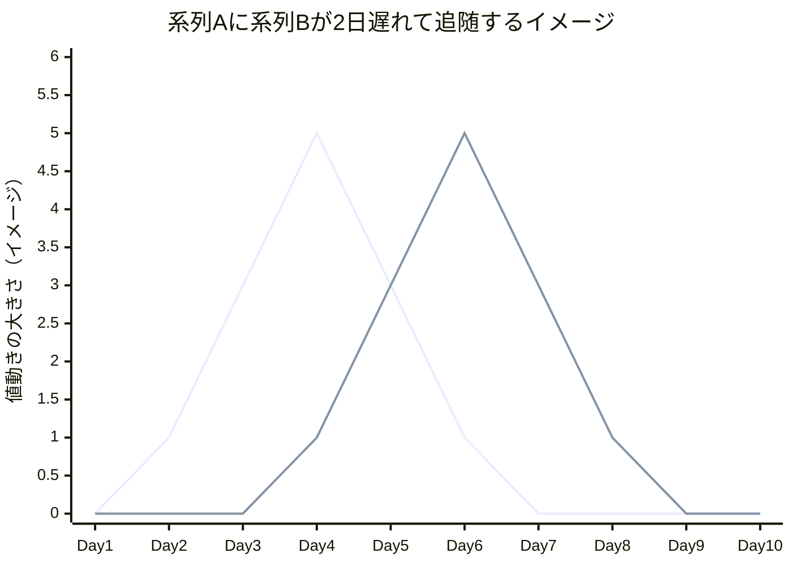
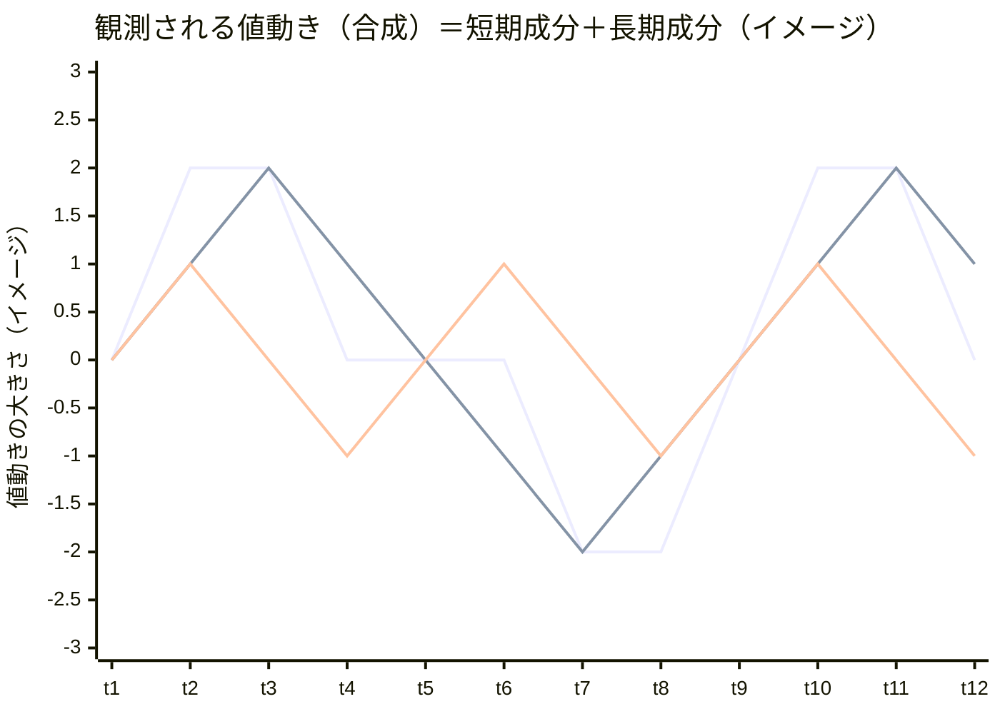

# チュートリアル教材04・05へのMermaid図追加 設計書

## 概要・目的

[チュートリアル教材: リード・ラグ分析＋ウェーブレット発展編](2026-07-25-tutorial-lead-lag-and-wavelet-lessons-design.md)で追加した`docs/05-portfolio-management/04-lead-lag-correlation.md`と`05-wavelet-cycle-analysis.md`は、いずれも「時間差」「周期の合成」という視覚的直感が理解を助ける概念を文章のみで説明している。

`docs/app-design.md`はMermaidのシーケンス図・フローチャートを既に活用しており、本リポジトリではMermaidが図表の標準ツールとして定着している。Mermaidの`xychart-beta`は折れ線・棒グラフで実際のデータ系列を描画できるため、これを使い、教材04の「リード・ラグ（時間差）」と教材05の「周期分解（短期成分＋長期成分への合成）」という2つの中核概念を視覚化する。

ウェーブレット分析特有の「時間×周期のヒートマップ」は2次元グリッドであり`xychart-beta`（折れ線・棒グラフ専用）では表現できないため、本機能のスコープ外とする（今回は追加しない）。

## スコープ

- v1で実装する:
  - `docs/05-portfolio-management/04-lead-lag-correlation.md`: 「主要概念・パラメータ解説」の直後、「シフト相関の限界」の前に、系列A・系列Bのリード・ラグをイメージで示す`xychart-beta`図を1点追加
  - `docs/05-portfolio-management/05-wavelet-cycle-analysis.md`: 「概要」の直後、「位置づけ」の前に、観測される値動き＝短期成分＋長期成分の合成であることをイメージで示す`xychart-beta`図を1点追加
- v1で実装しない（将来課題）:
  - ウェーブレット分析の時間×周期コヒーレンス・ヒートマップの図示（アスキーアート等での代替も含め見送り）
  - 他の既存教材（01〜03、04-analysis-agents等）への図の追加
  - 実データに基づくグラフ生成（本機能はすべて説明用の仮想データ）

## 図1 — 教材04: リード・ラグのイメージ図

### 配置

`## 主要概念・パラメータ解説`の表の直後、`### シフト相関の限界（次教材への橋渡し）`見出しの前に、新しい小見出し`### イメージ図: リード・ラグの視覚化`を追加し、その配下に図とキャプションを置く。

### 内容

系列A・系列Bが同じ山型カーブを描くが、系列Bが2日遅れて追随する様子を、Day1〜Day10の仮想データで示す。

```markdown
### イメージ図: リード・ラグの視覚化



1本目の折れ線が系列A、2本目の折れ線が系列B（系列Aと同じ形が2日分右にずれている＝2日遅れて追随）を表す仮想データです。実際のリターンはこれほど単純な形にはならず、日々のノイズが混ざります。
```

（上記の外側のMarkdownコードフェンス表記はこの設計書内での引用のためのものであり、実ファイルには内側の`mermaid`コードブロックとキャプション文のみを追加する。）

### 挿入後の教材04の見出し構成（確認用）

```
## 主要概念・パラメータ解説
### シフト相関の限界（次教材への橋渡し）
```

を

```
## 主要概念・パラメータ解説
### イメージ図: リード・ラグの視覚化
### シフト相関の限界（次教材への橋渡し）
```

に変更する（既存の「主要概念・パラメータ解説」表と「シフト相関の限界」本文は変更しない）。

## 図2 — 教材05: 周期分解のイメージ図

### 配置

`## 概要`の本文（「本教材（発展編）では...」の段落と「> 本教材は**発展・オプション**です」の間、または直後）の後、`## 位置づけ`見出しの前に、新しい小見出し`### イメージ図: 周期分解のイメージ`を追加する。

### 内容

観測される値動き（合成）が、長期成分と短期成分の重ね合わせであることを、t1〜t12の仮想データで示す。

```markdown
### イメージ図: 周期分解のイメージ



1本目の折れ線が観測される値動き（合成）、2本目が長期成分、3本目が短期成分を表す仮想データです（合成＝長期成分＋短期成分になるよう作成しています）。ウェーブレット分析は、この合成された値動きから周期の長さごとの成分を取り出す手法です。
```

（上記の外側のMarkdownコードフェンス表記は設計書内引用用。実ファイルには内側の`mermaid`コードブロックとキャプション文のみを追加する。）

### 挿入後の教材05の見出し構成（確認用）

```
## 概要
（本文...）
> 本教材は**発展・オプション**です。スキップしても06-real-world-examplesに進めます。

## 位置づけ
```

を

```
## 概要
（本文...）
> 本教材は**発展・オプション**です。スキップしても06-real-world-examplesに進めます。

### イメージ図: 周期分解のイメージ

## 位置づけ
```

に変更する（既存の「概要」本文・発展オプションの注記・「位置づけ」本文は変更しない）。

## データの妥当性検証（手計算）

図2の「合成 = 長期成分 + 短期成分」を検算する。

| t | 長期成分 | 短期成分 | 合成（長期+短期） | 図に記載した合成値 |
| --- | --- | --- | --- | --- |
| t1 | 0 | 0 | 0 | 0 |
| t2 | 1 | 1 | 2 | 2 |
| t3 | 2 | 0 | 2 | 2 |
| t4 | 1 | -1 | 0 | 0 |
| t5 | 0 | 0 | 0 | 0 |
| t6 | -1 | 1 | 0 | 0 |
| t7 | -2 | 0 | -2 | -2 |
| t8 | -1 | -1 | -2 | -2 |
| t9 | 0 | 0 | 0 | 0 |
| t10 | 1 | 1 | 2 | 2 |
| t11 | 2 | 0 | 2 | 2 |
| t12 | 1 | -1 | 0 | 0 |

全12点で一致することを確認済み。

## エラーハンドリング・留意点

| 事象 | 対応 |
| --- | --- |
| Mermaidの`xychart-beta`は凡例（系列名のラベル）を描画しない | 図の直後に「1本目が○○、2本目が△△」という説明文を必ず添える（上記本文に記載済み） |
| 仮想データが実際の株価変動と乖離している | 各図のキャプションに「イメージ」「仮想データ」であることを明記し、実データとの違いに注意喚起する |
| GitHub等のMarkdownビューアでMermaidが未対応の場合、図が表示されない | 図の直前・直後の文章だけでも概念が伝わるよう、キャプション文を図の説明として自己完結させる（図が見えない場合のフォールバックとして機能する） |

## テスト方針

Markdown教材のみの変更であり自動テスト対象はない。以下を確認する。

- 追加した`mermaid`コードブロックの`xychart-beta`構文（`title` / `x-axis` / `y-axis` / `line`の各行）が既存のMermaid記法（`docs/app-design.md`のflowchart/sequenceDiagram）と同様、コードフェンスで正しく囲われていること
- 図2のデータが「合成＝長期成分＋短期成分」を満たすこと（上記検算表の通り）
- 既存の見出し構成・本文・演習課題・理解度チェック・フッターが変更されていないこと（新規小見出しの追加のみで、既存文言は一切変更しない）
