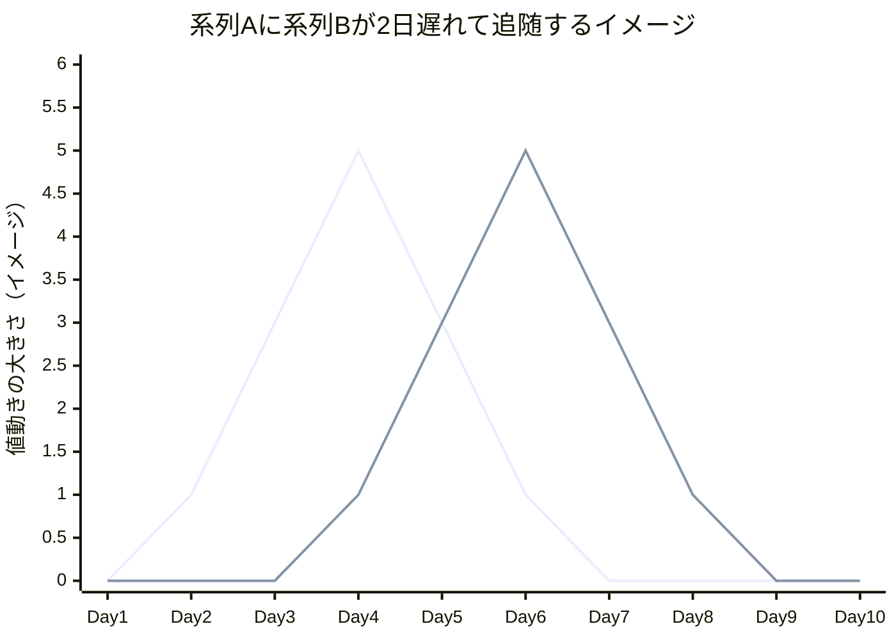

# 相関とリード・ラグ分析の基礎

## この教材で身につくこと

- シフト相関（時差相関）で2つの系列のどちらが先行するかをpandasで検出する方法
- 複数系列（業種など）に総当たりでリード・ラグを計算し、相関の強い順にペアを抽出する方法
- シフト相関がラグ0日（同時相関＝市場全体の地合い）に偏りやすい理由と、その限界

## 概要

02-risk-assessment.mdで学んだ相関係数（`DataFrame.corr()`）は「同じ日の
値動きがどれだけ似ているか」を1つの数値で表します。しかし実際の市場では、
ある銘柄・業種の値動きが別の銘柄・業種に数日〜数週間遅れて波及することが
あります。本教材では、一方の系列を日数分だけずらして相関を取り直す
「シフト相関」を使い、「どちらが先に動く傾向があるか（リード・ラグ）」を
検出する方法を学びます。

## 位置づけ

この教材は05-portfolio-managementカテゴリの4番目の教材です。
02-risk-assessment.mdの相関係数を「時間差」の視点に拡張します。
03-backtest-automation.mdの直後に位置し、次の05-wavelet-cycle-analysis.md
（発展編）では、本教材の手法の限界（期間全体で1つのラグ値しか出せない）を
解決するより高度な手法を扱います。

## 主要概念・パラメータ解説

| 概念 | 説明 |
| --- | --- |
| シフト相関 | `series_b.shift(lag)`と`series_a`の相関係数。`lag`を`-N`〜`N`まで振り、`|相関|`が最大になる`lag`を採用する |
| `lag > 0` | `series_a`が`series_b`に対して`lag`日先行（`series_a`の過去の値が`series_b`の現在値と相関） |
| `lag < 0` | `series_b`が`series_a`に対して`abs(lag)`日先行 |
| `max_lag_days` | 探索するラグの最大日数。長すぎると計算コストが増え、短すぎると長い周期の関係を見逃す |

### イメージ図: リード・ラグの視覚化



1本目の折れ線が系列A、2本目の折れ線が系列B（系列Aと同じ形が2日分右にずれている＝2日遅れて追随）を表す仮想データです。実際のリターンはこれほど単純な形にはならず、日々のノイズが混ざります。

### シフト相関の限界（次教材への橋渡し）

相関の強いペアを抽出すると、多くの場合ラグ0日（同時相関）に偏ります。
これは業種固有の先行・追随関係というより、市場全体の地合い（同じ日に
多くの銘柄・業種が一緒に動く傾向）を反映している可能性が高いです。
この限界は、期間全体を通じて「1つのラグ値」しか計算していないことに
起因します。次教材（05-wavelet-cycle-analysis.md、発展編）では、
周期の長さごとに分解することでこの限界に対処する手法を扱います。

## 実ソースコード（Python / プロンプト例）

### シフト相関の計算

```python
import numpy as np
import pandas as pd
import yfinance as yf


def fetch_daily_returns(tickers: list[str], period: str = "1y") -> pd.DataFrame:
    """複数銘柄の日次リターンをまとめたDataFrameを返す。"""
    prices = yf.download(tickers, period=period)["Close"]
    return prices.pct_change().dropna()


def compute_shifted_correlation(
    series_a: pd.Series, series_b: pd.Series, max_lag_days: int = 20
) -> tuple[int, float]:
    """series_aとseries_bのシフト相関から、|相関|が最大になるラグ日数と
    そのときの相関係数を返す。

    lag > 0はseries_aが先行、lag < 0はseries_bが先行することを示す。
    """
    combined = pd.concat([series_a.rename("a"), series_b.rename("b")], axis=1).dropna()
    best_lag, best_corr = 0, 0.0
    for lag in range(-max_lag_days, max_lag_days + 1):
        shifted = combined["b"].shift(lag)
        corr = combined["a"].corr(shifted)
        if pd.notna(corr) and abs(corr) > abs(best_corr):
            best_lag, best_corr = lag, corr
    return best_lag, round(best_corr, 3)


def compute_lead_lag_pairs(
    returns: dict[str, pd.Series], max_lag_days: int = 20
) -> list[dict]:
    """複数系列の全ペアについてシフト相関を計算し、|相関|の降順で返す。"""
    names = list(returns.keys())
    pairs = []
    for i, name_a in enumerate(names):
        for name_b in names[i + 1 :]:
            lag, corr = compute_shifted_correlation(
                returns[name_a], returns[name_b], max_lag_days
            )
            leading = name_a if lag >= 0 else name_b
            lagging = name_b if lag >= 0 else name_a
            pairs.append(
                {
                    "leading": leading,
                    "lagging": lagging,
                    "lag_days": abs(lag),
                    "correlation": corr,
                }
            )
    return sorted(pairs, key=lambda p: abs(p["correlation"]), reverse=True)
```

### LLMへの解説依頼

```python
def explain_lead_lag_pairs(pairs: list[dict], call_llm) -> str:
    """上位のリード・ラグペアをLLMに解説させる。"""
    top_pairs = pairs[:3]
    pairs_text = "\n".join(
        f"- {p['leading']}が{p['lagging']}に{p['lag_days']}日先行"
        f"（相関係数{p['correlation']}）"
        for p in top_pairs
    )
    prompt = f"""\
以下は複数銘柄間の値動きの時差相関（リード・ラグ）を、過去の株価データから
計算した結果です（Python側で計算済みのため再計算は不要です）。

{pairs_text}

各ペアについて、この関係が何を意味するかを投資初心者にも分かる言葉で
説明してください。ラグが0日に近いペアについては、銘柄固有の関係というより
市場全体の地合いを反映している可能性がある点にも触れてください。

出力は事実の説明と教育的な考察にとどめ、「買うべき」「今すぐ売買すべき」
のような指示的な表現は使わないでください。これは個人向けの投資助言では
ないことも明記してください。
"""
    return call_llm(prompt)
```

### 実行結果例

```text
- 6758.Tが7203.Tに2日先行（相関係数0.61）
- 7974.Tが6758.Tに0日先行（相関係数0.88）
```

```text
6758.Tと7203.Tの間には、6758.Tの値動きが7203.Tに2日遅れて
波及する傾向が見られます（相関係数0.61）。

一方、7974.Tと6758.Tはラグ0日で相関係数0.88と非常に高く、
両銘柄がほぼ同じ日に同じ方向へ動く傾向があります。これは銘柄固有の
先行・追随関係というより、市場全体の地合い（同じ日に多くの銘柄が
一緒に動く傾向）を反映している可能性があります。

これは一般的な教育目的の解説であり、個人向けの投資助言ではありません。
```

### 良い例と悪い例

```text
❌ 悪い例:
「7974.Tと6758.Tの相関が0.88と非常に強いので、7974.Tが動いたら
すぐに6758.Tを買うべきです。」
```

```text
✅ 良い例:
「ラグ0日・相関係数0.88というこの結果は、銘柄固有の先行・追随関係
というより、市場全体の地合いを反映している可能性があります。
過去の統計的傾向であり、将来の値動きを保証するものではありません。」
```

## 演習課題

1. `compute_lead_lag_pairs`を使い、3銘柄以上の日次リターンから
   リード・ラグペアの一覧を出力するスクリプトを書いてください。
2. `|correlation|`が0.5未満のペアを結果から除外するフィルタを
   `compute_lead_lag_pairs`に追加してください。
3. 実データで試したとき、上位ペアの多くがラグ0日に偏る理由を、
   本教材の「シフト相関の限界」の説明を踏まえて自分の言葉で説明してください。

## 理解度チェック

- [ ] シフト相関における`lag`の符号が何を意味するか説明できる
- [ ] リード・ラグ上位ペアがラグ0日に偏りやすい理由を説明できる
- [ ] シフト相関が「期間全体で1つのラグ値」しか出せないという限界を説明できる

---

投資判断に関わる内容です。必ず [免責事項](../../DISCLAIMER.md) をご確認ください。

[← 前へ: バックテスト自動化](03-backtest-automation.md) | [次へ: 周期分解によるリード・ラグ分析（発展） →](05-wavelet-cycle-analysis.md)
