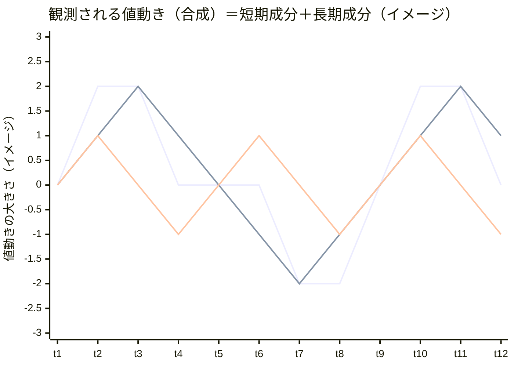

# 周期分解によるリード・ラグ分析（発展）

## この教材で身につくこと

- 04のシフト相関が「期間全体で1つのラグ値」しか出せず、短期の地合いと長期の業種固有の動きを区別できない理由
- 連続ウェーブレット変換（CWT）で、周期の長さ（短期/中期/長期）ごとにリード・ラグを分解する考え方
- コヒーレンス（関係の確からしさ）が低い区間を参考程度として扱うことの重要性

## 概要

04で学んだシフト相関は、期間全体を通じて「最も強い1つのラグ」しか
教えてくれません。しかし実際の値動きには、数日〜2週間程度の短い周期の
動き（市場全体の地合いに近い）と、1〜6か月程度の長い周期の動き
（業種固有のサイクルに近い）が混ざっています。

本教材（発展編）では、連続ウェーブレット変換（CWT）を使い、値動きを
「周期の長さ」ごとに分解したうえで、周期ごとに「どちらが先行しているか」
「その関係はどれくらい確からしいか（コヒーレンス）」を計算する考え方を
学びます。数式の詳細には立ち入らず、直感的な理解と最小限の実行可能な
サンプルコードを目的とします。

> 本教材は**発展・オプション**です。スキップしても06-real-world-examplesに進めます。

### イメージ図: 周期分解のイメージ



1本目の折れ線が観測される値動き（合成）、2本目が長期成分、3本目が
短期成分を表す仮想データです（合成＝長期成分＋短期成分になるよう
作成しています）。ウェーブレット分析は、この合成された値動きから
周期の長さごとの成分を取り出す手法です。

## 位置づけ

この教材は05-portfolio-managementカテゴリの5番目（最後）の教材です。
04-lead-lag-correlation.mdの限界（期間全体で1つのラグ値）を解決する
発展的な手法として位置づけます。

次の06-real-world-examplesでは、ここまでの内容を統合した実践的なツール構築演習に取り組みます。

## 主要概念・パラメータ解説

| 概念 | 説明 |
| --- | --- |
| 連続ウェーブレット変換（CWT） | 時系列を「時間×周期の長さ」の2次元に分解する変換。周期ごとに値動きの強さと位相（タイミングのズレ）を計算できる |
| コヒーレンス（`coherence`） | 2系列の関係の確からしさを`0`〜`1`で表す指標。低いほど「その周期・その時点での関係は参考程度」であることを示す |
| 周期帯（`PERIOD_BANDS`） | 短期（4〜10営業日）・中期（10〜40営業日）・長期（40〜120営業日）の3区分。単位は営業日 |
| ラグの符号 | 04と同じ規約: 正なら系列Aが先行、負なら系列Bが先行 |

## 実ソースコード（最小限のサンプル）

新規依存として`pywavelets`が必要です（`uv add pywavelets`、インポート名は`pywt`）。

```python
import numpy as np
import pandas as pd
import pywt

WAVELET = "cmor1.5-1.0"  # 複素モルレーウェーブレット


def compute_wavelet_lag_snapshot(
    series_a: pd.Series, series_b: pd.Series, period_days: float
) -> dict:
    """指定した周期（営業日）における、直近時点のラグとコヒーレンスを
    最小限の実装で計算する（時間軸方向の平滑化は省略した簡易版）。
    """
    combined = pd.concat([series_a.rename("a"), series_b.rename("b")], axis=1).dropna()
    center_freq = pywt.central_frequency(WAVELET)
    scale = center_freq * period_days

    coeffs_a, _ = pywt.cwt(combined["a"].to_numpy(), [scale], WAVELET, sampling_period=1.0)
    coeffs_b, _ = pywt.cwt(combined["b"].to_numpy(), [scale], WAVELET, sampling_period=1.0)
    wa, wb = coeffs_a[0], coeffs_b[0]

    cross = wa * np.conj(wb)
    coherence = float(np.abs(cross[-1]) ** 2 / (np.abs(wa[-1]) ** 2 * np.abs(wb[-1]) ** 2))
    lag_days = float(np.angle(cross[-1]) / (2 * np.pi) * period_days)

    return {"lag_days": round(lag_days, 1), "coherence": round(min(coherence, 1.0), 2)}
```

> このサンプルは概念理解のための最小実装であり、時間軸方向の平滑化・
> 複数周期の一括計算・複数業種対応は行っていません（平滑化を省略している
> ため、コヒーレンスは常に1に近い値になる点に注意してください。実運用
> では平滑化が必須です）。完全な実装（平滑化・複数周期帯・Streamlit UIでの
> 可視化・直近シグナル要約・AI解説コメント）は
> [`app/sector_analysis/wavelet.py`](../../../app/sector_analysis/wavelet.py)と
> [`app/prompt_patterns/wavelet_explanation.py`](../../../app/prompt_patterns/wavelet_explanation.py)
> を参照してください。

### LLMへの解説依頼

```python
def explain_wavelet_snapshot(
    sector_a: str, sector_b: str, band_label: str, snapshot: dict, call_llm
) -> str:
    """ウェーブレット分析のスナップショットをLLMに解説させる。"""
    lag = snapshot["lag_days"]
    leading = sector_a if lag >= 0 else sector_b
    lagging = sector_b if lag >= 0 else sector_a
    prompt = f"""\
以下は「{sector_a}」と「{sector_b}」について、周期帯「{band_label}」における
ウェーブレット分析の直近時点の計算結果です（Python側で計算済みです）。

- 支配的ラグ: 約{abs(lag):.1f}営業日（{leading}が{lagging}に先行）
- コヒーレンス（関係の確からしさ、0〜1）: {snapshot['coherence']:.2f}

この結果が何を意味するかを、コヒーレンスの水準（高い/低い）にも触れながら
投資初心者向けに説明してください。過去の統計的傾向であり将来を保証しない
ことを明記し、指示的な売買表現は使わないでください。
"""
    return call_llm(prompt)
```

### 実行結果例

```text
支配的ラグ: 約3.2営業日（電機・精密が機械に先行）
コヒーレンス: 0.62
```

```text
中期の周期帯（10〜40営業日）では、電機・精密の値動きが機械に約3.2営業日
先行する傾向が見られます。コヒーレンス0.62は中程度の確からしさを示して
おり、この関係は一定の裏付けがあるものの絶対的なものではありません。

これは過去の統計的傾向の説明であり、将来の値動きを保証するものでは
ありません。
```

### 良い例と悪い例

```text
❌ 悪い例:
「支配的ラグが3.2日なので、電機・精密が動いたら3営業日後に機械を
買えば確実に利益が出ます。」
```

```text
✅ 良い例:
「コヒーレンス0.62は中程度の確からしさであり、この関係は絶対的な
ものではありません。過去の統計的傾向であり、将来を保証しません。」
```

## 演習課題

1. `compute_wavelet_lag_snapshot`の`period_days`引数を変えて、
   短期（例: 8営業日）と長期（例: 60営業日）でラグ・コヒーレンスが
   どう変わるか比較してください。
2. 04で計算したシフト相関の結果と、本教材のウェーブレット分析の結果を
   同じ2銘柄で比較し、両者が一致する場合・しない場合それぞれについて
   考えられる理由を説明してください。
3. `app/sector_analysis/wavelet.py`の`summarize_band_snapshot`関数を読み、
   本教材のサンプルコードと何が違うか（特に平滑化の有無）を説明してください。

## 理解度チェック

- [ ] シフト相関とウェーブレット分析の違い（1つのラグ値 vs 周期ごとの分解）を説明できる
- [ ] コヒーレンスが低い区間を「参考程度」として扱うべき理由を説明できる
- [ ] 本教材のサンプルコードと`app/`の完全な実装との違いを説明できる

## さらに学ぶには

`app/`には、本教材で学んだ考え方をもとにした完成版のStreamlitアプリがあります。

- 複数業種を選択できるUI、周期帯（短期/中期/長期）ごとの支配的ラグの時系列グラフ
- 直近シグナルの要約パネル（`summarize_band_snapshot`、機械的な数値表示）
- ボタン起動・日次キャッシュ付きのAI解説コメント（`generate_wavelet_explanation`）

これらは、01-portfolio-management以降で一貫して使ってきた
「Pythonが事実を計算し、LLMがそれを解釈する」という設計パターンを、
より高度な分析（周期分解）にそのまま適用した例です。詳細は
[`app/README.md`](../../../app/README.md)と
[`docs/superpowers/specs/`](../../../app/docs/superpowers/specs/)
配下の設計書を参照してください。

---

投資判断に関わる内容です。必ず [免責事項](../../DISCLAIMER.md) をご確認ください。

[← 前へ: 相関とリード・ラグ分析の基礎](04-lead-lag-correlation.md) | [次へ: 06-real-world-examples →](../06-real-world-examples/00-README.md)
